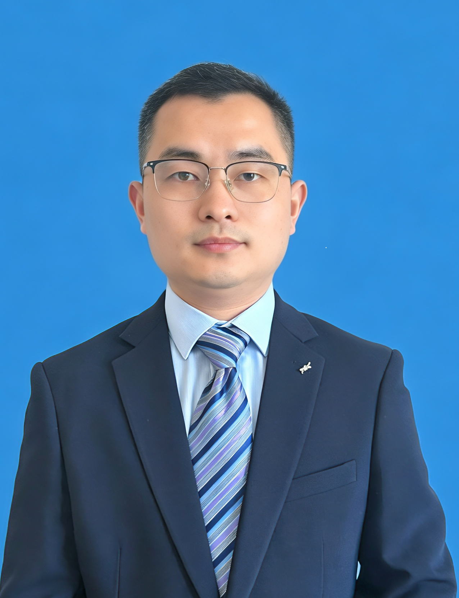

###  医科大学第一附属医院，手足踝外科，主治医师。

- 日常工作处理手足部常见急诊外伤的治疗（肘关节骨折，桡骨远端骨折，掌指骨骨折，踝关节和足部骨折，手足神经、血管、肌腱损伤、跟腱断裂）。

- 手足慢性疾病（腱鞘炎，腱鞘囊肿，腕管综合征，肘管综合征，跟腱炎，跖筋膜炎等）。

- 关注甲沟炎手术和非手术治疗方法，倡导不拔甲治疗甲沟炎，长期实践嵌甲、卷曲甲钢丝矫正法，坚持甲沟炎知识的科普，旨在减少群众因错误剪趾甲导致甲沟炎反复，助力您早日摆脱甲沟炎的困扰！
