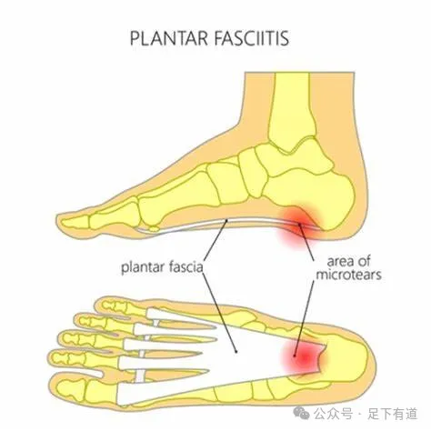
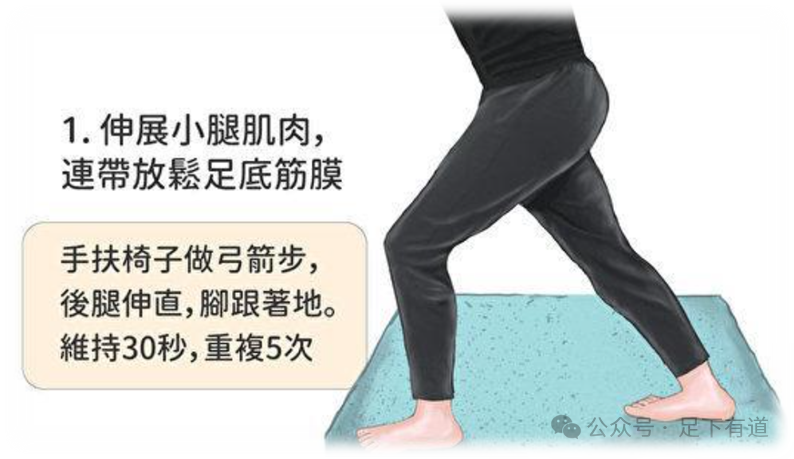
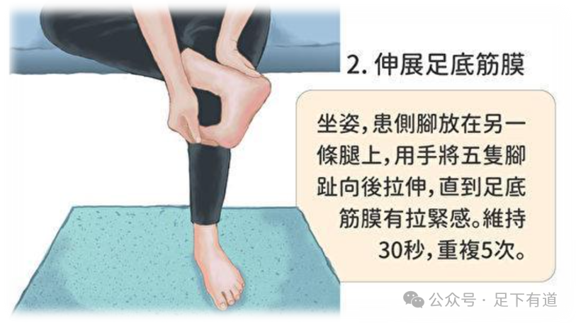

By：Hayson海生  
## 什么是足底筋膜炎？

#### 足底筋膜炎（Plantar fasciitis）是足跟和足部疼痛的最常见原因之一。它是由脚底从脚跟到脚趾的厚组织（筋膜）的刺激、肿胀和疼痛引起的。它是一种退行性改变而非真正意义上的炎症。

Plantar Fasciitis: Causes, Symptoms & Treatment - Dr Foot Podiatry

#### 足底筋膜炎的症状包括

- 脚底、脚后跟附近的疼痛
- 足弓疼痛
- 脚后跟底部肿胀

#### 患者将他们的疼痛描述
- 早上或久坐后第一步疼痛最明显，走几分钟后，疼痛通常会减轻，因为走路会拉伸筋膜。 *这种称为第一步疼痛的症状是足底筋膜炎的典型症状。*
- 长距离行走后持续的疼痛。
- 当您对脚后跟施加压力时出现尖锐或刺痛。
- 脚底疼痛会随着时间的推移而加重。

#### 家庭疗法

这些是您可以在家中采取的简单步骤来减轻疼痛。

- **休息。** 减少甚至停止做会加重疼痛的事情。例如跑步、跳舞或跳跃。如果您感到严重疼痛，医生可能还会建议您使用步行靴和拐杖几天，以减轻脚部的压力，休养生息。
- **改变您的锻炼习惯。** 例如，从跑步等高冲击力活动切换到骑自行车或游泳等低冲击力活动。
- **急性期冰敷。** 将水瓶放入冰箱或冰柜中，每天 3 到 4 次，在脚下滚动约 20 分钟。
- 鞋子和足弓垫
	穿厚的软底鞋。带足弓衬垫的鞋底有助于减少您踩踏和脚后跟着地时筋膜的紧张感。带衬垫的衬垫（例如硅胶跟垫）可以像厚鞋底一样缓冲您的脚跟。

#### 居家康复锻炼方法

 

参考文章：《足踝外科学》、部分图片来自网络搜集。

作者提示: 个人观点，仅供参考