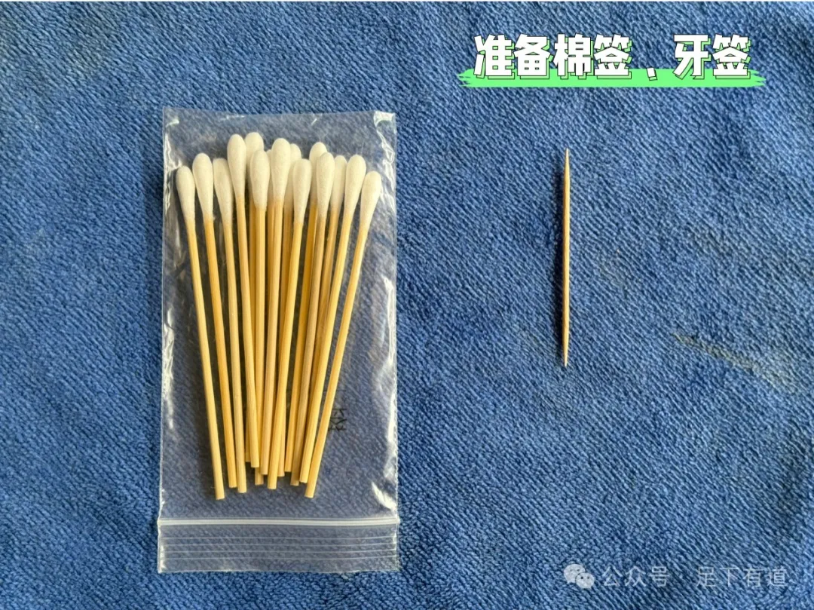
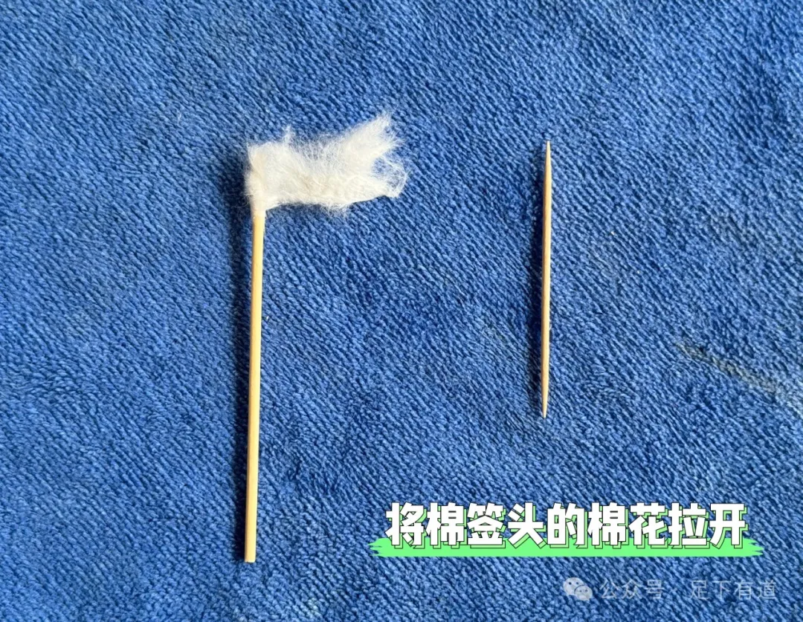
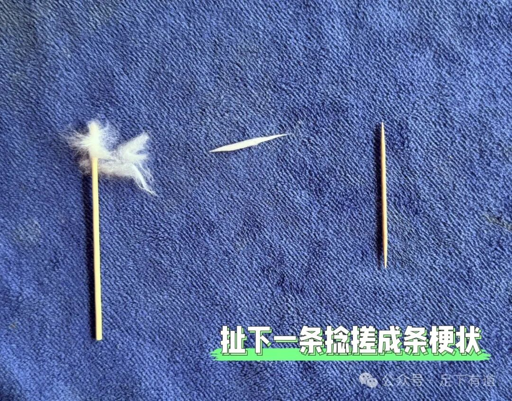
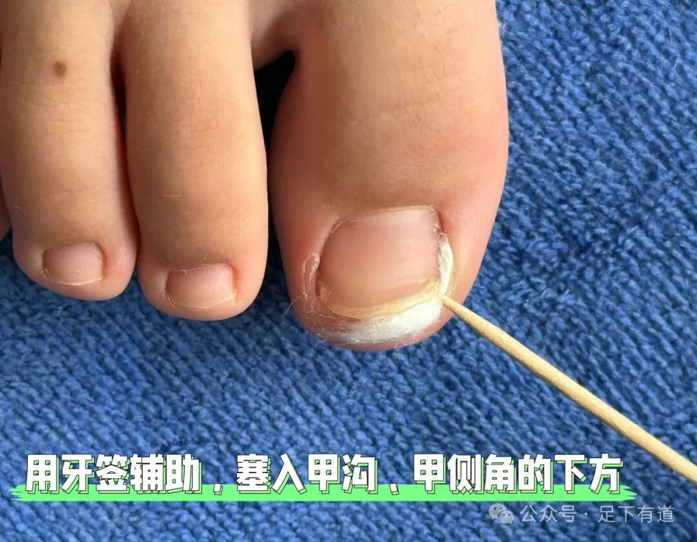
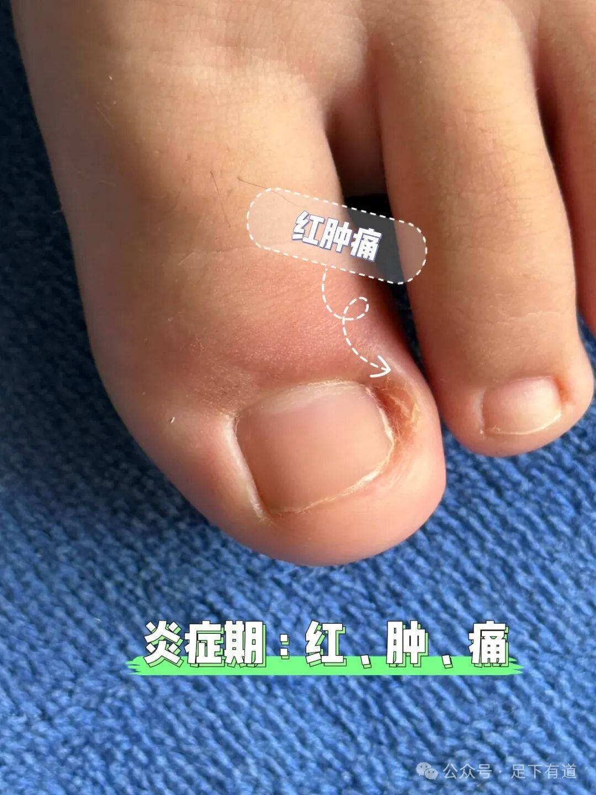
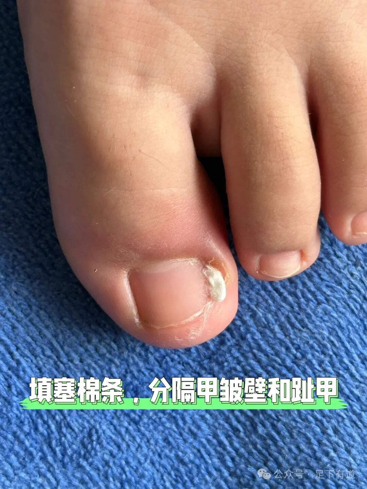
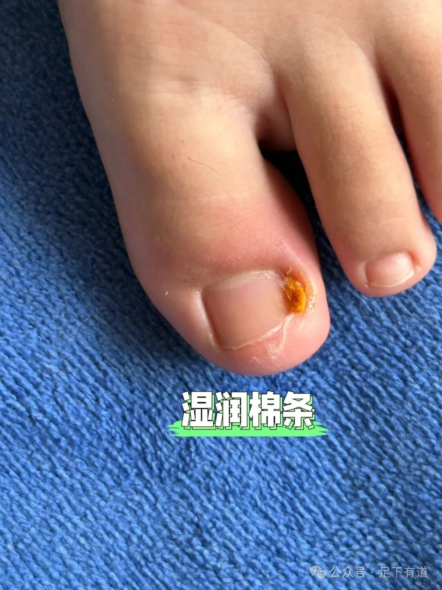
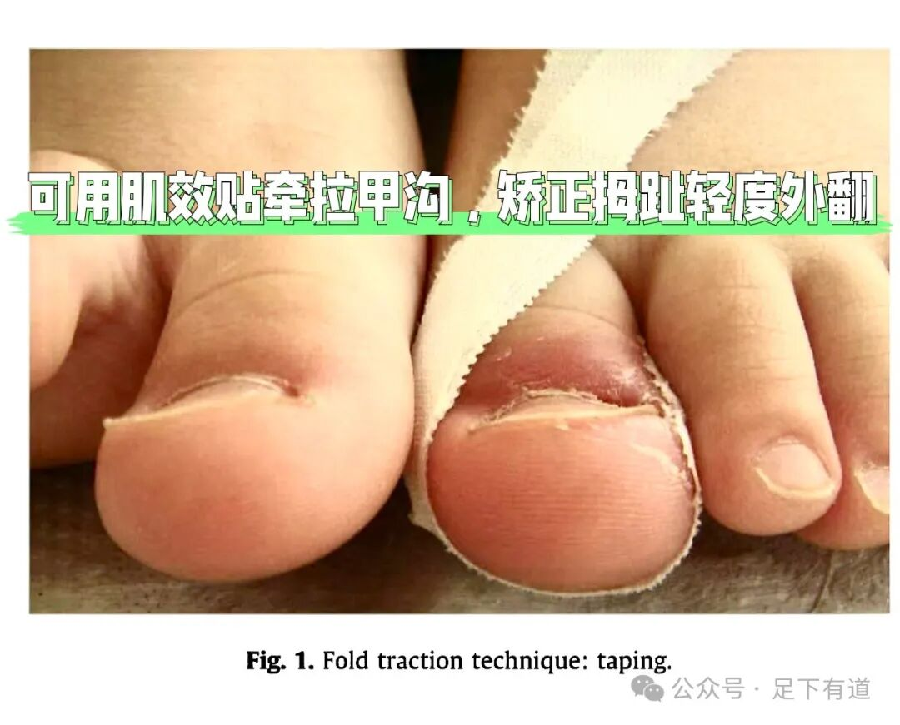
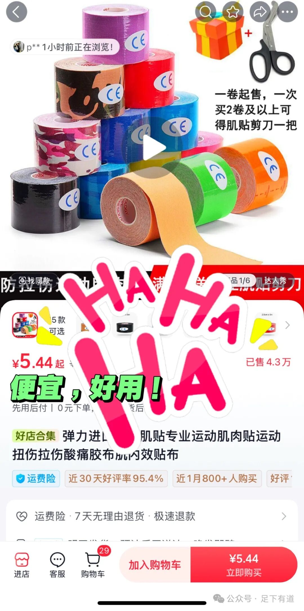

*By：Hayson海生 

第一步：

第二步：

第三步：

第四步：

**还可以做的更好**

如果在早期，炎症期还可以这样做！

温水泡脚，可加碘伏消毒液，清洁足部和甲沟，去除污物！

甲沟填塞棉花，分隔甲、肉，若渗出可促进引流！

 

如果伴有拇趾外翻，甲皱襞肥厚可用肌效贴辅助牵拉！

**GO**

椰奶喝多了，广告也很“椰树风”

参考资料：

Alkhalifah A, Dehavay F, Richert B.Management of ingrowing nail\[J\].Hand Surgery and Rehabilitation, 2024, 43(Sup):6.

Mayeaux, E J, C. Carter, and T. E. Murphy. "Ingrown Toenail Management." *American Family Physician* 100.3(2019):158-164.

作者提示: 个人观点，仅供参考