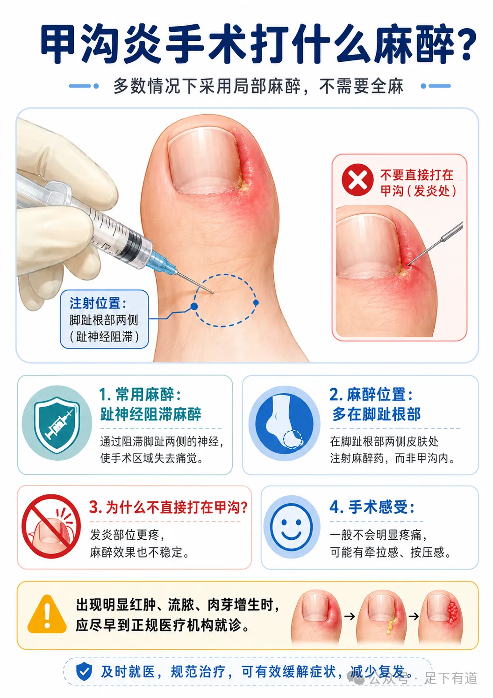

*By：Hayson海生 足下有道 

**很多患者一想到“甲沟炎手术”**

**第一反应就是：十指连心，是不是很疼？要不要全麻？**

其实，大多数甲沟炎手术不需要全麻，通常采用 **趾神经阻滞麻醉** ，也就是在脚趾根部两侧注射麻醉药，让整个脚趾暂时失去痛觉。

手术中一般不会感到明显疼痛，常用的麻醉药物是利多卡因，术后大约2小时左右麻醉效果消退，此时口服或者静脉使用镇痛药物，疼痛大多数人是可以耐受的，就这么说吧，这点痛没有你发炎时走路挤到脚趾那么疼。

****

**提醒：临床实际操作情况复杂，如针对不能配合的人群，像小朋友、小宝宝或者过度恐惧手术的患者可能需要全麻，具体会按照流程评估决定，文章内容仅供参考，请遵医嘱。**

作者提示: 个人观点，仅供参考