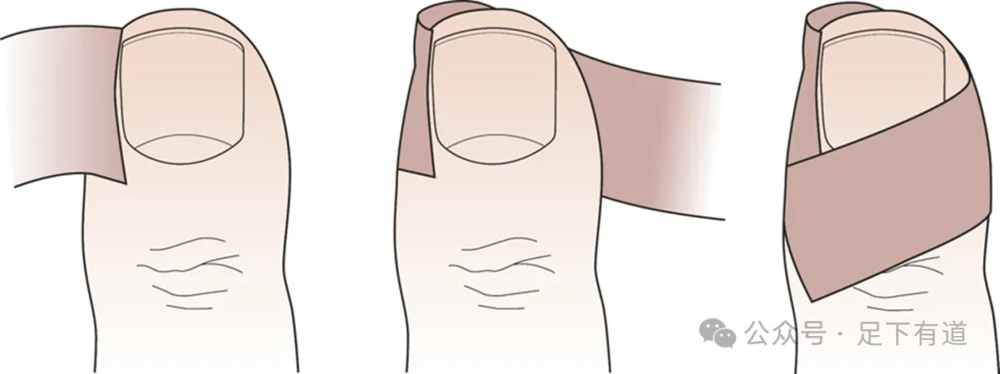
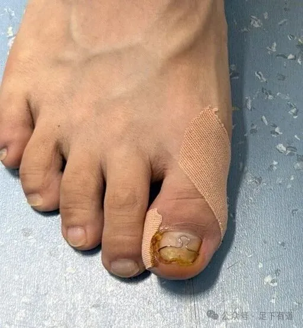
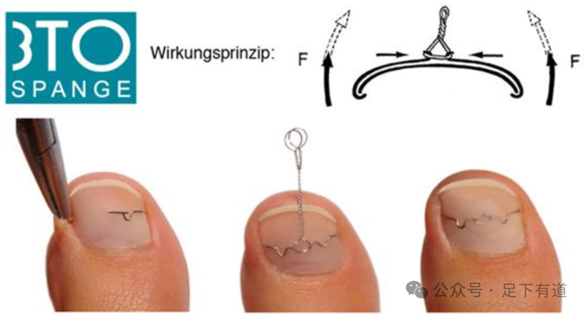
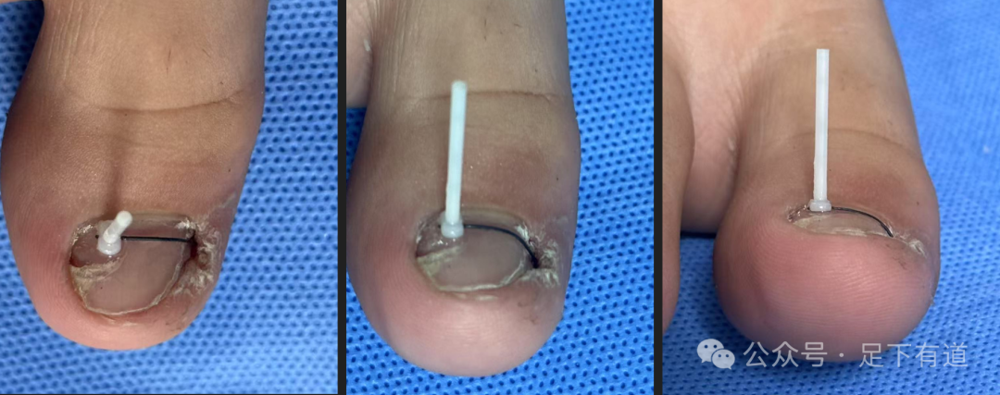
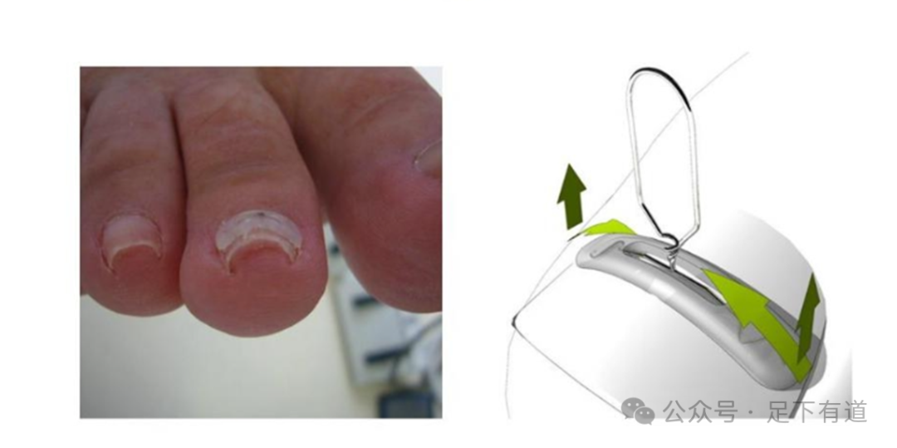

*By：Hayson海生 足下有道  

**甲沟炎恶性循环

有些人发现趾甲往肉里长，走路疼痛，自己把扎进去的趾甲剪掉，当时缓解了，可过1个多月新的趾甲又长出来，扎进肉里，又疼痛，又开始挖，越挖越深！普通的趾甲剪、剪刀已经不能满足自己的需求了，升级装备，网上可能买更厉害的鹰嘴剪，专门剪长肉里的趾甲，越剪越深！这就是甲沟炎恶性循环！

**如何终止恶性循环？

不做手术方案：趾甲矫正，多次复诊，分次付费，以时间换效果。

手术方案:见效快，花费高，部分需要住院手术。

1、停止修甲！

2、帮助嵌入的趾甲顺利长出来！

（从简单的贴胶带、垫棉花、甲面钢丝到欧米伽钢丝方法很多！）

3、一直修甲会导致趾甲盖越来越小，甲襞肥厚，最终形成肉包甲，需定期修甲，累计花费高。

图一、贴胶布

图二、贴胶布+钢丝矫正+填塞棉花

图三、经典3TO矫正，你们经常看到门店上宣传的德国技术！

图四、组合式矫正贴

图五、甲面矫正Podofix系统，你们经常看到门店上宣传的德国技术！

作者提示: 个人观点，仅供参考