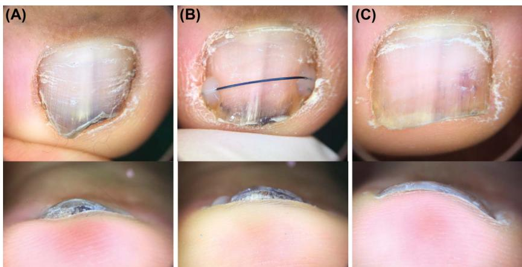
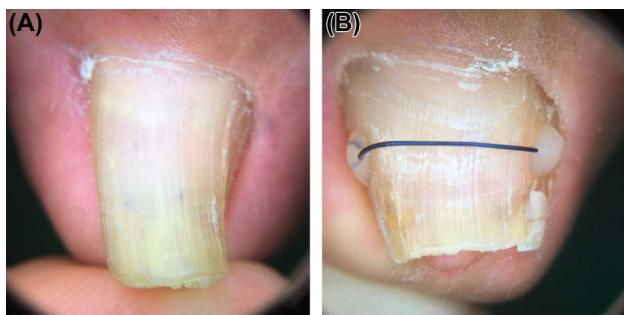
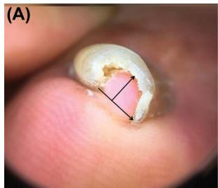
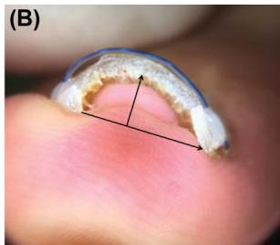

# Factors Influencing the Treatment Effect of Superelastic Wire Orthonyxia for Nail Plate Deformity

June-ho Won, MD,\*† Ji-sun Chun, MD,† Yong-hyun Park, MDD,‡ Young-ho Won, MD, PhD,\* and Sook Jung Yun, MD, PhD\*

Orthonyxia is a noninvasive method for correcting transverse curvature of nail plates. 

  
Figure 1. Orthonyxia performed on a short, buried toenail. (A) The lateral margin of the nail plate is buried in the periungual tissues. The Ni–Ti wire was attached to the exposed nail plate without manipulating the periungual tissues. (B) One month after the treatment, the wire is maintained, and the width of the nail plate has increased. However, the lateral margin of the nail plate cannot be seen in the front view. (C) Two months after the termination of the treatment. The lateral margin of the nail plate can be seen in the front view, and the slight hyperkeratosis underneath the nail plate has disappeared.
## Procedure

Patients did not require anesthesia during the treatment. Two bonding sites were selected near the lateral margin of the nail plate. The chosen sites were slightly ground with a nail grinder to increase the contact area of the nail plate with the adhesive agent. The slightly ground nail plate surface was rubbed with saline gauze to remove the debris. A dental adhesive agent was applied on the 2 bonding sites with a microbrush by rubbing it on the surface for 10 seconds each. An ultraviolet device was used to cure the adhesive agent for 10 seconds each. A nickel–titanium (Ni–Ti) superelastic wire was placed over the UV-cured adhesive agent. The flowable resin was applied on the adhesive agent and cured for 20 seconds to fix the Ni–Ti wire on the nail plate. After the wires were secure, the remaining wires were removed, and any sharp margin was covered with flowable resin for patient safety (Figure 2). The diameter of the Ni–Ti wire used in the treatment was empirically chosen between 0.3, 0.36, 0.4, 0.46, and 0.5 mm.

## Postprocedure Care

The patients could return to their preferred lifestyle immediately after the procedure. Most physical activities, including the ones involving water, were allowed. The only instruction given to the patients was to avoid direct impact, such as being stepped on or kicking an object, on the treated toenail. There was no restriction about what type of shoes to wear during the treatment period. Patients were instructed to revisit the clinic 1 month after the procedure to check clinical progress and side effects. We also advised them to revisit the clinic when the wire came off so that we can evaluate the need for retreatment. There was no fixed goal for treatment, and retreatment was performed until the patient was satisfied.

  
Figure 2. (A) The nail plate of the big toe is severely narrowed. (B) Superelastic wire orthonyxia was performed by attaching a superelastic Ni–Ti wire on the lateral margin of the nail plate using dental adhesives and resin. The photograph was taken 14 weeks after the treatment.

## Data Collection

We measured PT with a vernier caliper. The nail curvature index was measured from clinical photographs (Figure 3). On the clinical photograph of the front view, we drew a straight line between both ends of the nail plate (width) and another line perpendicular to it from the vertex of the nail plate (height). The nail curvature index was calculated by dividing the length of “height” with “width.” The curvature improvement rate

   
Figure 3. The arrow connecting both ends of the nail plate is the width and the arrow perpendicular to it is the height. Nail curvature index was calculated by dividing height by width. (A) Impingement of the subungual tissue is present. The baseline nail curvature index was 0.851. (B) After 14 weeks of treatment, the nail curvature index decreased to 0.361. The treatment pace was 4.11% per week.

(CIR) was calculated in percentage to measure the improvement.

$$
\begin{array} { r } { \mathrm { C I R } = \{ ( \mathrm { B a s e l i n e ~ N C I - p o s t - t r e a t m e n t ~ N C I } ) } \\ { \mathrm { / B a s e l i n e ~ N C I } \} \times 1 0 0 . \qquad } \end{array}
$$

The correction pace of the nail plate was acquired by dividing CIR by WRT.

## Discussion

Previous reports of orthonyxia mainly focused on the novelty of the method, and the treatment effects were not quantitatively analyzed. Our study is meaningful in the aspect that the influencing factors of orthonyxia were identified in a relatively large study group.

According to the adjusted R2 value, the first and second regression model explains 40.5% and 43.9% of the variability of the correction pace around its mean value, respectively. The equation of the regression model indicates that <mark style="background:#fff88f">the elements required for rapid correction </mark>of transverse curvature of nail plates were <mark style="background:#fff88f">high baseline NCI</mark>, <mark style="background:#fff88f">thin nail plate</mark>, <mark style="background:#fff88f">a Ni–Ti wire with a large diameter</mark>, and <mark style="background:#fff88f">frequent replacement </mark>of the applied wire. The variable with the most significant coefficient in both models was WD (1.244 and 2.44). However, it had a narrower range (0.3–0.5 mm) of variability compared with WRT (2–25 weeks). Wire residence time showed the largest calcrelimp output (31.3% and 29.3%) in both models, which means that it explained the most amount of variances. Accordingly, we concluded that WRT had the most influence on the correction pace. Unlike the linear regression model, the logistic regression model could not identify any risk factors related to adverse effects in SEWO.
Severe deformity and thick wires will increase the correction force and induce a rapid correction. <mark style="background:#fff88f">However, stronger correction force and faster correction pace may not always be beneficial</mark>. There has been a case of periungual tissue necrosis followed by treatment of the pincer nail with a shape-memory alloy.16 We found 4 cases of nail apparatus trauma (onycholysis, broken nail plate, and subungual purpura) while reviewing our clinical records. In orthodontics, hypoxic condition is created in the tissue compressed by the correction force, which leads to bone resorption.17 So, it is recommended to set the orthodontic force to the minimal amount of force, which generates tooth movement and avoid irreversible side effects.

A study including more clinical information is needed to improve the adjusted R2 value and discover risk factors for adverse effects. Also, the prognosis, such as long-term side effects and recurrence rates, of rapid correction in orthonyxia needs to be evaluated because excessive correction pace is known to induce irreversible tissue changes in orthodontics.18

## 相关笔记

- [[03_Disease_based_learning/02_Foot_Ankle/02_甲沟炎/Controversies in the Treatment of Ingrown Nails (2012)|嵌甲治疗争议 (2012)]]
- [[05_Research/orthotics for the 硅胶分隔垫的制作/orthotics for the 硅胶分隔垫的制作|硅胶分隔垫制作]]
- [[00_Home/甲病知识地图|甲病知识地图]]
