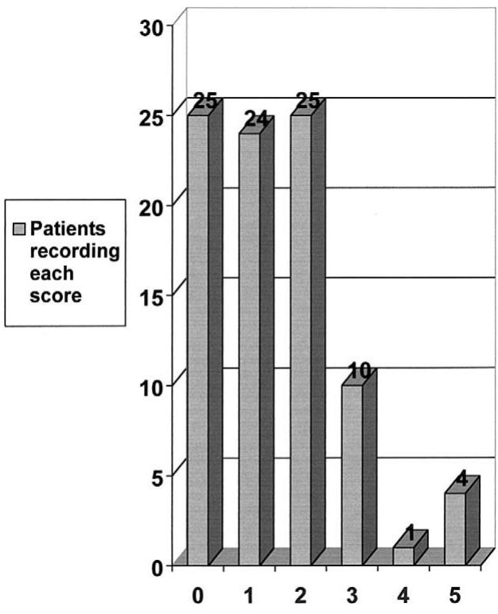
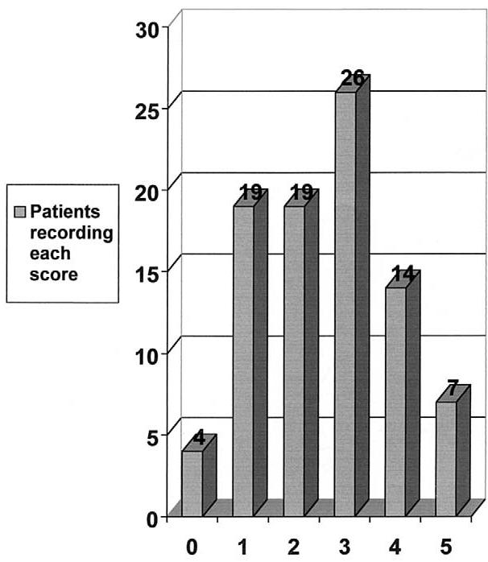
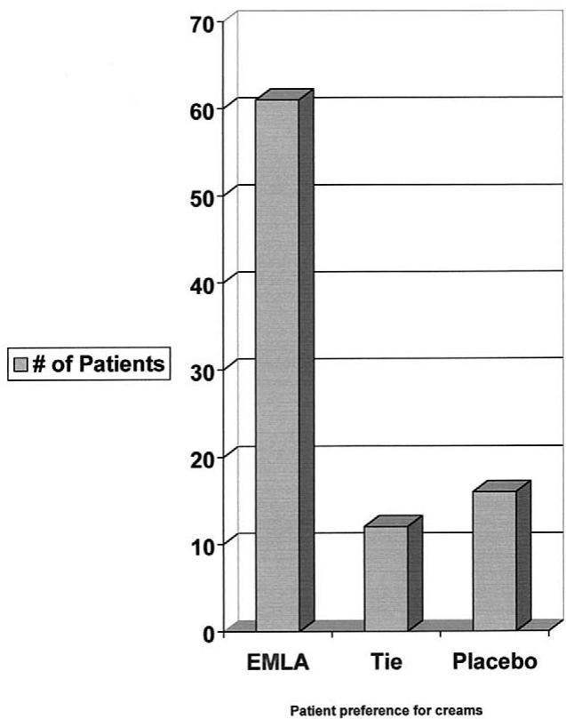

# USE OF EMLA CREAM WITH VASECTOMY

THOMAS P. COOPER

## ABSTRACT

Objectives. To determine whether the application of a eutectic mixture of anesthetic cream (EMLA cream) can decrease the pain of lidocaine injection during vasectomy. Methods. A double-blind, prospective study was performed in which each patient acted as his own control. One hour before a double-incision vasectomy, EMLA cream was applied to one side of the scrotum and a white lanolin hand cream to the other side. A double-incision vasectomy was performed, and each patient was asked to rate the pain associated with each side of the procedure. Results. Eighty-nine patients agreed to the study; 61 patients thought the EMLA cream decreased the pain of the vasectomy, 16 preferred the lanolin hand cream, and 3 said there was no difference. These results were significant at the 0.0001 level using the Student t test. Conclusions. EMLA cream significantly decreases the pain associated with lidocaine injections given as local anesthesia for vasectomy. UROLOGY 60: 135–137, 2002. © 2002, Elsevier Science Inc.

of a vasectomy is the injection of the local anesthetic.1 A eutectic mixture of anesthetic cream (EMLA cream) might decrease the pain associated with these injections, but two previous reports2,3 have shown mixed results. EMLA cream has found wide acceptance when used before neonatal circumcision, and some urologists use it to treat premature ejaculation.4 The cream has been used to lessen the skin pain associated with tubless extracorporeal shock wave lithotripsy.5 A prospective double-blind study was created to evaluate this cream’s effectiveness in relieving the pain associated with scrotal needle injections of lidocaine.

## MATERIAL AND METHODS

Ninety-three men were counseled between February and October 1998 regarding vasectomy and informed consent was obtained. The study protocol was shared with each couple, and 89 men agreed to participate. Each study patient was asked to report to the clinic 1 hour before the planned surgery. The adequacy of his scrotal shave was confirmed, and each cream was applied to the ventral surface of the scrotum, with care taken not to mix the creams across the median raphe. The patient was familiarized with a 0 to 5 visual analog pain scale, with 0 equal to no pain and 5, the worst possible pain. A simple occlusive plastic wrap (Saran Wrap) was placed over the scrotum, and the patient dressed and returned to the reception room for 1 hour. The patient was brought back to the procedure room where the creams were removed, a Betadine preparation was completed, and the surgeon was summoned. Bilateral partial vasectomy was then completed without the patient or surgeon knowing which cream had been applied to which side. The medical assistant who had applied the creams asked the patient to evaluate the pain associated with each of the two scrotal injections at the time of the injection. The side of application of each cream was random but both surgeons began with the left unilateral procedure and finished with the right. Records of the visual analogue scores were kept, and statistical analysis was applied.

## RESULTS

Figure 1 demonstrates the visual analogue scores the 89 patients recorded for the hemiscrotum pretreated with EMLA. Twenty-five patients had no pain with the needle injections of lidocaine and 4 patients recorded a visual analogue score of 5.

Figure 2 demonstrates the visual analogue score the 89 patients recorded for the hemiscrotum pretreated with placebo cream. Four patients recorded a 0 score and 7 patients recorded a 5.

Figure 3 demonstrates the patient preferences for EMLA and placebo cream. Of the 89 patients, 61 thought the EMLA cream-side injections to be less painful than the placebo side. The average visual analogue score difference was 1.98. Twelve of the 89 patients could detect no difference in the two creams, and 16 of the 89 patients had more pain relief with the placebo cream. The average visual analogue score difference in these 16 patients was 1.35. The preference for EMLA cream was statistically significant at the 0.0001 level using the Student t test.

  
VAS scores on hemiscrotae treated with EMLA  
FIGURE 1. Visual analog scores on hemiscrotums treated with EMLA cream. Bars represent number of patients recording each score.

A tabulation of the results revealed that randomization assigned the EMLA cream to the first incision site on 45 of the 89 patients and 44 of the patients had their first incision made on the lanolin cream side.

One surgeon averaged a 1.0 visual analogue score difference, and the second surgeon averaged a difference of 1.12. The average pain score recorded for lidocaine injection on the side treated with EMLA cream was 1.44; the average on the lanolin hand cream side was 2.49.

The lidocaine injection of the first side of the bilateral procedure produced an average pain score of 1.86; the second injection was more uncomfortable, with an average score of 2.05. The second side was more uncomfortable for each surgeon’s patients.

## COMMENT

Vasectomy is the single least invasive and most cost-effective surgical method of birth control known.6 Tubal ligation is far more invasive because general or spinal anesthesia is needed. Tubal complication rates are significantly higher than vasectomy complication rates.7 Despite these factors, only 12% of American men between the ages of 25 and 39 years get a vasectomy.8 The absolute number of American men seeking vasectomy has not increased between 1991 and 1995,9 despite inducements proffered with nonscalpel vasectomies and a general maturing of American values toward family planning. There is a general appreciation that men in the vasectomy age group are morbidly afraid of scrotal surgery and refuse to accept family planning responsibilities. Any efforts to address these patient concerns should result in wider acceptance of vasectomy and increased use of the procedure.

  
VAS scores on hemiscrotae treated with placebo  
FIGURE 2. Visual analog scores on hemiscrotums treated with placebo. Bars represent number ofpatients recording each score.

EMLA cream, a eutectic mixture of 25 mg prilocaine and 25 mg lidocaine per milliliter of cream in a water-soluble base has been shown to be slowly absorbed through the epidermis.10 Many urologists are familiar with its use at circumcision. It has been successfully used “off label,” not included in detailed prescribing information approved by the FDA, to treat premature ejaculation and to augment intravenous sedation for extracorporal shock wave lithotripsy.5

Two small noncontrolled studies2,3 document its use to anesthetize the scrotal skin before, and as a substitute for, injected local anesthetic agents.

  
FIGURE 3. Patient preference for EMLA cream and placebo. Bars represent number of patients.

Only one study2 used individual patients as their own controls, but the surgeon was not kept unaware of which side had the EMLA cream.

Although I routinely use a single midline incision for bilateral vasectomy, a bilateral incision was used in this study to allow each patient to be his own control.

The awkward nature of this study (patients waiting in the reception room for 1 hour after application of the EMLA cream) is eliminated by dispensing the cream in the preoperative visit and then having the patient apply the cream at home. Five grams (of the 30-g tube) is sufficient to cover the ventral surface of the scrotum, reducing the EMLA cream costs.

ACKNOWLEDGMENT. To Gary M. Stack who performed 35 of the vasectomies.

## REFERENCES

1. Duncan C: Pain during vasectomy: a prospective audit. Br J Theatre Nurs 9: 79–83, 1999.

2. Lichtenberg D, Krogh J, Rye B, et al: Topical anesthesia with eutectic mixture of local anesthetic cream in vasectomy: 2 randomized trials. J Urol 147: 98–99, 1992.

3. Khan AB, and Conn IJ: Use of EMLA during local anesthetic vasectomy. Br J Urol 75: 671, 1995.

4. Zornow D: Premature ejaculation. Presented at University Urology Forum 1998.

5. Tritrakarn T, LertakyamaneeJ, Koompong P, et al: Both EMLA and placebo cream reduced pain during extracorporeal piezoelectric shock wave lithotripsy with the Piezolith 2300. Anesthesiology 92: 1049–1054, 2000.

6. Clenney TL, and Higgins JC: Vasectomy techniques. Am Fam Phys 60: 137–146, 1999.

7. Peterson HB, Huber DH, and Belker AM: Vasectomy: an appraisal for the obstetrician-gynecologist. Obstet Gynecol 76: 568–572, 1990.

8. Forste R, Tanfer K, and Tedrow L: Sterilization among currently married men in the United States, 1991. Fam Plann Perspect 27: 100–107, 122, 1995.

9. HawsJM, Morgan GT, Pollack AE, et al: Clinical aspects of vasectomies performed in the United States in 1995. Urology 52: 685–691, 1998.

10. Juhlin L, and Evess H: EMLA: a new topical anesthetic. Adv Dermatol 5: 75–92, 1990.