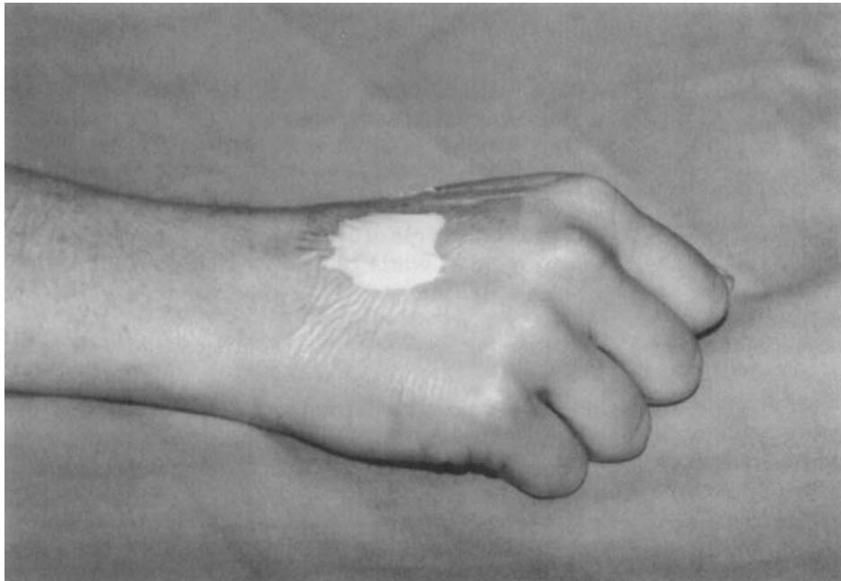

# Eutectic Mixture of Local Anesthetics (EMLA®) Cream

Noor M. Gajraj, FRCA, John H. Pennant, FRCA, and Mehernoor F. Watcha, MD

Department of Anesthesiology and Pain Management, The University of Texas Southwestern Medical School, Dallas, Texas

tion) elicits neural activity from 1) pressure-sensitive Ruffini endings, 2) movement-sensitive hair follicle receptors (Pacinian corpuscles) situated in the dermis, 3) mechanoreceptors innervated by single nerve endings, and 4) polymodal nociceptors situated close to the dermal-epidermal border. The cutaneous pain receptors are of two types—the Aδ type, consisting of fast, myelinated fibers, and the C type receptor, composed of slow, unmyelinated fibers. C fiber receptors are also present in the subcutaneous tissue and in the vascular walls. Local anesthetics act by blocking impulses from these receptors. When a needle is inserted through skin that has been infiltrated with local anesthetic, patients may feel needle movement but not pain, suggesting that pain on needle insertion originates from the deeper receptors (single nerve endings) and not the more superficial mechanoreceptors.

Many attempts have been made to produce local analgesia and to allow painless venipuncture by the topical application of drugs. Topical 40% lidocaine or 20% benzocaine have been employed, but their use has been limited by concerns about local irritation, systemic toxicity, and inadequate analgesia (1). With the advent of eutectic mixture of local anesthetics (EMLA®; Astra Pharmaceutical Products Inc., Westborough, MA), effective topical analgesia of intact skin is now feasible without the need for subcutaneous injections or exposure to high concentrations of local anesthetics. In countries in which it has been available for some time, it is claimed that intravenous induction has gradually become the technique of choice for pediatric patients (Meusing AEE. Induction techniques. Society for Pediatric Anesthesia 6th Annual Meeting, New Orleans 1992). With the recent introduction of EMLA® into the United States, it is appropriate to review its pharmacology, efficacy, clinical uses, side effects, and" contraindications.

## Factors Affecting Skin Penetration by Local Anesthetics

The keratinized layer of the skin provides an effective barrier to diffusion of topical drugs, including local anesthetics, making it difficult to achieve anesthesia of intact skin by topical application. Local anesthetics of the amide type are available in two forms—as a watersoluble salt and a less water-soluble uncharged base. The water-soluble salt dissociates into electrically charged cations and anions, leaving a small fraction as uncharged base. The concentrations of the charged and uncharged forms are dependent on the pK, a constant for each drug, and on the tissue pH. The uncharged base form penetrates and diffuses through the skin, whereas the cation blocks impulse transmission at the nerves. A high concentration of the aqueous base is therefore necessary for penetration of the local anesthetic through intact skin. This may be associated with increased risks of toxicity, particularly if large surface areas are exposed to the drug.

The uncharged base form of many local anesthetics is also very soluble in alcohol. Alcohol solutions and sprays are often used to deliver high concentrations of local anesthetics onto mucous membranes. After the alcohol has evaporated, the local anesthetic diffuses through the membrane to provide analgesia. However, the absence of water makes these alcohol solutions ineffective in penetrating the stratum corneum of intact skin.

The base form of amide anesthetics is also freely soluble in oils. If the lidocaine base is dissolved in oil and an emulsifier added, the oil-in-water emulsion has a high concentration of the active base (up to 20%) in the emulsified droplets, which contain more than 90% water (2).

## EMLA®

The next major step in pharmaceutical research on topical drugs came with a serendipitous discovery that a specific mixture of crystalline bases of lidocaine and prilocaine had a lower melting point than the melting point of the individual drugs (3,4). This combination is termed a eutectic mixture, and such a combination of local anesthetics is a liquid at room temperature and the individual components are crystalline solids.

Table 1. Composition of 1 g of EMLA® Cream
<table><tr><td>Composition</td><td>Amount (mg)</td></tr><tr><td>Lidocaine</td><td>25</td></tr><tr><td>Prilocaine</td><td>25</td></tr><tr><td>Arlactone 289®</td><td>19</td></tr><tr><td>Carbopol 934®</td><td>10</td></tr><tr><td>Sodium hydroxide to pH 9.6 Purified water to produce 1g</td><td></td></tr></table>

EMLA® = eutectic mixture of local anesthetics.

The most favorable conditions for a lowering of the melting point occurred when a 1:1 mixture of lidocaine and prilocaine was used. With the addition of an emulsifier, droplets of this eutectic mixture would contain the active base in concentrations up to 80%. This high concentration of active base along with the small and relatively uniform droplet diameter of 1 μm are factors promoting skin penetration. Finally, drugs that have been dissolved in oil before an oil-in-water emulsion is made have a tendency to adhere to the oil phase and consequently have a decreased penetration. Because the active drugs in the eutectic mixture are in the liquid phase, the release rate should be favorable. This was confirmed in tests involving a silicone membrane system (5,6).

Thus, ideal circumstances for skin penetration by the active base are achieved with the EMLA® preparation, viz high concentration gradient, small microdroplet size, and a satisfactory release rate, and the low total concentration of the anesthetics will reduce the risks of toxicity (7). The composition of EMLA® is provided in Table 1. Arlacton® is an emulsifier and Carbopol® a thickening substance that produces a suitable consistency.

## Pharmacology Application

EMLA® cream acts by diffusing through intact skin to block neuronal transmission from dermal receptors. EMLA® is supplied as a 5-g or 30-g tube together with transparent and occlusive Tegaderm® dressings. To be effective, EMLA® must be applied to intact skin at least 1 h before the procedure and covered with an occlusive dressing (Saran® wrap, Tegaderm®). Usually 1-2 g of EMLA® cream are applied per 10 cm² area of skin (Figure 1). A thick deposit is more effective than a thin layer (8). The recommended application areas for infants and children are given in Table 2. Parents of patients, or the patients themselves, can apply the EMLA® at home prior to the medical visit. In infants, toddlers, and some older children it may be necessary to cover the occlusive dressing with a loose bandage to prevent the child from removing it and ingesting the EMLA® cream. An EMLA® patch has been made by modifying a disposable electrocardiograph electrode (9), but this is not commercially available.

The duration of application varies according to the type of procedure being undertaken and the site of application. For example, skin-graft harvesting requires an application time of approximately 2 h, whereas cautery of genital warts can be undertaken after only a 10-min application.

## Absorption

Skin blood flow, epidermal and dermal thickness, duration of application, and the presence of skin pathology are important factors affecting the onset, efficacy, and duration of EMLA® analgesia. Blanching of the skin may be seen after 30 to 60 min, probably due to vasoconstriction. Longer application times may result in erythema due to vasodilation.

Some investigators have studied regional variations in the analgesic efficacy of EMLA® (10). The cream was applied for 30, 60, 90, and 120 min to the forehead, cheek, antecubital fossa, and dorsum of the hand. The cutaneous blood flow on the face was 4–5 times higher than on the other sites. On the forehead, the analgesic efficacy decreased with increasing application time, presumably because of the higher vascular uptake. For all other locations, efficacy increased with increasing application time.

juhlin et al. (11,12) studied the absorption of EMLA® cream by normal and diseased skin in adults. EMLA® was applied for 1-2 h under an occlusive dressing over 25–100 cm² of skin. In normal skin, absorption was also faster on the face than on the upper arm. In the case of skin affected by psoriasis or eczema, absorption was faster, with anesthesia noted in 15 min compared to 60 min in normal skin. However, the duration of anesthesia was shorter (15–30 min). Similar results were noted in children with atopic dermatitis.

Plasma levels of lidocaine and prilocaine in Juhlin et al.'s adult study (11) were much lower than toxic levels. Maximum plasma levels were reached 2–2.5 h after application to the face (mean 150 ng/mL of lidocaine and 58 ng/mL of prilocaine). In pediatric patients, plasma levels following a 2-h application of 10–16 g of EMLA® cream remained well below toxic levels at 2, 3, 4, and 5 h (13). In another study, plasma levels of local anesthetics measured after a 4-h application of 2 g of EMLA® over 16 cm² of skin in children aged 3–12 mo, were less than 150 ng/mL, which is well below toxic levels (14). Plasma levels following application of EMLA® in children less than 3 mo of age also remain low (15). However, methemoglobin concentrations were increased in this patient population. The enzyme capacity for red blood cell methemoglobin reductase in children younger than 3 mo can be overloaded when EMLA® is administered concurrently with other methemoglobin-inducing drugs. This is discussed below in the section on side effects. In summary, absorption of EMLA® from cutaneous sites seems to be low, although there is concern about methemoglobin elevation in young children.

  
Figure 1. Eutectic mixture of local anesthetics (EMLA®) applied to the dorsum of the hand, covered with an occlusive dressing.

Table 2. Maximum Application Areas of EMLA® Cream in Children and Infants
<table><tr><td>Maximum Body weight (kg) area (cm²)</td></tr><tr><td>&lt;10</td></tr><tr><td>100 10-20 600</td></tr><tr><td>&gt;20 2000</td></tr></table>

EMLA® = eutectic mixture of local anesthetics.

## Depth of Penetration

Bjerring and Ardendt-Nielsen (16) studied the depth and duration of analgesia after application of EMLA® . cream for 30, 60, 90, and 120 min at multiple sites on 12 healthy volunteers. After a 60-min application, the pain threshold depth was approximately 3 mm. The maximum depth of analgesia of approximately 5 mm was achieved 30 min after a 90-min application and during the 60-min period after a 120-min application of the cream. In this study, the pain threshold depth increased approximately 30 min before the sensory threshold depth increased. It is postulated that nerve fibers located more deeply in the dermis are blocked sooner than the more superficially located mechanoreceptors. However, in one double-blind placebo-controlled study in adults, EMLA® cream did not effectively reduce the unpleasantness of percutaneous infiltration of lidocaine after a 1-h application (17).

It has been suggested that EMLA® cream is less effective in black patients, possibly because of increased density of the stratum corneum compared to white patients (18).

## Duration of Action

The duration of action of EMLA® is dependent on the dose of cream applied and the duration of contact with skin under the occlusive dressing, with improved pain scores noted with increased application time (19). The minimum effective time for analgesia for venipuncture on the dorsum of the hand was 45 min. However, anesthesia to pinprick increases 30–60 min after removal of the cream from the skin. This suggests continuing penetration of EMLA® from a depot in the superficial layers of the skin, and supports Bjerring and Arendt-Nielsen's findings (16).

## Clinical Uses

## Venipuncture, Venous and Arterial Cannulation

EMLA® is effective in relieving the pain of venipuncture in adults (20,21). Although 45 min has been suggested as the minimum effective onset time for reducing the pain of intravenous cannulation (22), a statistically significant reduction in pain scores has been noted after applying EMLA® for only 5 min (23). If EMLA® is used to anesthetize normal skin prior to blood sampling, the results of the analyses of the blood are not distorted (24). However, the use of EMLA® to prevent the pain of intradermal skin tests reduces the flare response, and may lead to false-negative interpretation of weakly positive tests (25). The addition of nitroglycerine ointment to EMLA® cream increases the ease of venous cannulation by promoting venodilation (26).

The major use of EMLA® will probably continue to be for children. The fear of pain associated with injections and other painful procedures is a major source of concern affecting the physical and mental well-being of children and their families (27,28). The behavioral responses of children when approached by medical personnel carrying needles and syringes makes the overall hospital experience a traumatic one for children, their parents, and also for nurses and other care providers. In addition, movement reactions to anticipated pain by the child can make the procedure technically difficult. EMLA® cream has been shown to decrease the pain associated with venipuncture and venous cannulation in children in several randomized, placebo-controlled, double-blind studies (22,29–35).

Hallén reported a randomized, placebo-controlled, double-blind study in 114 children aged 4–17 yr who assessed pain on venous cannulation using a four-point scale (36). A thick layer of EMLA® or placebo was applied over a suitable vein, usually on the dorsum of the hand. Patients were asked to estimate pain according to a four-point scale: no pain, slight, moderate, or severe pain. The analgesic effect of EMLA® became evident only after a 60-min application. However, in another study of 111 children aged 1–5 yr, the pain of venipuncture was alleviated after a 30-min application of EMLA® (37). Other investigators found EMLA® cream to be as effective as intradermal infiltration of lidocaine in producing analgesia prior to venous cannulation in children aged 7–12 yr (38). Curiously, patient cooperation did not improve with pain-free conditions, emphasizing the significance of the emotional component of anticipated pain in children. In another study, it was noted that although subjective pain scores were significantly lower in unpremedicated children who received EMLA® compared to a placebo cream prior to venous cannulation, plasma catecholamine and arginine vasopressin levels did not differ between the two groups (30). This suggests that anxiety and anticipated pain may have a greater influence on patient behavior than the painful stimulus itself.

In adults, EMLA® has also proved to be more effective than lidocaine infiltration in alleviating the pain associated with radial arterial cannulation (39). The depth of penetration may explain the superiority of EMLA® over lidocaine infiltration. EMLA® may make cannulation easier as the tissue is not distorted as much as when lidocaine is infiltrated.

## Lumbar Puncture and Epidural Injections

In two randomized, placebo-controlled studies, EMLA® alleviated the pain associated with lumbar puncture in children with malignant disease (40,41). Ralston and Head-Rapson (42) compared EMLA® with lidocaine infiltration for insertion of lumbar epidural catheters using a 16-gauge Tuohy needle in laboring women. They noted an application of EMLA® for a minimum of 5 min was as effective as skin and subcutaneous injection of lidocaine, or skin and ligament injections of lidocaine.

## Drug Reservoir Injections

EMLA® has been compared with placebo for reducing the pain associated with subcutaneous drug reservoir injection in children with malignant disease (40,41). This patient population undergoes repeated painful procedures and an effective local anesthetic that can be applied topically would be useful. Children who received EMLA® prior to the painful procedures described above had lower pain scores.

## Other Procedures Involving Needle Insertion

In a placebo-controlled study of patients receiving a retrobulbar injection of local anesthesia for cataract surgery, significantly lower pain scores were recorded in patients treated with EMLA® cream (43). Despite great care in application, the study creams leaked onto the eyes of five patients causing transient stinging, conjunctival congestion and, in one case, possible loss of corneal epithelium. However, uncomplicated cataract surgery was possible in all patients.

Insertion of needles is required for electromyography. EMLA® relieved the pain of electromyography needling in a randomized, placebo-controlled study (44). A 45-min application of EMLA®was effective at the forearm site but not the thenar eminence, a difference that can be explained by the thicker skin at the thenar eminence.

EMLA® also has been used for pediatric renal biopsy (45). In an open, uncontrolled study, eight children had 2.5 g of EMLA® applied to the skin 1 h prior to the biopsy. The skin was incised with a scalpel and the deeper tissues infiltrated with 1% lidocaine. Five children reported no sensation of the initial skin puncture and only one child reported feeling a sharp object.

## Skin Surgery

In an open study of 146 patients Ohlsén et al. (46) reported the successful use of EMLA® cream for skin graft harvesting. The cream was applied for a minimum of 90 min prior to surgery (mean 200 min). The most common site for obtaining a graft was the thigh, and the area of the graft ranged from less than 50 cm² to greater than 700 cm². Measured levels of lidocaine and prilocaine were below toxic levels and there were no systemic side effects. EMLA® cream also has been compared with infiltration of lidocaine for anesthesia for skin graft harvesting from the inner upper arm or thigh (47). When applied for a minimum of 2 h, EMLA® was as effective as infiltration of lidocaine with epinephrine and had the advantage of being painless to administer whereas lidocaine infiltration produced varying amounts of pain. Donor site bleeding was greater in the EMLA® group compared to the lidocaine group. This could be explained by the concomitant use of epinephrine in the lidocaine infiltration group. In addition, it was noted that the return of cutaneous sensation in the EMLA® group was variable, and in a few cases occurred within 10–15 min of the procedure. Therefore, postoperative analgesia may be required at an early stage in this patient population if EMLA® is used.

Superficial skin surgery may be performed following application of EMLA® cream in both children and adults (4,48,49). In children EMLA® has been used for the treatment of molluscum contagiosum (50,51). In a placebo-controlled, double-blind study EMLA® proved to be an effective analgesic after a 15-min application (52). However the proportion of children reporting no pain increased from 36% in the 15-min group to 61% in those patients in whom EMLA® had been applied for 60 min.

The pain associated with argon laser treatment may be reduced by the use of EMLÅ® cream (53). Analgesic efficacy increased with longer application times (60– 120 min). The effect after a 2-h application was similar to that produced by infiltration with lidocaine. EMLA® is also effective for laser treatment of port wine stains (54). In one study of 73 children aged 5–16 yr, pain scores were significantly lower for the EMLA®-treated sites compared to placebo (55).

EMLA® is also an effective analgesic for debridement of leg ulcers (56,57) and for diathermy treatment for facial hirsutism (58). EMLA®-treated patients reported significantly less pain than the placebo group.

## Genitourinary Surgery

EMLA® has been used successfully for cautery of condylomata acuminata in adults (59,60). Analgesia was obtained after 10 min, which agrees with previous observations (61). EMLA® also has been used to provide anesthesia for vulval biopsy (62,63). The application time required for analgesia of the mucosal surface (mean 16 min) was less than that required for analgesia of keratinized skin (mean 22 min), again suggesting that EMLA® penetrates a mucosal surface faster than keratinized epithelium.

Rylander et al. (64) reported a placebo-controlled double-blind study of 80 women with genital condylomata acuminata, in which EMLA® cream provided effective anesthesia after 5–15 min of application time. Another study compared lidocaine infiltration with application of EMLA® for laser surgery of genital warts in men (65). EMLA® was applied to the warts 10 min preoperatively. Although pain was significantly less after application of EMLA® than after infiltration of lidocaine, infiltration anesthesia resulted in better surgical anesthesia than EMLA®, although the difference was small. However, the combined pain scores for application and surgery were significantly less in the ÈMLA® group.

In pediatric outpatients, EMLA® has been used for painless separation of preputial adhesions (66). However, it is less effective than a dorsal nerve of penis block in preventing pain after circumcision (67). The mean duration of action was only 30 min for EMLA® and 6.4 h for the dorsal nerve block using 0.5% bupivacaine. Factors that may be responsible for the short duration of action include a high vascular uptake and rubbing off of the cream after the child awakens. Although concerns of toxicity from rapid absorption from mucosal surfaces have led to a recommendation that EMLA® not be used on these surfaces, there have been several studies of its use in this situation. EMLA®was used in an open pilot study of 10 patients to reduce the pain associated with laser treatment for premalignant conditions of the cervix (68). The differences in pain scores between the EMLA®-treated and control groups were not statistically significant. However, a larger placebocontrolled double-blind study is in progress.

## Ear, Nose, Throat, and Oral Surgery

EMLA® has been used successfully for electrocochleography, myringotomy, and grommet insertion (69–73). For myringotomy, EMLA® was more effective than 5% cocaine.

In the management of otitis externa, EMLA® relieved pain and anesthetized the auditory canal prior to cleaning (74), but its use is limited to those cases without a perforated tympanic membrane. High doses of EMLA® in an ear with a tympanic perforation may result in absorption of large amounts by the middle ear resulting in ototoxicity (75).

In an open study, an EMLA®-cocaine combination was used for manipulation of fractured nasal bones without discomfort in 12 patients (76). A thick layer of EMLA® (60 g) was applied to the skin covering the nose and covered with an occlusive dressing for 1 h. The nasal mucosa was treated with 4 mL of 5% cocaine solution.

Removal of oral arch bars is less painful after EMLA® is applied (77). The nasal mucosa also has been anesthetized using EMLA® prior to fiberoptic endoscopy (78). However, when applied to the mucosa for 3 min, anesthesia with EMLA® was less effective than lidocaine spray or gel. EMLA® also obscures the field of vision during endoscopy and therefore cannot be recommended for this procedure.

Table 3. Uses of EMLA® Cream in Children
<table><tr><td>Use/author/study design</td><td>No. of patients</td><td>Application time (min)</td></tr><tr><td>Venipuncture</td><td></td><td></td></tr><tr><td>Ehrenström Reiz and Reiz (22)/double-blind</td><td>60</td><td>60</td></tr><tr><td>Wahlstedt et al. (32)/double-blind</td><td>60</td><td>60</td></tr><tr><td>Copper et al. (34)/double-blind</td><td>40</td><td>60</td></tr><tr><td>Hellgren et al. (35)/open</td><td>42</td><td>120</td></tr><tr><td>Hallén et al. (36)/double-blind</td><td>114</td><td>60</td></tr><tr><td>Hopkins et al. (37)/double-blind</td><td>111</td><td>30</td></tr><tr><td>Venous cannulation</td><td></td><td></td></tr><tr><td>Dohlwitz and Uppfeldt (33)</td><td>110</td><td>&gt;20</td></tr><tr><td>Maunuksela and Korpela (29)/double-blind</td><td>60</td><td>60</td></tr><tr><td>Manner et al. (30)/double-blind</td><td>40</td><td>65-28</td></tr><tr><td>Hallén and Uppfeldt (31)/double-blind</td><td>111</td><td>60</td></tr><tr><td>Soliman et al. (38)/open</td><td>42</td><td>60</td></tr><tr><td>Lumbar puncture</td><td></td><td></td></tr><tr><td>Halperin et al. (40)/double-blind</td><td>14</td><td>73 (mean)</td></tr><tr><td>Kapelushnik et al. (41)/double-blind Renal biopsy</td><td>28</td><td>45-60</td></tr><tr><td>Ogborn (45)/open</td><td></td><td></td></tr><tr><td>Curettage of molluscum contagiosum</td><td>8</td><td>60</td></tr><tr><td>Rosdahl et al. (50)/double-blind</td><td></td><td></td></tr><tr><td>Wagner and Mensing (51)/open</td><td>55</td><td>60</td></tr><tr><td>de Waard-van der Spek et al. (52)/double-blind</td><td>40</td><td>30</td></tr><tr><td>Laser treatment of port wine stains</td><td>83</td><td>15-60</td></tr><tr><td>Tan and Stafford*(55)/double-blind</td><td></td><td></td></tr><tr><td>Separation of preputial adhesions</td><td>73</td><td>60</td></tr><tr><td></td><td></td><td></td></tr><tr><td>MacKinlay (66)/open</td><td>39</td><td>60</td></tr><tr><td>Postoperative circumcision</td><td></td><td></td></tr><tr><td>Lee and Forrester (67)/open</td><td>20</td><td></td></tr><tr><td>Cutaneous hypersensitivity</td><td></td><td></td></tr><tr><td>Fitzgerald et al. (89)/double-blind</td><td>17</td><td></td></tr></table>

EMLA® = eutectic mixture of local anesthetics.

## Lithotripsy

Extracorporeal shock wave lithotripsy (ESWL) has become generally accepted as the method of choice for removal of most renal stones up to 2 cm in diameter. Bierkens et al. (79) compared EMLA® with placebo during ESWL. Patients in the EMLA® group required less supplementary intravenous fentanyl, although the difference was not statistically significant. Another study compared EMLA® cream with infiltration with 1% lidocaine and epinephrine (80). The two methods of analgesia were equally effective. However, in another placebo-controlled study, EMLA® did not reduce the amount of systemic analgesic compared to placebo during ESWL with the Storz Modulith SL 20 lithotripter (81). The Siemens Lithostar was used in the two previous studies. Therefore, there may be differences between different models of lithotripter in terms of peak positive pressures and wave forms that are reflected in differing analgesic requirements. The pain experienced during ESWL may sometimes be at a level deeper than the skin. Monk et al. (82) showed EMLA® to be effective during treatment with the Dornier HN3 lithotripter. The efficacy however was greater in males.

## Miscellaneous Uses

There are several anecdotal reports of the use of EMLA® for the treatment of postherpetic neuralgia (PHN) (83–85). Stowe et al. (86) reported an open study of 12 patients with refractory PHN in whom 5–10 g EMLA® was applied for 24 h. Mean visual analog pain scores for all patients were significantly improved 6 h after application. Plasma lidocaine and prilocaine concentrations remained well below toxic levels in all patients. Lycka (87) applied 1 to 2 g/cm² overnight to nine patients with PHN for a 2-wk period. Six patients had significant pain relief during the study, and four remained pain-free 2 wk after nightly application of the cream had been stopped. EMLA® may be useful in other chronic pain syndromes although this remains to be investigated.

Honnens de Lichtenberg et al. (80) studied the use of EMLA® cream for anesthesia during vasectomy (88).

Table 4. Uses of EMLA® Cream in Adults
<table><tr><td>Use/author/study design</td><td>No. of patients</td><td>Application time (min)</td></tr><tr><td>Venipuncture</td><td></td><td></td></tr><tr><td>Hallén et al. (20)/double-blind</td><td>40</td><td>60</td></tr><tr><td>Nott and Peacock (23)/double-blind</td><td>120</td><td>5</td></tr><tr><td>Venous cannulation</td><td></td><td></td></tr><tr><td>Maddi et al. (1)/double-blind</td><td>75</td><td>45-60</td></tr><tr><td>Ehrenström Reiz et al. (19)/double-blind Arterial cannulation</td><td>119</td><td>45</td></tr><tr><td>Smith et al. (39)/double-blind Lumbar epidural insertion</td><td>40</td><td>60</td></tr><tr><td>Ralston and Head-Rapson (42)/single-blind Retrobulbar injections</td><td>60</td><td>9.1 (mean)</td></tr><tr><td>Sunderraj et al. (43)/double-blind EMG needling</td><td>115</td><td>60</td></tr><tr><td>Lamarche et al. (44)/double-blind</td><td>34</td><td>45</td></tr><tr><td>Split skin grafts Ohlsén et al. (46)/open</td><td>146</td><td>200 (mean)</td></tr><tr><td>Goodacre et al. (47)/open</td><td>80</td><td>120</td></tr><tr><td>Laser treatment of port wine stains</td><td></td><td></td></tr><tr><td>Ashinoff and Geronemus (54)/open Debridement of leg ulcers</td><td>8</td><td>60</td></tr><tr><td>Holm et al. (56)/double-blind</td><td></td><td></td></tr><tr><td>Diathermy treatment of hirsutism</td><td>80</td><td>30</td></tr><tr><td>Hjorth et al. (58)/double-blind</td><td>21</td><td>60</td></tr><tr><td>Cautery of genital warts</td><td></td><td></td></tr><tr><td>Hallén et al. (59)/open</td><td>108</td><td>30-60</td></tr><tr><td>Ljunghall and Lillieborg (60)/open</td><td>52</td><td>5-10</td></tr><tr><td>Vulval biopsy</td><td></td><td></td></tr><tr><td>Byrne et al. (62)/open</td><td>10</td><td>11-28</td></tr><tr><td>Laser surgery of genital warts</td><td></td><td></td></tr><tr><td>Rylander et al. (64)/double-blind</td><td></td><td></td></tr><tr><td>Lassus et al. (65)/open</td><td>80</td><td>5-15</td></tr><tr><td>Electrocochleography</td><td>100</td><td>10</td></tr><tr><td></td><td></td><td></td></tr><tr><td>Timms et al. (69)/double-blind</td><td>15</td><td>20</td></tr><tr><td>Myringotomy ± grommet insertion</td><td></td><td></td></tr><tr><td>Whittet et al. (70)/open</td><td></td><td></td></tr><tr><td>Bingham et al. (72)/open</td><td>49</td><td>20</td></tr><tr><td>Roberts and Carlin (73)/double-blind</td><td>29</td><td>15</td></tr><tr><td></td><td>20</td><td>30</td></tr><tr><td>Otitis externa</td><td></td><td></td></tr><tr><td>Premachandra (74)/open</td><td>5</td><td>60</td></tr><tr><td>Reduction of nasal fractures</td><td></td><td></td></tr><tr><td>El-Kholy (76)/open</td><td>12</td><td>60</td></tr><tr><td>Lithotripsy</td><td></td><td></td></tr><tr><td>Bierkens et al. (79)/double-blind</td><td>92</td><td>60</td></tr><tr><td>Honnens de Lichtenberg et al. (80)/open</td><td>96</td><td>95-290</td></tr><tr><td>McDonald and Berry (81)/double-blind</td><td>60</td><td>100</td></tr><tr><td>Monk et al. (82)/double-blind</td><td>58</td><td>90</td></tr><tr><td>Vasectomy</td><td></td><td></td></tr><tr><td>Honnens de Lichtenberg et al. (88)/open</td><td>42</td><td>30</td></tr></table>

EMLA® = eutectic mixture of local anesthetics; EMG = electromyography.

Although EMLA® alone was insufficient, it was successful in reducing the pain associated with mepivacaine infiltration.

In the United States, EMLA® is not recommended for use in infants under the age of 1 mo. However, EMLA® has been used elsewhere in premature babies to treat the hypersensitivity to local tissue damage produced by routine heel lances (89). The chronic pain response was reduced successfully.

EMLA® has been used to relieve tourniquet pain during a Bier's block for upper limb surgery (90). Although EMLA® and subcutaneous ring anesthesia provided superior analgesia compared with the control group, both had a limited analgesic effect compared to the double-cuff technique, suggesting that skin compression is only one component of tourniquet pain.

Finally, the response to EMLA® has been used to differentiate between the Ehlers-Danlos syndrome and patients with simple hypermobility (91). Control patients and patients with simple hypermobility did not differ in their response to cutaneous analgesia. The thresholds to cutaneous laser stimulation and the depth of anesthesia were significantly less in the Ehlers-Danlos patients compared to the other two groups.

## Complications

The occlusive dressing and EMLA® cream have been swallowed by children. In one child it was assumed that the upper airway had become anesthetized since it was possible to perform laryngoscopy and tracheal intubation with only a small dose of thiopentone (92). The child continued to breathe spontaneously during tracheal intubation without cough or laryngospasm. Another child "blacked out" for 10–15 s within minutes of licking EMLA® from the back of one hand (93). It is also possible for the cream to be rubbed into the eye. The possibility of toxic blood concentrations in these incidents is a cause for concern and precautions should be taken to ensure that children do not tamper with the dressing.

Local skin reactions, such as pallor, erythema, alterations in temperature sensation, edema, itching, and rash are common following EMLA® application, but generally are mild and transient (2).

Prilocaine may cause methemoglobinemia. Two of its metabolites, 4-hydroxy-2-methylaniline and 2-methylaniline (o-toluidine), have been implicated in this condition. Methemoglobinemia was reported in a 3-mo-old male infant who became cyanosed after 5 g of the cream was applied to the dorsum of the hands and in the antecubital area for a total of 5 h (94). His methemoglobin concentration was 28% although this may have been partly due to concomitant treatment with a sulfonamide drug. Engberg et al. (14) measured plasma lidocaine, prilocaine, and methemoglobin levels in 22 infants aged 3–12 mo after application of 2 g of EMLA® beneath an occlusive dressing. Methemoglobin levels all remained within the normal range.

Other investigators also measured plasma levels of lidocaine, prilocaine, and methemoglobin in infants less than 3 mo of age (15). In addition they studied the activity of methemoglobin reductase, the enzyme responsible for converting methemoglobin back to hemoglobin. A small increase in methemoglobin levels which inversely correlated with methemoglobin reductase activity was found. Although the maximum methemoglobin levels (median 2.24%) were not clinically significant, caution is advised in this age group. Small but significant increases in methemoglobin concentrations have been found in children aged 1–6 yr following routine administration of 5 g of EMLA®cream (95). Although the peak methemoglobin concentration observed was well within safe limits, the finding of an increased concentration 24 h later suggests that cumulative effects may occur in children receiving the cream daily.

## Contraindications and Precautions

EMLA® cream should not be used in those rare patients with congenital or idiopathic methemoglobinemia, or in infants under the age of 12 mo who are receiving treatment with methemoglobin-inducing drugs. Patients taking drugs associated with methemoglobinemia (e.g., sulfonamides, acetaminophen, nitroglycerine, nitroprusside, and phenytoin) are at greater risk of developing methemoglobinemia if concurrently treated with EMLA® cream.

EMLA® currently is not recommended for use on the mucous membranes because of the faster absorption of lidocaine and prilocaine than through intact skin (96). Similarly, EMLA® is not recommended for skin wounds; there is evidence that the risk of wound infection may be increased (97). There are also concerns regarding its effect on wound healing although a study using a rat model failed to demonstrate an adverse outcome (98).

EMLA® is contraindicated in patients with a known history of sensitivity to local anesthetics of the amide type or to any other component of the product. EMLA® should be used with caution in patients receiving Class I antiarrhythmic drugs (e.g., tocainide, mexiletine) because the toxic effects are additive and potentially synergistic.

## Conclusion

EMLA® cream is a safe, effective topical anesthetic for use in a variety of clinical settings in both children and adults (Tables 3 and 4). It is particularly useful for venipuncture and venous cannulation in the pediatric population. However, it is also effective in decreasing pain during myringotomy placement, minor skin surgery, lumbar puncture, and radial artery cannulation. Nevertheless, EMLA® has a limited depth of penetration. Research should be directed to finding newer drugs that penetrate skin more quickly and to a greater depth. In addition, newer drugs should not affect methemoglobin reductase and thus be useful in neonates and infants.

## References

1. Maddi R, Horrow JC, Mark JB, et al. Evaluation of a new cutaneous topical anesthesia preparation. Reg Anaesth 1990;15: 109-12.

2. Evers H, Von Dardel O, Juhlin L, et al. Dermal effects of compositions based on the eutectic mixture of lignocaine and prilocaine (EMLA). Studies in volunteers. Br J Anaesth 1985;57: 997-1005.

3. Brodin A, Nyqvist-Mayer A, Wadsten T, et al. Phase diagram and aqueous solubility of the lidocaine-prilocaine binary system. J Pharm Sci 1984;73:481-4.

4. Juhlin L, Evers H, Broberg F. A lidocaine-prilocaine cream for superficial skin surgery and painful lesions. Acta Derm Venereol (Stockh) 1980;60:544–6.

5. Nyqvist-Mayer AA, Brodin AF, Frank SG. Phase distribution studies on an oil-water emulsion based on a eutectic mixture of lidocaine and prilocaine as the dispersed phase. J Pharm Sci 1985; 74:1192–5.

6. Nyquist-Mayer A, Brodin A, Franks S. Drug release studies on an oil-water emulsion based on a eutectic mixture of lidocaine and prilocaine as the dispersed phase. J Pharm Sci 1986;75:365–73.

7. juhlin L, Evers H. EMLA: a new topical anesthetic. Adv Dermatol 1990;5:75–92.

8. Sims C. Thickly and thinly applied lignocaine-prilocaine cream prior to venipuncture in children. Anaesth Intensive Care 1991; 19:343-5.

9. Anwari JS, Nott MR. Disposable EMLA patches [letter]. Anaesthesia 1992;47:448.

10. Arendt-Nielsen L, Bjerring P, Nielsen J. Regional variations in analgesic efficacy of EMLA cream. Acta Derm Venereol (Stockh) 1990;70:314–18.

11. Juhlin L, Hagglund G, Evers H. Absorption of lidocaine and prilocaine after application of a eutectic mixture of local anesthetics (EMLA) on normal and diseased skin. Acta Derm Venereol (Stockh) 1989;69:18–22.

12. Juhlin L, Rollman O. Vascular effects of a local anesthetic mixture in atopic dermatitis. Acta Derm Venereol (Stockh) 1984;64: 439-40.

13. Haugstvedt S, Friman AM, Danielson K. Plasma concentrations of lidocaine and prilocaine and analgesic effect after dermal application of EMLA cream 5% for surgical removal of molluscum in children. Z Kinderchir 1990;45:148–50.

14. Engberg G, Danielson K, Henneberg S, Nilsson A. Plasma concentrations of prilocaine and lidocaine and methaemoglobin formation in infants after epicutaneous application of a 5% lidocaine-prilocaine cream (EMLA). Acta Anaesthesiol Scand 1987;31:624-8.

15. Nilsson A, Engberg G, Henneberg S, et al. Inverse relationship between age-dependent erythrocyte activity of methaemoglobin reductase and prilocaine-induced methaemoglobinaemia during infancy. Br J Anaesth 1990;64:72–6.

16. Bjerring P, Ardendt-Nielsen L. Depth and duration of skin analgesia to needle insertion after topical application of EMLA cream. Br J Anaesth 1990;64:173–7.

17. Jones SK, Handfield-Jones S, Kennedy CTC. Does EMLA reduce the discomfort associated with local-anaesthetic infiltration? Clin Exp Dermatol 1990;15:177–9.

18. Hymes JA, Spraker MK. Racial differences in the effectiveness of a topically applied mixture of local anesthetics. Reg Anaesth 1986;11:11–13.

19. Ehrenström Reiz G, Reiz S, Stockman O. Topical anaesthesia with EMLA, a new lidocaine-prilocaine cream and the Cusum technique for detection of minimal application time. Acta Anaesthesiol Scand 1983;27:510–12.

20. Hallén B, Carlsson P, Uppfeldt A. Clinical study of a lidocaineprilocaine cream to relieve the pain of venipuncture. Br J Anaesth 1985;57:326–8.

21. Wehle B, Bjornstrom M, Cedgard M, et al. Repeated application of EMLA cream 5% for the alleviation of cannulation pain in haemodialysis. Scand J Urol Nephrol 1989;23:299–302.

22. Ehrenström Reiz GME, Reiz SLÀ. EMLA—a eutectic mixture of local anaesthetics for topical anaesthesia. Acta Anaesthesiol Scand 1982;26:596–8.

23. Nott MR, Peacock JL. Relief of injection pain in adults. EMLA cream for 5 minutes before venepuncture. Anaesthesia 1990;45: 772-4.

24. Amdisen A, Glud V. No influence from topical application of EMLA cream before blood sampling on routine clinical chemistry and haematology measurements. Eur J Clin Pharmacol 1991; 41:619-20.

25. Simons FER, Gillespie CA, Simons KJ. Local anaesthetic creams and intradermal skin tests [letter]. Lancet 1992;339:1351-2.

26. Teillol-Foo WLM, Kassab JY. Topical glyceryl trinitrate and eutectic mixture of local anaesthetics in children. A randomised controlled trial on choice of site and ease of venous cannulation. Anaesthesia 1991;46:881-4.

27. Blom GE. The reactions of hospitalized children to illness. Pediatrics 1958;22:590–600.

28. Venham L, Bengston D, Cipes M. Children's response to sequential dental visits. J Dent Res 1977;56:454–9.

29. Maunuksela E-L, Korpela R. Double-blind evaluation of a lignocaine-prilocaine cream (EMLA) in children. Effect on the pain associated with venous cannulation. Br J Anaesth 1986;58: 1242-5.

30. Manner T, Kanto J, Iisalo E, et al. Reduction of pain at venous cannulation in children with a eutectic mixture of lidocaine and prilocaine (EMLA cream): comparison with placebo cream and no local premedication. Acta Anaesthesiol Scand 1987;31:735–9.

31. Hallén B, Uppfeldt A. Does lidocaine-prilocaine cream permit painfree insertion of IV catheters in children? Anesthesiology 1982;57:340-2.

32. Wahlstedt C, Kollberg H, Möller C, Uppfeldt A. Lidocaineprilocaine cream reduces venepuncture pain. Lancet 1984;ii:106.

33. Dohlwitz A, Uppfeldt A. Schmerzlinderung bei Venenpunktion. Anaesthesist 1985;34:355–8.

34. Cooper CM, Gerrish SP, Hardwick M, Kay R. EMLA cream reduces the pain of venipuncture in children. Eur J Anaesthesiol 1987;4:441–8.

35. Hellgren U, Kihamia CM, Premji Z, Danielson K. Local anaesthetic cream for the alleviation of pain during venepuncture in Tanzanian schoolchildren. Br J Clin Pharmacol 1989;28:205–6.

36. Hallén B, Olsson GL, Uppfeldt A. Pain-free venipuncture. Effect of timing of application of local anaesthetic cream. Anaesthesia 1984;39:969–72.

37. Hopkins CS, Buckley CJ, Bush GH. Pain-free injection in infants. Use of a lignocaine-prilocaine cream to prevent pain at intravenous induction of general anaesthesia in 1–5 year-old children. Anaesthesia 1988;43:198–201.

38. Soliman IE, Broadman LM, Hannallah RS, McGill WA. Comparison of the analgesic effects of EMLA (eurectic mixture of local anesthetics) to intradermal lidocaine infiltration prior to venous cannulation in unpremedicated children. Anesthesiology 1988; 68:804-6.

39. Smith M, Gray BM, Ingram S, Jewkes DA. Double-blind comparison of topical lignocaine-prilocaine cream (EMLA) and lignocaine infiltration for arterial cannulation in adults. Br J Anaesth 1990;65:240–2.

40. Halperin DL, Koren G, Attias D, et al. Topical skin anesthesia for venous, subcutaneous drug reservoir and lumbar punctures in children. Pediatrics 1989;84:281-4.

41. Kapelushnik J, Koren G, Solh H, et al. Evaluating the efficacy in alleviating pain associated with lumbar puncture; comparison of open and double-blinded protocols in children. Pain 1990; 42:31-4.

42. Ralston SJ, Head-Rapson AG. Use of EMLA cream for skin anaesthesia prior to extradural insertion in labour. Anaesthesia 1993;48:65–7.

43. Sunderraj P, Kirby J, Joyce PW, Watson A. A doubled-masked evaluation of lignocaine-prilocaine cream (EMLA) used to alleviate the pain of retrobulbar injection. Br J Ophthalmol 1991;75: 130-2.

44. Lamarche Y, Lebel M, Martin R. EMLA partially relieves the pain of EMG needling. Can J Anaesth 1992;39:805–8.

45. Ogborn MR. The use of a eutectic mixture of local anesthetic in pediatric renal biopsy. Pediatr Nephrol 1992;6:276–7.

46. Ohlsén L, Englesson S, Evers H. An anaesthetic lidocaine/ prilocaine cream (EMLA) for epicutaneous application tested for cutting split skin grafts. Scand J Plast Reconstr Surg 1985;19: 201-9.

47. Goodacre TEE, Sanders R, Watts DA, Stoker M. Split skin grafting using topical local anaesthesia (EMLA): a comparison with infiltrated anaesthesia. Br J Plast Surg 1988;41:533–8.

48. de Waard-van der Spek FB, van den Berg GM, Oranje AP. EMLA cream: an improved local anesthetic. Review of current literature. Pediatr Dermatol 1992;9:126–31.

49. Lycka BAS. EMLA: a new and effective topical anesthetic. J Dermatol Surg Oncol 1992;18:859–62.

50. Rosdahl I, Edmar B, Gisslén H, et al. Curettage of molluscum contagiosum in children: analgesia by topical application of a lidocaine/prilocaine cream (EMLA). Acta Derm Venereol (Stockh) 1988;68:149–53.

51. Wagner G, Mensing H. Perkutane Anaesthesie durch Anwendung einer Lidocain-Prilocain-Creme (EMLA-Creme 5%) Erfahrungen bei der Therapie multipeler Mollusca contagiosa im Kindesalter. Acta Derm Venereol (Stockh) 1989;15:44–6.

52. de Waard-van der Spek FB, Oranje AP, Lillieborg S, et al. Treatment of molluscum contagiosum using a lidocaine/prilocaine cream (EMLA) for analgesia. JAm Acad Dermatol 1990;23:685–8.

53. Arendt-Nielsen L, Bjerring P. Laser-induced pain for evaluation of local analgesia: a comparison of topical application (EMLA) and local injections (lidocaine). Anesth Analg 1988;67:115–23.

54. Ashinoff R, Geronemus RG. Effect of the topical anesthetic EMLA on the efficacy of pulsed dye laser treatment of port-wine stains. J Dermatol Surg Oncol 1990;16:1008–11.

55. Tan OT, Stafford TJ. EMLA for laser treatment of portwine stains in children. Lasers Surg Med 1992;12:543–8.

56. Holm J, Andrén B, Grafford K. Pain control in the surgical debridement of leg ulcers by the use of a topical lidocaineprilocaine cream, EMLA. Acta Derm Venereol (Stockh) 1990;70: 132-6.

57. Enander Malmros I, Nilsen T, Lillieborg S. Plasma concentrations and analgesic effect of EMLA (lidocaine/prilocaine) cream for the cleansing of leg ulcers. Acta Derm Venereol (Stockh) 1990; 70:227-30.

58. Hjorth N, Harring M, Hahn A. Epilation of upper lip hirsutism with a eutectic mixture of lidocaine and prilocaine used as a topical anesthetic. J Am Acad Dermatol 1991;25:809–11.

59. Hallén A, Ljunghall K, Wallin J. Topical anaesthesia with local anaesthesia (lidocaine and prilocaine, EMLA) cream for cautery of genital warts. Genitourin Med 1987;63:316–19.

60. Ljunghall K, Lillieborg S. Local anaesthesia with a lidocaine/ prilocaine cream (EMLA) for cautery of condylomata acuminata on the vulval mucosa. The effect of timing of application of the cream. Acta Derm Venereol (Stockh) 1989;69:362–6.

61. Holst A, Evers H. Experimental studies of new topical anaesthetics on the oral mucosa. Swed Dent J 1985;9:185–93.

62. Byrne MA, Taylor-Robinson D, Pryce D, Harris JRW. Topical anaesthesia with lidocaine-prilocaine cream for vulval biopsy. Br J Obstet Gynaecol 1989;96:497–9.

63. Ljunghali K, Rylander E, Sjöberg I, Lillieborg S. Topical anaesthesia with lidocaine-prilocaine cream for vulval biopsy [letter] Br J Obstet Gynaecol 1990;97:864–5.

64. Rylander E, Sjöberg I, Lillieborg S, Stockman O. Local anesthesia of the genital mucosa with a lidocaine/prilocaine cream (EMLA) for laser treatment of condylomata acuminata: a placebocontrolled study. Obstet Gynecol 1990;75:302–6.

65. Lassus A, Kartamaa M, Happonen H-P. A comparative study of topical analgesia with a lidocaine/prilocaine cream (EMLA) and infiltration anesthesia for laser surgery of genital warts in men. Sex Transm Dis 1990;17:130–2.

66. MacKinlay GA. Save the prepuce. Painless separation of preputial adhesions in the outpatient clinic. Br Med J 1988;297:590–1.

67. Lee JJ, Forrester P. EMLA for postoperative analgesia for day case circumcision in children. A comparison with dorsal nerve of penis block. Anaesthesia 1992;47:1081–1083.

68. Sarkar PK. Topical anaesthesia with lignocaine-prilocaine cream (EMLA) for carbon dioxide treatment to the cervix—a pilot study. Br J Clin Pract 1990;44:352–3.

69. Timms MS, O'Malley S, Keith AO. Experience with a new topical anaesthetic in otology. Clin Otolaryngol 1988;13:485–90.

70. Whittet HB, Williams HO, Wright A. An evaluation of topical anaesthesia for myringotomy. Clin Otolaryngol 1988;13:481–4.

71. Summerfield MJ, White PS. Ventilation tube insertion using topical anaesthesia in children. J Laryngol Otol 1992;106:427–8.

72. Bingham B, Hawke M, Halik J. The safety and efficacy of EMLA cream topical anesthesia for myringotomy and ventilation tube insertion. J Otolaryngol 1991;20:193–5.

73. Roberts C, Carlin WV. A comparison of topical EMLA cream and prilocaine injection for anaesthesia of the tympanic membrane in adults. Acta Otolaryngol 1989;108:431–3.

74. Premachandra DJ. Use of EMLA cream as an analgesic in the management of painful otitis externa. J Laryngol Otol 1990;104: 887-8.

75. Anniko M, Schmidt S-H. The ototoxic potential of EMLA. Acta Otolaryngol (Stockh) 1988;105:255–65.

76. El-Kholy"A. Manipulation of the fractured nose using topical local anaesthesia. J Laryngol Otol 1989;103:580–1.

77. Pere P, Iizuka T, Rosenberğ PH, Lindqvist C. Topical application of 5% eutectic mixture of ignocaine and prilocãine (EMLA) before removal of arch bars. Br J Oral Mâxillofac Surg 1992;30: 153-6.

78. Randell T, Yli-Hankala A, Valli H, Lindgren L. Topical anaesthesia of the nasal mucosa for fibreoptic airway endoscopy. Br J Anaesth 1992;68:164-7.

79. Bierkens AF, Maes RM, Hendrikx AJM, et al. The use of local anesthesia in second generation extracorporeal shock wave lithotripsy: eutectic mixture of local anesthetics. J Urol 1991;146: 287-9.

80. Honnens de Lichtenberg M, Miskowiak J, Mogensen P, Andersen JT. Local anesthesia for extracorporeal shock wave lithotripsy: a study comparing eutectic mixture of local anesthetics cream and lidocaine infiltration. J Urol 1992;147:96–7.

81. McDonald PF, Berry AM. Topical anaesthesia for extracorporeal shock wave lithotripsy. Br J Anaesth 1992;69:399–400.

82. Monk TG, Ding Y, White PF. Analgesic efficacy of EMLA during outpatient shock-wave lithotripsy [abstract]. Anesth Analg 1992; 74:S213.

83. Wheeler JG. EMLA cream and herpetic neuralgia [letter]. Med J Aust 1991;154:781.

84. Collins PD. EMLA cream and herpetic neuralgia [letter]. Med J Aust 1991;155:206–7.

85. Milligan KA, Atkinson RE, Schofield PA. Lidocaine-prilocaine cream in postherpetic neuralgia. Br Med J 1989;298:253.

86. Stowe PJ, Glynn C, Minor BČ. A study to explore the effect of EMLA cream in postherpetic neuralgia. Pain 1989;39:301–5.

87. Lycka B. Medical indications for using a topical anesthetic. Perspect Pain Manag 1991;1:9–12.

88. Honnens de Lichtenberg M, Krogh J, Rye B, Miskowiak J. Topical anesthesia with eutectic mixture of local anesthetics cream in vasectomy: 2 randomized trials. J Urol 1992;147:98–9.

89. Fitzgerald M, Millard C, McIntosh N. Cutaneous hypersensitivity following peripheral tissue damage in newborn infants and its reversal with topical anaesthesia. Pain 1989;39:31-6.

90. Tsai Y-C, Lai Y-Y, Chang C-L. Comparison of the effect of EMLA cream, subcutaneous ring anaesthesia and a double cuff technique in the prevention of tourniquet pain. Br J Anaesth 1993; 70:394–6.

91. Arendt-Nielsen L, Kaalund S, Högsaa B, et al. The response to local anaesthetics (EMLA-cream) as a clinical test to diagnose between hypermobility and Ehlers-Danlos type III syndrome. Scand J Rheumatol 1991;20:190–5.

92. Norman J, Jones PL. Complications of the use of EMLA [letter]. Anaesthesia 1990;64:403.

93. James IG. EMLA: complications [letter]. Br J Anaesth 1990;65:295.

94. Jakobson B, Nilsson A. Methemoglobinaemia associated with a prilocaine-lidocaine cream and trimetoprim-sulphamethoxazole. A case report. Acta Anaesthesiol Scand 1985;29:453–5.

95. Frayling IM, Addison GM, Chattergee K, Meakin G. Methaemoglobinaemia in children treated with prilocaine-lignocaine cream. Br Med J 1990;301:153–4.

96. Haasio J, Jokinen T, Numminen M, Rosenberg PH. Topical anaesthesia of gingival mucosa by 5% eutectic mixture of lignocaine and prilocāine or by 10% lignocaine spray. Br J Oral Maxillofac Surg 1990;28:99–101.

97. Powell DM, Rodeheaver GT, Foresman PA, et al. Damage to tissue defenses by EMLA cream. J Emerg Med 1991;9:205–9.

98. Nykanen D, Kissoon N, Rieder M, Armstrong R. Comparison of a topical mixture of lidocaine and prilocaine (EMLA) versus 1% lidocaine on wound healing. Pediatr Emerg Care 1991;7:15–7.