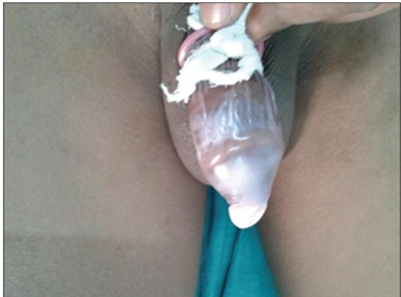
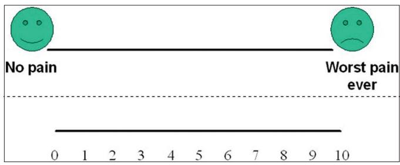
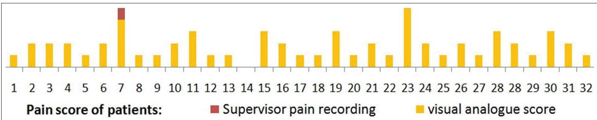

# Meatotomy using topical anesthesia: A painless option

Vinod Priyadarshi, Anurag Puri, Jitendra Pratap Singh, Shwetank Mishra, Dilip Kumar Pal, Anup Kumar Kundu

Department of Urology, IPGMER and SSKM Hospital, Kolkata, West Bengal, India

## Abstract

Aim: Urethral meatotomy is an office procedure often done under local anesthesia with or without penile block or under short general anesthesia. Whatever may be the method, the patient has to bear the pain of injection. To avoid painful injections, in the present study, topical anesthesia in the form of eutectic mixture of prilocaine and lidocaine anesthetics (EMLA/Prilox) has been used to perform such procedures and its effectiveness determined. Materials and Methods: A total of 48 consecutive patients with meatal stenosis who attended urology outdoor were enrolled in this study. After exclusion, in 32 patients, 3-4 g of Prilox cream was applied over the glans and occlusive covering was maintained for 45 min before the procedure. Meatotomy was done in a standard manner with hemostat application at the stenosed segment for 2-3 min followed by ventral incision at meatus. The patient’s pain perception was measured using visual analog score. Results: Out of 32, only one patient that had inappropriate application of cream, had a perception of pain during the procedure. Rest all the patient had no discomfort during the procedure. Mean visual analog score was 1.8 which is not a significant percepted pain level. No patient had any major complication. Conclusion: Use of topical anesthesia in form of Prilox (EMLA) cream for meatotomy is safe and effective method that avoids painful injections and anxiety related to it and should be considered in most of such patients as an alternative of conventional penile blocks or general anesthesia.

Key Words: Eutectic mixture of local anesthetics, local anesthesia, meatal stenosis, meatotomy, topical anesthesia

Address for correspondence:

Dr. Vinod Priyadarshi, Department of Urology, IPGMER and SSKM Hospital, West Bengal, India. E‑mail: vinod\_priyadarshi@yahoo.com Received: 20.01.2014, Accepted: 11.02.2014

## INTRODUCTION

Stenosis of external urethral meatus (meatal stenosis) is traditionally treated by meatotomy which involves a simple ventral incision to open the meatus.[1] It is a minor office procedure often done under local anesthesia with or without penile block or under short general anesthesia. Regional and general anesthesia have always their vested complications along with them and an infiltration of local anesthesia, itself having several drawbacks. Injections of local anesthetics are often painful by themselves. They may worsen needle anxiety and increase the pain perception. Moreover, they may cause bleeding and distortion of the surgical area with development of local edema or hematoma and there is always a risk of inadvertent intravascular injection, especially when large amount of anesthetic solution is used.[2] For small procedures like meatotomy, application of topical anesthetic creams is another option to achieve local anesthesia without pricking a needle. Therefore, to avoid painful injections, in the present study, topical anesthesia in form of eutectic mixture of prilocaine and lidocaine; eutectic mixture of local anesthetics (EMLA/Prilox) has been used to perform such procedures and its effectiveness determined.

<table><tr><td colspan="2">Access this article online</td></tr><tr><td>Quick Response Code:</td><td>Website:</td></tr><tr><td rowspan="3"></td><td>www.urologyannals.com</td></tr><tr><td>DOI:</td></tr><tr><td>10.4103/0974-7796.148622</td></tr></table>

## MATERIALS AND METHODS

A total of 48 consecutive patients of meatal stenosis who attended urology outdoor were enrolled in this study. Seven boys, who were less than 5 years of age, four patients with associated anterior urethral stricture and three patients who had erosions at glans or meatus, were excluded from the study. Two patients, who had associated phimosis and underwent circumcision along with meatotomy, were also not considered for the study. Rest all (32) the patients underwent meatotomy as an office procedure under application of topical anesthesia (Prilox). In each case, 3-4 g of Prilox cream (2.5% lidocain and 2.5% prilocain, Neon Laboratories Ltd.) was applied directly over the glans and secured with a condom as an occlusive covering that was maintained for 45 min before the procedure [Figure 1]. After taking the patient on to the operation table, occlusive dressing was removed, Prilox cream was wiped away and the penis was prepared with antiseptic. Meatotomy was done in a standard manner with ventral midline application of hemostat at the stenosed segment up to a few millimeters down from the meatus for 1‑2 min followed by ventral midline incision along the crushed segment. Hemostatic sutures were applied to anchor the urethral mucosa at the meatal lips. After completion of procedure, antibiotic dressing was done and 10 mg/kg ibuprofen was given to continue analgesia in the post‑operative period.

Adequacy of local anesthesia was checked in each case with a tooth forceps before crushing or incising the tissue. Injectable local anesthesia in form of 2% lignocain was always kept ready to supplement, in case of insufficient anesthesia, though it was never required. During the procedure, the patient’s pain perception was noted by a single supervisor based on visible signs and recorded as “Painless” for the patient who has no signs of pain and remained quiet and relaxed, as for “Possible pain”, the patient has signs of discomfort such as facial muscle tension, increased tone, flexion of finger and toes, occasional restless movement or shifting position and if “Painful”, the patient shows frequent restless movements or frowning or cry or moan during the procedure.

  
Figure 1: Prilox cream applied over glans and covered with a condom as an occlusive dressing

After the completion of the procedure, the patient’s pain perspective was again recorded using visual analog score by asking him to mark over the horizontal line drawn over one side of the paper depicting “no pain” and “worst ever pain” on either end, while on the flip side having parallel similar line marked as numbered scale from 0 to 10 [Figure 2] which was kept out of patient’s view.

## RESULTS

Most of the patient in this study were children and the mean patient age was 13.4 years (range = 5.5‑36 years). Twenty two patients had their age in between 5 and 12 while the rest were more than 12 years of age. Mean operative time for meatotomy was 7.5 min (standard deviation [SD] =1.5 min). Out of 32 patients who underwent meatotomy, only one patient (7th in number) had a perception of pain which was recorded as “possible pain” by the expert supervisor while suturing the urethral edge. It was found that the condom occlusive dressing in this patient was slipped after application while he was moving and it was readjusted after 20 min of application. Presuming inappropriate application of cream as the possible cause, all successive patients were asked to lie down during the contact period of 45 min. The rest of the patients had no discomfort during the procedure. The comments from the patients regarding their pain experience during the procedure were taken just after completion of the procedure. Mean visual analog score was 1.8 (SD = 0.7) which implies it as almost painless [Figure 3]. Even the patient, who had a perception of pain, marked a score of 4, which means pain in the procedure was significantly low, though it was there.

None were recorded to have any major complication. However two patients complained of penile numbness for as long as 24 h.

## DISCUSSION

Meatal stenosis most commonly occurs due to recurring meatitis and local irritation at the junction of the glans epithelium and urethral mucosa. Denudation of epithelium and side‑to‑side adherence most commonly starts ventrally and extends toward the glans tip. This decrease in caliber leads to diminished urinary stream and strenuous voiding which further causes cracking of the meatal edges and meatitis, resulting in dysuria and this vicious circle continues.[3] The most definitive treatment for symptomatic meatal stenosis is to incise the meatus ventrally to establish a normal aperture.[1,3]

  
Figure 2: Visual analog scale

  
Figure 3: Visual analog score of all the patients

Over the period, meatotomy has evolved as an office procedure often done under local anesthesia with or without penile block or under short general anesthesia, especially in pediatric population. Though avoidance of general anesthesia is usually preferred due to its hazards,[3] infiltration of local anesthesia itself is a painful procedure.[1,2] Not only it causes anxiety and discomfort due to needle prick at glans, infiltration of anesthetics may also lead to bleeding, hematoma or edema that may distort the surgical site and affects the desirable outcome.[2] Apart from this, there always remains a risk of accidental intravascular injection and its systemic complications.[2,4]

In comparison, application of topical anesthetics in cream form is simple, straight forward and does not causes anatomic distortion or any pain and as such, the patient’s anxiety and fear about the procedure are alleviated.[2,5] Topical anesthetics were developed in the latter half of the 19th century, starting with a description of the topical uses for cocaine by   Koller et al.[5] but soon, it became out of favor due to its suspected cardiac toxicity and local irritation.[6] In search of an effective as well as safe alternative, several other drugs such as lidocaine, bupivacaine, tetracaine, pramoxine, dibucaine, benzocaine and their combinations, with or without adrenalin, have been tried with promising results.[5,6]

Prilox (better known as EMLA) cream is an emulsion in which oil phase is a eutectic mixture of lidocaine (25 mg/mL) and prilocaine (25 mg/mL) along with a thickener, an emulsifier and distilled water adjusted to a pH level of 9.4.[7] Being an eutectic mixture, melting point of the preparation is lower than the room temperature, allowing both anesthetics to exist as liquids rather than as crystals form and the presence of polyoxyethylene fatty acid emulsifier enhances the absorption of the product through the intact skin. As such, though the true concentration of anesthetic is only 5% and hence a lower risk of systemic toxicity, the cream has greater potency due to the emulsified oil droplets.[5] It should be applied over skin surface as a thick layer (1‑2 g/10 cm2, up to a maximal dose of 10 g).[7] Occlusion and longer duration of the application increases its penetration through stratum corneum and thus accentuates its efficacy.[5,7,8] Anesthetic effect has been shown to reach a maximal depth of 3 mm after a 60‑min application and 5 mm after a 120‑min application[9] though mucosa and skin with thin or no stratum corneum, absorb anesthesia more readily.[5]

First use of EMLA cream in office meatotomy was reported by Cartwright et al.[1] who used it as the only anesthetic in 58 children with meatal stenosis and found only three of them had some discomfort due to technically inappropriate application. Though they described it simple, successful and cost‑effective in comparison to lidocain intradermal injections, there was no focus on pain in their study. Simultaneously, some other authors like Benini et al. who used EMLA in the circumcision of newborns, found that pain was substantially decreased in comparison to placebo.[10] Similar conclusions were achieved by Weatherstone et al. using 30% lidocain cream.[11] Smith and Gjellum compared the use of EMLA and lidocaine 4% creams for pain relief in 52 boys undergoing meatotomy using Wong‑Baker faces score and both agents were considered equally good after 45 min of application though after 30 min of application, pain scores were lower in group who received lidocaine 4%.[3] The intricacy of this study was that it was performed over a pediatric population who were not only unable to express their pain categorically, but also could not be able to alleviate the anxiety of strangers and the procedure, though no injections were used. In comparison, present study has been conducted over a relatively older population (mean age 13.4 years) who can better express their experienced pain over a visual analog score and at the same time an experienced supervisor independently recorded their reflexes during the procedure to correlate these scores.

A study by Taddio et al. found that application of EMLA is effective and safe in neonatal circumcision, with no adverse effect and proposed it as an alternative to nerve bock.[12] However the same author, in a later review did not found the use of EMLA to be superior over other analgesic techniques with proven efficacy and suggested that further research was required regarding its use in other painful procedures and its repeated administration.[13]

Recently, Ben‑Meir et al. compared the outcomes of meatotomy in pediatric age group performed under sedation with EMLA cream application against the same procedure performed under general anesthesia using sevoflurane with or without penile block of ropivacaine. Contrary to previous review, they found that meatotomy performed using EMLA and sedation had equally good outcome to meatotomy performed using general anesthesia and had no statistically significant difference in analgesic effect in either group.[14] The authors concluded that sedation plus topical anesthesia in form of EMLA is as safe and effective as general anesthesia.

In comparison to general anesthesia and locally injected anesthetics, topical application of EMLA has minor degree of reported complications. Minimal edema, erythema and blanching of the tissues in contact with EMLA have been reported side‑effects,[3,7] though severe degree of blanching that posed difficulty in cutting precisely through the crush line have also been reported.[12] A history of congenital or idiopathic methemoglobinemia is an absolute contraindication; patients with glucose‑6‑phosphate dehydrogenase deficiency, preterm babies and those who require treatment with methemoglobin‑inducing drugs are more susceptible to acquired methemoglobinemia.[2,13] In present study, no such side‑effects were encountered, but two patients complained for penile numbness for as long as 24 h. This may be due to more absorption of anesthetic cream through the thinner glanular mucosa of these two patients.

## CONCLUSION

Use of topical anesthetic cream in form of EMLA is a simple, safe, painless and effective method of local anesthesia for minor procedures like meatotomy. Being patient friendly as well, it should be considered as the method of choice for anesthesia in such patients who required surgery for meatal stenosis.

## REFERENCES

1. Cartwright PC, Snow BW, McNees DC. Urethral meatotomy in the office using topical EMLA cream for anesthesia. J Urol 1996;156:857‑8.

2. Gyftopoulos KI. The efficacy and safety of topical EMLA cream application for minor surgery of the adult penis. Urol Ann 2012;4:145‑9.

3. Smith DP, Gjellum M. The efficacy of LMX versus EMLA for pain relief in boys undergoing office meatotomy. J Urol 2004;172:1760‑1.

4. Zilbert A. Topical anesthesia for minor gynecological procedures: A review. Obstet Gynecol Surv 2002;57:171‑8.

5. Sobanko JF, Miller CJ, Alster TS. Topical anesthetics for dermatologic procedures: A review. Dermatol Surg 2012;38:709‑21.

6. White PF, Katzung BG. Local anesthetics. In: Katzung BG, editor. Basic and Clinical Pharmacology. 10th ed. San Francisco: McGraw‑Hill Medical; 2007. p. 412‑23.

7. Kundu S, Achar S. Principles of office anesthesia: Part II. Topical anesthesia. Am Fam Physician 2002;66:99‑102.

8. Tahir A, Webb JB, Allen G, Nancarrow JD. The effect of local anaesthetic cream (EMLA) applied with an occlusive dressing on skin thickness. Does it matter? J Plast Reconstr Aesthet Surg 2006;59:404‑8.

9. Bjerring P, Arendt‑Nielsen L. Depth and duration of skin analgesia to needle insertion after topical application of EMLA cream. Br J Anaesth 1990;64:173‑7.

10. Benini F, Johnston CC, Faucher D, Aranda JV. Topical anesthesia during circumcision in newborn infants. JAMA 1993;270:850‑3.

11. Weatherstone KB, Rasmussen LB, Erenberg A, Jackson EM, Claflin KS, Leff RD. Safety and efficacy of a topical anesthetic for neonatal circumcision. Pediatrics 1993;92:710‑4.

12. Taddio A, Stevens B, Craig K, Rastogi P, Ben‑David S, Shennan A, et al. Efficacy and safety of lidocaine‑prilocaine cream for pain during circumcision. N Engl J Med 1997;336:1197‑201.

13. Taddio A, Ohlsson A, Ohlsson K. Lidocaine-prilocaine cream for analgesia during circumcision in newborn boys. Cochrane Database of Systematic Reviews 2000;2:CD000496.

14. Ben‑Meir D, Livne PM, Feigin E, Djerassi R, Efrat R. Meatotomy using local anesthesia and sedation or general anesthesia with or without penile block in children: A prospective randomized study. J Urol 2011;185:654‑7.

Copyright of Urology Annals is the property of Medknow Publications & Media Pvt. Ltd. and its content may not be copied or emailed to multiple sites or posted to a listserv without the copyright holder's express written permission. However users may print download or email articles for individual use