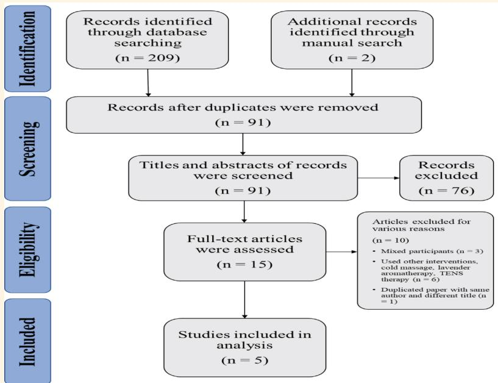

REVIEW

# Effectiveness of the Eutectic Mixture of Local Anaesthetics Cream in the Management of Arteriovenous Fistula Needle Insertion Pain in Patients Undergoing Haemodialysis

Hamed Al Shahri,1 \*Issa Al Salmi,2 Waleed Al Rajhi,3 Hamidreza Shemshaki4

abstract: This review aimed to assess the efectiveness of the eutectic mixture of local anaesthetics (EMLA) cream in the management of arteriovenous fistula (AVF) needle insertion pain in adult patients undergoing haemodialysis (HD) compared with other alternative interventions. The main search was conducted in November 2020 and updated in December 2021. In the search strategy, keywords and synonyms were used and multiple databases were searched with no date limitation to ensure a comprehensive search that would yield all studies relevant to the review and minimise location bias. A total of 209 studies were found in this search and filtered. After filtering through these studies, only five studies were finally included in the review. EMLA-cream was found to be efective in reducing AVF needle insertion pain among adult patients undergoing HD. Despite EMLA cream’s efectiveness in reducing HD needle insertion pain and its fewer side efects, the findings of the included studies should be interpreted with caution, as there are some limitations, and further research is required.

Keywords: EMLA Cream; Pain; Dialysis; Arteriovenous Fistula.

Arteriovenous fistula (AVF) is a majorrequirement for a good haemodialysis (HD) requirement for a good haemodialysis (HD) session. Aghbolagh et al. reported that 80% of HD patients experience moderate-to-severe pain during AVF needle insertion but do not receive pain relief.1 These patients undergo AVF needle insertion two to three times per week, which is often their greatest concern during HD treatment.2 This struggle with pain often causes patients despair and frustration and may cause them to abscond from treatment.3–5

The eutectic mixture of local anaesthetics (EMLA) cream is a mixture of lidocaine (25 mg/g) and prilocaine (25 mg/g). It is the preferred local anaesthetic and can be easily used by the patients themselves.6 The EMLA cream blocks both active and inactive sodium channels, inhibiting the conduction of stimuli and reducing pain transmission.6

HD is a painful process for patients with renal failure. However, the ability to adapt to the pain psychologically varies among individuals. A study by Jeon et al. found that female patients experience a greater pain dimension than their male counterparts.7 According to Brkovic et al., the pain associated with AVF needle insertion should be considered a health issue.8 Hence, the nephrology community needs to promote this as a clinical research priority to improve the HD patient's quality of life and pain-related disability.

Despite the diverse pain management and control methods developed in the past few decades, local anaesthetic therapy is the most adopted method due to patient perceptions, its ease of use and availability of several options. In addition to having chronic renal problems, HD patients also face some related health issues, including insomnia, anxiety and depression. According to a study by Davison and Jhangri, these three issues may increase the degree of pain sensation HD patients feel during AVF needle insertion.9 Therefore, the practical implication of a local anaesthetic is to improve compliance despite the pain generated during the venipuncture process.7,9

The EMLA cream is a mixture of two substances (lidocaine and prilocaine) and was commercialised in 1984 as a non-invasive intervention. It is available as a cream, patch or spray and is widely used during medical procedures such as venipuncture, laser therapy, skin biopsy, lumbar puncture, vaccination, cryosurgery and intradermal testing.7,10

To date, no systematic review specifically addresses the efectiveness of EMLA cream in managing AVF needle puncture or insertion pain in adult HD patients. A study was conducted comparing the eficacy of EMLA cream with that of local infiltration anaesthesia in pain reduction during vaginal delivery. That study reviewed four studies, with a total of 348 patients (173 in the EMLA group and 175 in the conventional local infiltration anaesthesia group) undergoing perineal repair after vaginal delivery. They found that EMLA cream helped to reduce pain during perineal repair after vaginal delivery with a success rate of 95%.11

Regarding current interventions for pain management in HD, there are a few strategies, such as the EMLA cream, lidocaine spray or tape, vapocoolant spray and piroxicam cream, which may be used to reduce and relieve patients’ pain during needle insertion and persuade them to continue HD treatment.4 However, some studies have shown that without such pain relief intervention, HD patients’ quality of life may be afected, resulting in the desire to withdraw from HD treatment.5,9 Assessing the efectiveness of pain relief interventions is a highly important strategy to improve HD patients’ quality of care and treatment adherence. This systematic review was conducted to primarily evaluate the efectiveness of EMLA cream in reducing AVF needle insertion pain; the secondary aim was to assess whether EMLA cream was safe to use in adult HD patients, with no adverse side-efects that may harm them.

## Methods

## search approach

A systematic literature review was conducted in December 2020 in multiple databases. The study design, search strategy and data abstraction were determined using the Preferred Reporting Items for Systematic Reviews and Meta-analyses (PRISMA) criteria [Figure 1]. The search was restricted to articles published in the English language.

Since the research aimed to investigate the efectiveness of EMLA cream in clinical practice, only a few experimental studies addressing EMLA cream as an intervention for pain management were found. Thus, the Population, Intervention, Comparison and Outcome framework was used to explain the research question and set up the inclusion criteria. This framework ensured that the key concept was addressed and that the retrieved articles were relevant to the aims and objectives of the current research. The population was adult HD patients (>18 years old); the intervention was ELMA cream (a mixture of lidocaine and prilocaine); comparison was an alternative intervention (e.g. lidocaine, vapocoolant and piroxicam); and the outcome was either primary (reduce and relieve pain during AVF needle insertion) or secondary (no side efects on the patients’ skin or safety risk). The inclusion and exclusion criteria are shown in Table 1.

An initial scoping search was conducted to determine the keywords to be used for the search and ensure the availability of relevant papers. In addition, the search facilitated the creation of other keywords, synonyms and abbreviations related to the search.

To ensure that no comparable systematic reviews had been conducted or proposed, the following databases were explored: the Joanna Briggs Institute (JBI), the International Prospective Register of Systematic Reviews (PROSPERO), the Cochrane Library and the Campbell Collaboration Library of Systematic Reviews.

‘EMLA cream’, ‘Arteriovenous Fistula needle pain and ‘hemodialysis patients’ or ‘haemodialysis patient were the keywords used during the scoping search

Table 1: The inclusion and exclusion criteria for selecting studies for this review.
<table><tr><td rowspan="3">Population</td><td>Inclusion Criteria</td><td>Exclusion Criteria</td></tr><tr><td>Fully conscious adult haemodialysis patients age &gt;18 years old</td><td>Haemodialysis patients &lt;18 years old Patients who</td></tr><tr><td>Male or female patients with AVF for &gt;2 months</td><td>underwent AVF surgery less than 2 months ago Unconscious or mentally challenged patients</td></tr><tr><td rowspan="3">Intervention</td><td></td><td>Patients with a known history of neuropathy disease and skin allergies or</td></tr><tr><td>EMLA cream (a mixture of lidocaine and prilocaine)</td><td>eczema Pain relief and medicine</td></tr><tr><td></td><td>Pharmaceutical intervention</td></tr><tr><td>Comparison</td><td>Alternative interventions (e.g. lidocaine, vapocoolant and piroxicam)</td><td></td></tr><tr><td>Outcome</td><td>The effectiveness of EMLA cream in pain management during AVF needle insertion</td><td>Outcome not reported</td></tr><tr><td>Study design</td><td>Quantitative research including RCTs and quasi-experimental studies Grey literature</td><td>Qualitative studies Case report Expert opinion</td></tr><tr><td>Setting</td><td>In-centre haemodialysis unit (hospital)</td><td>Home dialysis Not in hospital</td></tr><tr><td>Time-span</td><td>No time limit</td><td></td></tr><tr><td>Language</td><td>Studies published in the English language</td><td>Studies with only title and abstract in English but the remainder in a</td></tr><tr><td></td><td></td><td>different language Other languages</td></tr></table>

AVF = arteriovenous fistula; RCT = randomized controlled trial

  
Figure 1: PRISMA flow diagram of the included studies.

on Google Scholar, whereas ([‘EMLA’] OR [‘eutectic mixture of local anesthetic\*] AND Arteriovenous\*) OR ‘fistula needle\* fistula cannula\* and (‘hemodialysis patient’ OR \* dialysis patient) were used in the other databases.

Truncation was used to ensure the variations of word stems. Furthermore, quotation marks allowed the researcher to keep the terms in order and look for every phrase relevant to the search. In addition, parentheses were used to allow for the combination of various concepts within the search, while Boolean operators were used to connect and define the search terms.

The main systematic search was conducted on the following databases: CINIL, BNI, EMBASE, Medline, PubMed, Cochrane Library, AMED, JBI, SIGN, NICE, Center for Evidence-Based Medicine and PROSPERO. In addition, hand-searching and citation chaining (backward and forward chaining) were utilised to ensure that all relevant studies were found and considered in this review. Also, grey literature was utilised in this review to limit publication bias.

The main search was conducted in November 2020 and updated in December 2021. In the search strategy, keywords and synonyms were used and multiple databases were searched, with no date limitation to ensure a comprehensive search that would retrieve all studies relevant to the review and minimise location bias. The search was limited to studies published in English, which might be considered a limitation of the review due to language bias. However, the lack of available study translations was an issue; therefore, this limitation was considered acceptable by the authors. Also, truncation, quotation marks, parenthesis and Boolean operators were utilised and the number of references for each of them was identified.

## study selection

Original research articles reporting on the use of pain management during AVF needle insertion for HD patients were included. Conference abstracts were not included because they lacked detail and had not undergone rigorous peer review. The level of evidence of the studies included was rated according to the criteria of the Center for Evidence-Based Medicine (http://www.cebm.net). The methodological quality of the studies was assessed using the JBI critical appraisal tool.

Two reviewers independently appraised the chosen studies and the lists of essential questions in the tools were scored. Any variation was discussed by the reviewers, looking for any inconsistency between individual scores of the studies, with a third reviewer available to adjudicate if there was any disagreement. This ensured that bias was minimised, enhancing the review’s trustworthiness. Subsequently, the studies that met the essential criteria were moved to the next stage, which was data extraction.

## data extraction and synthesis

After using the critical appraisal tool to filter the studies, the relevant data were extracted using a valid extraction tool. This step was crucial to enhance the validity of the findings and allow conclusions to be drawn clearly for extraction. The JBI data extraction tool was used. Due to the heterogeneity of the included studies, a meta-analysis was not possible. Thus, the extracted data were synthesised by the authors as a narrative synthesis.

Table 2: The setting, country, sample size, gender, age range and haemodialysis experience of participants in the five studies.
<table><tr><td rowspan=1 colspan=14>Author and year      Setting          Design         Sample Size     Gender     Age Range    HD Experienceof publication.</td></tr><tr><td rowspan=18 colspan=14>Mirzaei et al.6           S.R.      Quasi-experimental    40 Patients      Male:25      &gt;18 years    More than 3 months(2018)                Hospital,          study         Pre-/post-test     (62.5%)      (Mean age     on haemodialysisIran                                                             SD: 55.25     treatment, (Meansimilaryears).     HD time: 4.98 years)accessFujimoto et al.12          Six         Multi-centre       66 Patients     Group EL:(2020)                Japanese        randomised                        Males 20     (Mean age    AVF access (radio-Group EL: 32HD         crossover study                       (62.5%),      SD: 65.8      cephalic fistula)patientsfacilities,          (RCT)                         Females 12      years).Japan                           Group LE: 34patientsMales 18(52.9%)</td></tr><tr><td rowspan=1 colspan=1>(Mean age</td><td rowspan=1 colspan=1>on haemodialysis</td></tr><tr><td rowspan=1 colspan=2>Female:15</td><td rowspan=1 colspan=1>SD: 55.25</td><td rowspan=1 colspan=1>treatment, (Mean</td></tr><tr><td rowspan=1 colspan=2>(37.5%)</td><td rowspan=1 colspan=1>years).</td><td rowspan=1 colspan=1>HD time: 4.98 years)</td></tr><tr><td rowspan=2 colspan=2></td><td rowspan=1 colspan=1></td><td rowspan=1 colspan=1>With easy AVF</td></tr><tr><td rowspan=1 colspan=1></td><td rowspan=1 colspan=1></td></tr><tr><td rowspan=1 colspan=1>>20 years</td><td rowspan=1 colspan=1>With forearm</td></tr><tr><td rowspan=1 colspan=1>(Mean age</td><td rowspan=1 colspan=1>AVF access (radio-</td></tr><tr><td rowspan=1 colspan=1>SD:65.8</td><td rowspan=1 colspan=1>cephalic fistula)</td></tr><tr><td rowspan=1 colspan=6></td><td rowspan=1 colspan=1>years).</td></tr><tr><td rowspan=3 colspan=6>Group LE: 34(37.5%).</td></tr><tr><td rowspan=2 colspan=1></td></tr><tr><td rowspan=1 colspan=1>Group EL:</td></tr><tr><td rowspan=1 colspan=2>Group LE:</td><td rowspan=1 colspan=1>65.5± 10.6</td><td rowspan=1 colspan=1></td></tr><tr><td rowspan=1 colspan=2>Males 18</td><td rowspan=1 colspan=1>Group LE:</td><td rowspan=1 colspan=1></td></tr><tr><td rowspan=1 colspan=2>(52.9%)</td><td rowspan=1 colspan=1>66.2 ± 10.7</td><td rowspan=1 colspan=1></td></tr><tr><td rowspan=1 colspan=2>Females 16</td><td rowspan=1 colspan=1></td><td rowspan=2 colspan=1></td></tr><tr><td rowspan=1 colspan=2></td><td rowspan=1 colspan=1></td></tr><tr><td rowspan=1 colspan=5>Malekshahi et al.13       S.A.</td><td rowspan=1 colspan=3>Double-blind</td><td rowspan=1 colspan=2>75 Patients</td><td rowspan=1 colspan=2>Male: 67%</td><td rowspan=1 colspan=1>&gt;18 years</td><td rowspan=1 colspan=1>More than 3 months</td></tr><tr><td rowspan=10 colspan=12>(2017)                Hospital,Iran                             Group A: 25patients     same groupsEMLAGroup B: 25patientsFemale 9Placebopatients</td><td rowspan=1 colspan=1>clinical trial (RCT)</td><td rowspan=1 colspan=1>Piroxicam</td></tr><tr><td rowspan=1 colspan=2>The three</td><td rowspan=1 colspan=1>(4%) younger</td><td rowspan=1 colspan=1>Less than 1 year: 7</td></tr><tr><td rowspan=1 colspan=2>same groups</td><td rowspan=1 colspan=1>than 30</td><td rowspan=1 colspan=1>patients (9.3%)</td></tr><tr><td rowspan=1 colspan=2></td><td rowspan=1 colspan=1>years;</td><td rowspan=1 colspan=1>Between 1 to 3</td></tr><tr><td rowspan=1 colspan=2>Group B: 25</td><td rowspan=1 colspan=2>Male 16</td><td rowspan=1 colspan=1>18 patients(24%)</td><td rowspan=1 colspan=1>years: 27 patients(34.7%)</td></tr><tr><td rowspan=1 colspan=1>between 30</td><td rowspan=1 colspan=1>More than 3 years:</td></tr><tr><td rowspan=1 colspan=9></td><td rowspan=1 colspan=1></td><td rowspan=1 colspan=1>and 49 years;</td><td rowspan=1 colspan=1>42 patients (56%)</td></tr><tr><td rowspan=1 colspan=1></td><td rowspan=1 colspan=1>54 patients</td><td rowspan=1 colspan=1>With HD vascular</td></tr><tr><td rowspan=1 colspan=1></td><td rowspan=1 colspan=1>(72%) olderthan 50</td><td rowspan=1 colspan=1>access</td></tr><tr><td rowspan=1 colspan=2></td><td rowspan=1 colspan=1>years</td><td rowspan=1 colspan=1></td></tr><tr><td rowspan=1 colspan=2>Çelik et al.16 (2011)</td><td rowspan=1 colspan=1></td><td rowspan=1 colspan=2>S.</td><td rowspan=1 colspan=2>Randomised,</td><td rowspan=1 colspan=1></td><td rowspan=1 colspan=2>41 Patients</td><td rowspan=1 colspan=2>Male: 21</td><td rowspan=1 colspan=1>Between 32</td><td rowspan=1 colspan=1>10 Persons with</td></tr><tr><td rowspan=3 colspan=3></td><td rowspan=3 colspan=2>UniversityHospital,Turkey</td><td rowspan=1 colspan=1></td><td rowspan=1 colspan=5>placebo-controlled,</td><td rowspan=1 colspan=1></td><td rowspan=1 colspan=1>All patients</td><td rowspan=1 colspan=1>(51.2%)</td></tr><tr><td rowspan=1 colspan=4>crossover study</td><td rowspan=1 colspan=2>randomly</td><td rowspan=1 colspan=2>Female:20</td><td rowspan=1 colspan=1>(57.5 ± 13.3)</td><td rowspan=1 colspan=1>Seven smoking</td></tr><tr><td rowspan=1 colspan=3>(RCT)</td><td rowspan=1 colspan=2>received</td><td rowspan=1 colspan=2>(48.8%)</td><td rowspan=1 colspan=1></td><td rowspan=1 colspan=1>patients (17.1%)</td></tr><tr><td rowspan=13 colspan=12>different    data reportedinterventionsduring threeHD</td><td rowspan=5 colspan=2></td></tr><tr><td rowspan=1 colspan=2>different</td><td rowspan=1 colspan=2>data reported</td><td rowspan=1 colspan=1></td><td rowspan=1 colspan=1>3 to 180 months (0.3</td></tr><tr><td rowspan=1 colspan=2>interventions</td><td rowspan=1 colspan=2>for the</td><td rowspan=1 colspan=1></td><td rowspan=1 colspan=1>to 15 years)</td></tr><tr><td rowspan=1 colspan=2>during three</td><td rowspan=3 colspan=2></td><td rowspan=3 colspan=1></td><td rowspan=1 colspan=1>Radio-cephalic</td></tr><tr><td rowspan=2 colspan=4></td><td rowspan=2 colspan=2>consecutive</td></tr><tr><td rowspan=1 colspan=1>fistula: 53.7%</td></tr><tr><td rowspan=1 colspan=2>treatments</td><td rowspan=1 colspan=2></td><td rowspan=1 colspan=1></td><td rowspan=1 colspan=1>Brachiocephalic</td></tr><tr><td rowspan=2 colspan=2></td><td rowspan=1 colspan=1></td><td rowspan=1 colspan=1>fistula: 46.3% (upper</td></tr><tr><td rowspan=2 colspan=2></td><td rowspan=1 colspan=1></td><td rowspan=1 colspan=1>and lower arm AVF</td></tr><tr><td rowspan=1 colspan=1></td><td rowspan=1 colspan=1></td><td rowspan=1 colspan=1>area)</td></tr><tr><td rowspan=2 colspan=6></td><td rowspan=1 colspan=1></td><td rowspan=1 colspan=1>Fistula site: Right</td></tr><tr><td rowspan=1 colspan=6></td><td rowspan=1 colspan=1></td><td rowspan=1 colspan=1>arm 48.8%, Left arm</td></tr><tr><td rowspan=1 colspan=1></td><td rowspan=1 colspan=1>51.2%</td></tr><tr><td rowspan=1 colspan=12>George et al.14         C.M.C.        Single-centre,       50 Patients      Male: 35</td><td rowspan=1 colspan=1>Between 12</td><td rowspan=1 colspan=1>22 Hypertensive</td></tr><tr><td rowspan=1 colspan=10>(2014)                Hospital,      crossover study       -EMLA</td><td rowspan=1 colspan=2>(70%)</td><td rowspan=1 colspan=1>to 82 years</td><td rowspan=1 colspan=1>patients (44%)</td></tr><tr><td rowspan=4 colspan=14>India            (RCT)group57.5)             (38%)(30%)-Lidocaine                   One patient27 patients with-Infiltrationradio-cephalicgroup23 patients withbrachiocephalicfistula (46%)</td></tr><tr><td rowspan=1 colspan=4></td></tr><tr><td rowspan=1 colspan=2></td><td rowspan=1 colspan=2>was only 1227 patients with</td></tr><tr><td rowspan=1 colspan=4></td></tr></table>

HD = haemodialysis; SD = standard deviation; AVF = arteriovenous fistula; RCT = randomised controlled trials; EMLA = eutectic mixture of local anaesthetics.

## Results

## filtration

The search yielded a total of 209 studies, which were filtered and any duplicate studies removed, leaving

Table 3: The intervention, its manufacture, period, haemodialysis access/technique and needle size and the washout period.
<table><tr><td rowspan=1 colspan=20>Author          Intervention       Medicine      Period      HD access       HD       Wash-out      Follow-upand year of                            (Drug)                        area/        needlepublication                         manufacture                   technique       size/diameter</td></tr><tr><td rowspan=1 colspan=11>Mirzaei et     EMLA cream (1.5g)    Not reported   Total of four   Not reported</td><td rowspan=1 colspan=9>16 gauge     One week      Successful</td></tr><tr><td rowspan=1 colspan=11>al.6 (2018)       applied on fistula                       weeks</td><td rowspan=1 colspan=7>for all     (Last week)</td><td rowspan=1 colspan=2>monitoring of</td></tr><tr><td rowspan=1 colspan=18>site 20 mins before                       Each                       patients    wash-out for</td><td rowspan=1 colspan=2>intervention</td></tr><tr><td rowspan=1 colspan=8>cannulation.intervention</td><td rowspan=1 colspan=10>all patients</td><td rowspan=1 colspan=2>process by the</td></tr><tr><td rowspan=1 colspan=7>Lidocaine spray</td><td rowspan=1 colspan=1>repeated</td><td rowspan=1 colspan=10></td><td rowspan=1 colspan=2>assessors</td></tr><tr><td rowspan=1 colspan=7>(20mg) applied on</td><td rowspan=1 colspan=1>thrèe times</td><td rowspan=1 colspan=10></td><td rowspan=1 colspan=2>Last week</td></tr><tr><td rowspan=2 colspan=4>fistula site 5 minsbefore cannulation.</td><td rowspan=1 colspan=2></td><td rowspan=1 colspan=2>for each</td><td rowspan=1 colspan=10></td><td rowspan=1 colspan=2>considered</td></tr><tr><td rowspan=1 colspan=2></td><td rowspan=1 colspan=2>patient</td><td rowspan=1 colspan=10></td><td rowspan=1 colspan=2>as wash-out</td></tr><tr><td rowspan=1 colspan=4>Ice pack (five pieces)</td><td rowspan=1 colspan=2></td><td rowspan=1 colspan=2>Three weeks</td><td rowspan=1 colspan=10></td><td rowspan=1 colspan=2>to assess any</td></tr><tr><td rowspan=2 colspan=4>applied on fistulasite 2 mins before</td><td rowspan=1 colspan=2></td><td rowspan=1 colspan=2>intervention</td><td rowspan=1 colspan=10></td><td rowspan=2 colspan=2>interferencesin the</td></tr><tr><td></td><td></td><td></td><td rowspan=1 colspan=1>+ one week</td><td rowspan=4 colspan=10></td><td rowspan=1 colspan=5></td><td rowspan=1 colspan=1></td></tr><tr><td></td><td></td><td></td><td></td><td></td><td></td><td></td><td></td><td rowspan=2 colspan=2>medicines used</td></tr><tr><td rowspan=2 colspan=4>cannulation.</td><td rowspan=2 colspan=3></td><td rowspan=2 colspan=1>wash-out</td></tr><tr><td rowspan=1 colspan=2>(researchers).</td></tr><tr><td rowspan=1 colspan=4>Fujimoto et     EMLA cream 1g,</td><td rowspan=1 colspan=3>Reported</td><td rowspan=1 colspan=1>Total of four</td><td rowspan=1 colspan=3>Area: forearm</td><td rowspan=1 colspan=7>16 gauge     One week</td><td rowspan=1 colspan=2>Regular follow-</td></tr><tr><td rowspan=1 colspan=4>al.12 (2020)   applied 1 hour before</td><td rowspan=1 colspan=2></td><td></td><td rowspan=1 colspan=1>weeks</td><td rowspan=1 colspan=3>AVF</td><td rowspan=1 colspan=5>for all</td><td rowspan=1 colspan=3>(Week three)</td><td rowspan=1 colspan=1></td><td rowspan=1 colspan=1>up provided.</td></tr><tr><td rowspan=1 colspan=4>AVF puncture</td><td rowspan=1 colspan=2></td><td></td><td rowspan=1 colspan=1>Week 1: no</td><td rowspan=1 colspan=3></td><td rowspan=2 colspan=7>patients    wash-out foreach patient</td><td rowspan=2 colspan=1></td><td rowspan=2 colspan=1>Interventiondrugs safety</td></tr><tr><td rowspan=1 colspan=4>Lidocaine tape 18mg,</td><td rowspan=1 colspan=4>intervention</td><td rowspan=1 colspan=3></td></tr><tr><td rowspan=2 colspan=4>applied 30 minsbefore AVF puncture</td><td rowspan=1 colspan=2></td><td rowspan=1 colspan=2>Week 2:</td><td rowspan=2 colspan=3></td><td rowspan=2 colspan=7></td><td rowspan=1 colspan=1></td><td rowspan=1 colspan=1>(side-effects)</td></tr><tr><td rowspan=1 colspan=2></td><td rowspan=1 colspan=2>EMLA and</td><td rowspan=1 colspan=1></td></tr><tr><td rowspan=1 colspan=4></td><td rowspan=1 colspan=2></td><td rowspan=1 colspan=2>Lidocaine</td><td rowspan=1 colspan=3></td><td rowspan=1 colspan=7></td></tr><tr><td rowspan=5 colspan=4></td><td rowspan=1 colspan=4>Week 3:</td><td rowspan=1 colspan=3></td><td rowspan=1 colspan=7></td><td rowspan=1 colspan=1></td></tr><tr><td rowspan=1 colspan=3></td><td rowspan=1 colspan=4>wash- out</td><td rowspan=1 colspan=3></td><td rowspan=1 colspan=7></td></tr><tr><td rowspan=2 colspan=3></td><td rowspan=1 colspan=4>Week 4:</td><td rowspan=1 colspan=3></td><td rowspan=2 colspan=7></td></tr><tr><td rowspan=1 colspan=4>Lidocaine</td><td rowspan=1 colspan=3></td><td rowspan=1 colspan=5></td></tr><tr><td rowspan=1 colspan=2></td><td></td><td rowspan=1 colspan=1>and EMLA</td><td rowspan=1 colspan=3></td><td rowspan=1 colspan=7></td></tr><tr><td rowspan=1 colspan=4>Malekshahi     EMLA cream (2g)</td><td rowspan=1 colspan=2>Not reported</td><td></td><td rowspan=1 colspan=1>Two stages</td><td rowspan=1 colspan=3>Not reported</td><td rowspan=1 colspan=3>16 gauge</td><td></td><td rowspan=1 colspan=3>Not reported</td><td rowspan=1 colspan=1></td></tr><tr><td rowspan=2 colspan=4>et al.13       Piroxicam cream (2g)(2017)Placebo (Vitamin</td><td rowspan=1 colspan=2></td><td></td><td rowspan=1 colspan=1>in two days</td><td rowspan=1 colspan=3></td><td rowspan=1 colspan=3>for all</td><td></td><td rowspan=1 colspan=3></td><td rowspan=1 colspan=1></td><td rowspan=1 colspan=1>measuremènt</td></tr><tr><td rowspan=1 colspan=3></td><td rowspan=1 colspan=1>Before and</td><td rowspan=1 colspan=3></td><td rowspan=2 colspan=7>patients</td><td rowspan=2 colspan=1></td><td rowspan=4 colspan=1>duringinterventionprovided.</td></tr><tr><td rowspan=1 colspan=4>A+D) cream (2g)</td><td rowspan=1 colspan=3></td><td rowspan=1 colspan=1>after HD</td><td rowspan=3 colspan=3></td><td rowspan=3 colspan=7></td></tr><tr><td></td><td></td><td></td><td></td><td rowspan=2 colspan=3></td><td rowspan=2 colspan=1>session</td><td rowspan=2 colspan=1></td></tr><tr><td rowspan=1 colspan=4>Distributed to</td></tr><tr><td></td><td></td><td></td><td></td><td></td><td></td><td></td><td rowspan=2 colspan=1>One session</td><td rowspan=2 colspan=3></td><td rowspan=2 colspan=7></td><td rowspan=2 colspan=1></td><td rowspan=2 colspan=1>Short-term</td></tr><tr><td rowspan=1 colspan=4>patients (25+25+25),</td><td rowspan=1 colspan=3></td></tr><tr><td rowspan=1 colspan=4>who were instructed</td><td rowspan=1 colspan=3></td><td rowspan=1 colspan=1>with no</td><td rowspan=1 colspan=3></td><td rowspan=3 colspan=9></td></tr><tr><td rowspan=1 colspan=4>to apply 2g of each</td><td rowspan=1 colspan=3></td><td rowspan=1 colspan=1>intervention+ one</td><td></td><td></td><td></td></tr><tr><td rowspan=1 colspan=4>on the fistula area</td><td rowspan=2 colspan=3></td><td rowspan=2 colspan=1>session with</td><td rowspan=1 colspan=4></td><td rowspan=1 colspan=3></td><td rowspan=1 colspan=4></td><td rowspan=5 colspan=1></td></tr><tr><td rowspan=2 colspan=4>and cover with a</td><td></td><td></td><td></td><td></td><td></td><td></td><td></td><td></td><td></td><td></td><td></td></tr><tr><td></td><td></td><td></td><td></td><td rowspan=2 colspan=3></td><td rowspan=2 colspan=3></td><td rowspan=2 colspan=3></td><td rowspan=2 colspan=4></td><td rowspan=2 colspan=1></td><td rowspan=2 colspan=1>intervention</td></tr><tr><td rowspan=2 colspan=4>transparent tape for</td><td rowspan=2 colspan=3></td><td rowspan=2 colspan=1>intervention</td></tr><tr><td rowspan=4 colspan=6></td><td></td><td rowspan=1 colspan=3></td><td rowspan=1 colspan=1></td><td rowspan=1 colspan=1>medications</td></tr><tr><td rowspan=1 colspan=4>1 hour before HD</td><td rowspan=1 colspan=3></td><td rowspan=1 colspan=1></td><td></td><td></td><td></td><td></td><td></td><td></td></tr><tr><td rowspan=2 colspan=4>session</td><td rowspan=2 colspan=3></td><td rowspan=2 colspan=1></td><td></td><td></td><td></td><td></td><td></td><td></td></tr><tr><td rowspan=1 colspan=4></td><td rowspan=1 colspan=1></td><td rowspan=2 colspan=1>usedIntervention</td></tr><tr><td rowspan=1 colspan=4>Çelik et al.16      Ethyl chloride</td><td rowspan=1 colspan=3>Reported</td><td rowspan=1 colspan=1>Four HD</td><td rowspan=1 colspan=3>Not reported</td><td rowspan=1 colspan=3>18 gauge</td><td></td><td rowspan=1 colspan=4>Not reported</td></tr><tr><td rowspan=1 colspan=4>(2011)         vapocoolant spray:</td><td rowspan=1 colspan=3></td><td rowspan=1 colspan=1>sessions</td><td rowspan=1 colspan=3></td><td rowspan=1 colspan=3>for all</td><td></td><td rowspan=1 colspan=3></td><td rowspan=1 colspan=1></td><td rowspan=1 colspan=1>process and</td></tr><tr><td rowspan=1 colspan=4>Use at a 10-cm</td><td rowspan=1 colspan=3></td><td rowspan=1 colspan=1>1st: no</td><td rowspan=1 colspan=3></td><td rowspan=1 colspan=3>patients</td><td></td><td rowspan=1 colspan=3></td><td rowspan=1 colspan=1></td><td rowspan=1 colspan=1>tolerability</td></tr><tr><td rowspan=1 colspan=4>distance for 2seconds.</td><td rowspan=1 colspan=3></td><td rowspan=1 colspan=1>intervention</td><td rowspan=1 colspan=3></td><td rowspan=1 colspan=7></td><td rowspan=1 colspan=1></td><td rowspan=1 colspan=1>assessed by theresearchers</td></tr><tr><td rowspan=2 colspan=4>EMLA cream (5%):</td><td rowspan=2 colspan=3></td><td rowspan=1 colspan=1>2nd, 3rd and</td><td rowspan=3 colspan=3></td><td rowspan=4 colspan=8></td><td></td></tr><tr><td rowspan=1 colspan=1>4th: with</td><td rowspan=1 colspan=3></td><td rowspan=1 colspan=1></td><td rowspan=1 colspan=1>Safety of</td></tr><tr><td rowspan=1 colspan=4>2ml applied for 45 to</td><td rowspan=2 colspan=3></td><td rowspan=1 colspan=1>intervention</td><td rowspan=4 colspan=12>interventionsused monitoredbefore and2 hoursafter needle</td></tr><tr><td rowspan=1 colspan=4>60 mins before fistula</td><td></td></tr><tr><td rowspan=1 colspan=4>needle insertion</td><td rowspan=1 colspan=3></td><td rowspan=1 colspan=1></td></tr><tr><td rowspan=1 colspan=4>Placebo cream: 2 ml</td><td rowspan=1 colspan=3></td><td rowspan=1 colspan=1></td></tr><tr><td rowspan=2 colspan=4></td><td rowspan=1 colspan=5>applied 45 to 60 mins</td><td rowspan=1 colspan=2></td><td rowspan=1 colspan=4></td><td rowspan=1 colspan=1></td><td></td><td></td><td></td><td></td></tr><tr><td rowspan=11 colspan=20>punctureinsertionNot reported   Regular follow-al.14 (2014)      thick layer applied                     sessions (4   area technique    for all                     up providedfor 1 hour before                      days) 50                      patientscannulation.                        patientsrandomisedinfiltration of                        into twolidocaine performed                     groups,each startedwith 26-gaugewith eitherEMLA orinjectablelidocaineinfiltration.</td></tr><tr><td rowspan=1 colspan=4></td><td rowspan=1 colspan=4></td></tr><tr><td rowspan=1 colspan=2>George et</td><td rowspan=1 colspan=2>EMLA cream: A</td><td rowspan=1 colspan=3>Not reported</td><td rowspan=1 colspan=1>Four HD</td><td rowspan=1 colspan=6>Traditional16 gauge</td></tr><tr><td rowspan=1 colspan=1>al.¹⁴ (2014)</td><td rowspan=1 colspan=1></td><td rowspan=1 colspan=2>thick layer applied</td><td rowspan=1 colspan=3></td><td rowspan=1 colspan=1>sessions (4</td><td rowspan=1 colspan=6>area techniquefor all</td></tr><tr><td rowspan=1 colspan=1></td><td rowspan=1 colspan=1></td><td rowspan=1 colspan=2>for 1 hour before</td><td rowspan=1 colspan=3></td><td rowspan=1 colspan=1>days)50</td><td rowspan=1 colspan=6></td></tr><tr><td rowspan=1 colspan=2>cannulation.</td><td rowspan=1 colspan=4></td><td rowspan=2 colspan=6></td></tr><tr><td rowspan=1 colspan=2>Subcutaneous</td><td rowspan=1 colspan=4>randomised</td></tr><tr><td rowspan=1 colspan=4></td></tr><tr><td rowspan=1 colspan=4></td></tr><tr><td rowspan=1 colspan=2></td></tr><tr><td rowspan=1 colspan=2></td></tr></table>

HD = haemodialysis; EMLA = eutectic mixture of local anaesthetics; AVF = arteriovenous fistula.

Table 4: The clinical outcomes, measure/scale and results/findings of the five studies.
<table><tr><td rowspan=1 colspan=11>Author            Clinical outcomes             Measure/scale                      Results/findingsand year ofpublicationMirzaei et al.6        EMLA cream is the       During the first three HD           • Patients were satisfied with the EMLA</td></tr><tr><td rowspan=1 colspan=11>(2018)                  most effective,            sessions, there was no             cream, as it was an easy and effectiveeasy and safe             intervention (control              method of reducing pain duringmethod                 group); therefore, patients          fistula needles insertion compared towere asked to report their          lidocaine spray and ice pack.pain level using the VAS.• The findings indicated that there were</td></tr><tr><td rowspan=2 colspan=9>Then the numeric painassessment scale (rangingfrom 0–10) was used forthe intervention stage, 2min after fistula needlesinsertion (three methods).</td><td rowspan=1 colspan=2>differences in mean pain intensitybetween the three methods, withthe EMLA cream being significantlymore effective than the lidocaine</td></tr><tr><td rowspan=3 colspan=2>spray and ice pack.Overall Result:• EMLA cream is better than lidocaine</td></tr><tr><td rowspan=1 colspan=9>Fujimoto et al.12      This paper examined      A 100-mm straight line VAS</td></tr><tr><td rowspan=1 colspan=9>(2020)                 three hypotheses:         was used to measure the</td></tr><tr><td rowspan=7 colspan=9>1. EMLA cream             AVF puncture pain byasking the patients to drawinhibits painduring AVF              a slash on the line based onpuncture                their perceived pain.-Left end indicating minimalpain (or no pain at all)-Right end indicatingmaximum pain (worst painI have ever experienced)2. QOL of HD            Patients were asked to fillpatients                 out evaluation forms (Six(Carryover/              subscales in the SF-36)period andtreatment effect)</td><td rowspan=1 colspan=2>tape in reducing AVF puncture pain.</td></tr><tr><td rowspan=10 colspan=2>• No significant differences in patientsQOL was observed between EMLAand lidocaine.• No side-effects were reported in both</td></tr><tr><td rowspan=1 colspan=1></td></tr><tr><td rowspan=1 colspan=1></td></tr><tr><td rowspan=1 colspan=1></td></tr><tr><td rowspan=1 colspan=1></td></tr><tr><td rowspan=1 colspan=3></td><td rowspan=1 colspan=1></td></tr><tr><td rowspan=3 colspan=6>3. No drug- related</td><td rowspan=1 colspan=3>The side effect of each</td></tr><tr><td rowspan=2 colspan=5></td><td rowspan=1 colspan=3>intervention (drug)</td><td rowspan=1 colspan=1></td><td rowspan=1 colspan=1></td></tr><tr><td rowspan=1 colspan=4></td><td rowspan=1 colspan=3>was evaluated after theexamination</td></tr><tr><td rowspan=1 colspan=6></td><td rowspan=1 colspan=3>Rating (Worst) 0 – 100 (Best)</td></tr><tr><td rowspan=1 colspan=6>Malekshahi et        1. EMLA cream</td><td rowspan=1 colspan=3>All patients were asked to</td><td rowspan=1 colspan=2>• Median pain reduction in the EMLA</td></tr><tr><td rowspan=8 colspan=6>al.13 (2017)cannulation2. Some skinbleachingobserved in theEMLA group</td><td rowspan=2 colspan=2></td><td rowspan=2 colspan=3>indicate their amount ofpain after cannulation</td></tr><tr><td rowspan=1 colspan=1>pain after ca</td></tr><tr><td rowspan=1 colspan=2></td><td rowspan=1 colspan=2>using the visual analoguescale</td><td rowspan=1 colspan=2>al analogue</td><td rowspan=1 colspan=2>• EMLA cream is a more effective and</td></tr><tr><td rowspan=3 colspan=3></td><td></td><td></td></tr><tr><td rowspan=2 colspan=3>Short-term side effectchecklist used for all three</td><td></td><td></td></tr><tr><td rowspan=2 colspan=2>easy method than piroxicam gelin reducing the pain during AVFcannulationOne hour after the application ofmedications:• Skin bleaching observed in 16% ofpatients in the EMLA group</td></tr><tr><td rowspan=1 colspan=3>groups during and aftermedication use</td></tr><tr><td rowspan=1 colspan=3></td><td rowspan=4 colspan=2>• No side effect observed in theremaining groups (Piroxicam andvitamin A+D)• EMLA cream resulted in significantlylower pain scores in the EMLAgroup compared to the ethylchloride vapocoolant spray and</td></tr><tr><td rowspan=5 colspan=6>Çelik et al.16          1. EMLA cream(2011)                 is moreeffective thanethyl chloridevapocoolant inpreventing AVFneedle pain</td><td rowspan=1 colspan=3>Control Group</td></tr><tr><td rowspan=1 colspan=3>Patients&#x27; pain assessed using</td></tr><tr><td rowspan=1 colspan=3>VAS before and after the</td></tr><tr><td rowspan=1 colspan=3>first intervention</td><td rowspan=2 colspan=2>control groups.</td></tr><tr><td rowspan=1 colspan=3>VAS (0–100) score</td></tr><tr><td rowspan=1 colspan=6></td><td rowspan=1 colspan=3>Intervention Group</td><td rowspan=1 colspan=2></td></tr><tr><td rowspan=4 colspan=11>three interventions (EMLA, ethyl2. Safety and                                                • One patient who used EMLA creamtolerability of            inspected 2 hours before           had a transient skin rashEMLA cream            and after cannulation forredness, swelling and localskin reactions</td></tr><tr><td rowspan=1 colspan=3></td><td rowspan=2 colspan=1></td></tr><tr><td rowspan=1 colspan=3>cream and pa n was measured</td></tr><tr><td rowspan=1 colspan=3>All patients' AVF sites were</td></tr></table>

<table><tr><td>Author and year of publication</td><td>Clinical outcomes</td><td>Measure/scale</td><td>Results/findings</td></tr><tr><td rowspan="3">George et al.14 (2014)</td><td rowspan="2">1. EMLA cream is suitable for managing AVF cannulation pain</td><td>An hour before HD treatment, patients were asked to apply the medication.</td><td>• Pain score was significantly higher in the infiltration group, and the pain on cannulation was slightly higher in the EMLA group.</td></tr><tr><td>Then, VAS (1–10) was used to assess the pain, and the data were recorded</td><td>• Patients felt more stressed during lidocaine infiltration than AVF cannulation, which made them prefer EMLA cream.</td></tr><tr><td>2. Side-effects of EMLA reported</td><td>Any patient who reported itching, irritation and erythema during or after the application of the medication.</td><td>• No patients had side effects</td></tr></table>

EMLA = eutectic mixture of local anaesthetics; HD = haemodialysis; VAS = visual analogue scale; AVF = arteriovenous fistula; QOL = quality of life.

89 studies that were relevant to the inclusion and exclusion criteria. Two studies were included from the hand search; however, no studies were identified in the grey literature and backward and forward chaining searches. Following the initial filtration, the titles and abstracts of the remaining studies were reviewed, and 76 were excluded. The full text of the remaining 15 studies were read in full and 10 were excluded for focusing on mixed participants (n = 3), using other interventions—cold massage, lavender aromatherapy and TENS therapy—(n = 6) and being a duplicate (n = 1). Finally, only five studies were used for the critical appraisal [Figure 1].

## type of studies

Four studies were randomised controlled trials (RCTs), while one was a quasi-experimental descriptive study [Table 2].

This heterogeneity necessitated the performance of a narrative synthesis rather than a meta-analysis. The included studies had a good methodology and the included participants were the same in all ramifications, both pre- and post-testing methodology; the studies were either blinded or double-blinded studies. Additionally, the assessors in all the included studies were expert and certified HD staf.

## geographical location and clinical setting of the included studies

The geographical locations of the studies were as follow: two from Iran, one from Japan, one from Turkey and one from India [Table 2]. This explains the diferences in the studies’ clinical setting and range of findings, which is due to the diversity of the clinical environment and HD treatment methods used in the diferent countries. However, EMLA cream is used globally and in all HD settings due to its ease of use and application. The main focus was the efectiveness of EMLA cream in reducing AVF needle insertion pain in diferent HD facilities.

Regarding clinical setting, all five studies were conducted in diferent clinical settings. However, four of them were single-centre studies conducted in one HD facility, while the one by Fujimoto et al. was conducted in six diferent HD centres.12

## participants

The number of participants in the included studies ranged from 40 to 75 [Table 2]. All included studies clearly stated the number of participants included. Malekshahi et al.’s study had the largest sample size (n = 75), as it examined three diferent intervention groups.13

The participants in all five studies were adult patients receiving regular HD and their age ranged from 18 to 82 years, except for George et al.’s study, which included one patient aged 12 years, a decision for which no clear rationale was given.14 However, all the participants were on continuous HD treatment and had an AVF access, which usually meant they needed anaesthesia (for the pain) more often than others.

Regarding the gender of participants in the included studies, the majority were male. This is because the current review only considered HD patients with AVF and according to Weigert et al., men are more likely to have an AVF than women during HD treatment.15

Patients’ experiences during HD may have afected the studies’ results, in terms of fistula area (site), AVF cannulation techniques and diabetes mellitus status. Çelik et al. and George et al. reported that 54% and 30% of patients with a radio-cephalic fistula in their study had diabetes mellitus, respectively.14,16 The other included studies did not provide any data on these essential points.

## intervention

EMLA cream was the main intervention in all included studies and was compared with other interventions— lidocaine spray, piroxicam cream, ethyl chloride vapocoolant spray, placebo cream and lignocaine infiltration [Table 3]. The dose of each intervention was provided in four studies (apart from George et al.'s study).14 The manufacturers of the interventions were only reported in two studies.12,16

## factors affecting emla cream’s effectiveness

Certain factors, such as AVF needle size, cannulation technique, patients’ experience in HD and the dose and duration of EMLA applied, might afect the efectiveness of EMLA cream in reducing and managing AVF needle insertion pain in adult HD patients. These were a key component of the included studies and were discussed in most of them [Table 3].

## dose of emla cream and time of application

The time between EMLA cream application and AVF cannulation was 60 minutes in four studies and 20 minutes in one.6 This diference in the intervention dose (drug strength) and application time may have impacted on the efectiveness of the cream and led to insignificant findings. However, the strength of the EMLA cream was almost the same in all the included studies (1–2 gm), which could be explained by the fact that the manufacturing companies in the four geographical locations were following similar guidelines.

## hd needle size

Four of the studies reported using a 16-gauge needle, while one reported using an 18-gauge needle.16 This diference is because certain facilities choose the needle gauge based on patient preference and the blood pump. While there are no guidelines on the needle gauge to be used, the pain-relieving eficacy of EMLA cream in HD patients may be afected if a small gauge is used. However, the included studies showed that using the EMLA cream with either a 16- or 18-gauge HD needle resulted in the same level of reduction in AVF needle insertion pain. Moreover, there were no significant diferences in the rate of complications, such as AVF site bleeding, due to the diferent needle sizes.

## duration

The study duration was stated in all the included studies. The longest study period was four weeks,6,12 followed by four days,14,16 and the shortest period was two days.13 However, Mirzaei et al.’s study repeated each intervention (three drugs) three times for everyone, whereas other studies assessed EMLA cream’s eficacy for just two days.6,13 Despite the diferences in the studies’ duration, the patients were satisfied with the EMLA cream during AVF cannulation.

## hd access area/technique

Diferent fistula areas or sites and cannulation techniques were reported in the included studies. Mirzaei et al. used the forearm as the AVF site for their participants, while George et al. reported that all patients were cannulated using the traditional AVF cannulation technique.6,14 The remaining three studies did not provide any information on the cannulation area or technique used.12,13,16

## wash-out

Two studies provided information about wash-out during their studies,6,12 whereas the remaining three studies did not report if they had conducted a washout.13,14,16

## statistics

Three studies utilised descriptive analysis for their data.13,14,16 In contrast, Mirzaei et al. utilised both descriptive analysis and inferential statistics for their study baseline and continuous data, while Fujimoto et al. used inferential statistics.6,12

## outcomes

Four studies measured their outcomes with the same tool—visual analogue scale; they measured the efectiveness of the interventions used before and after 1–2 minutes of AVF cannulation, whereas Fujimoto et al. measured their patients’ pain experience immediately after AVF cannulation and used the SF-36 form to measure the quality of life of each patient.12 However, all included studies measured three outcome: pain reduction, patients’ quality of life and post medication side-efects [Table 4].

## robustness of the synthesis

The number, quality of evidence and trustworthiness of the included studies play an essential role in the robustness of the synthesis process.17 In this systematic review, only five primary studies were included because of the dificulty involved in finding more studies that met the inclusion criteria. Despite this low number, four were level-two RCTs, according to the hierarchy of evidence, while the study by Mirzaei et al. was a quasi-experimental study.6,18 Thus, the included studies were of moderate-to-high quality, according to the hierarchy of evidence.

All included studies had good methodology due to the nature of the interventions used; they all had the same type of participants (HD patients with AVF), pre- and post-test, with similar comparisons between the groups. Moreover, the researchers and assessors of each study conducted their study without any change, thus enhancing the trustworthiness of the studies.

According to the quality of the included studies, they would be an appropriate source for providing strong suggestions and recommendations for clinical practice regarding the efectiveness of EMLA cream in HD patients.

## Discussion

This systematic review found EMLA cream to be a highly efective, easy method of reducing or inhibiting AVF needle insertion pain in adult HD patients.

## effectiveness of emla cream and the size of the hd needle used

Four studies reportedly used the same AVF needle size (16-gauge) while one study utilised an 18-gauge needle for their patients. The studies showed that when compared with other interventions, EMLA cream performed well in achieving patients’ desired outcome by reducing AVF needle pain, regardless of the diference in AVF needle size. According to Van Loon et al., there are no current guidelines on HD needle size;19 therefore, each HD facility could use the standard size of 14 to 18 gauge, based on patients’ preferences, AVF vintage and expansion and patients’ bleeding tendency. Since all the patients in the included studies were adults with mature AV fistulae (more than three months of HD AVF history), the size of the needle used had no efect the objective of the studies. Moreover, all studies using both needle sizes reported a statistically significant diference in the median pain reduction before and after the intervention. Thus, it can be concluded that the EMLA cream was efective despite the diference in needle size.

## time of emla application and dose applied

Although the studies reported some variation in the EMLA dose applied and time of application before AVF needle insertion, the results suggested that EMLA cream was significantly more efective in relieving the pain of AVF needle insertion compared to the other interventions. Moreover, the four RCT studies were considered high-quality papers according to the hierarchy of evidence. Tadicherla and Berman stated that the nerve endings in the skin are present in the dermis and to reach the dermis, topical anaesthetics need to pass through the stratum corneum and be wrapped in oil droplet formulations to achieve their anaesthetic efect.20

EMLA cream is a combination of lidocaine and prilocaine, both of which exist as solids at room temperature but become liquid, oil droplets once mixed, due to a lowering of their melting point.21 Therefore, based on this formulation, it appears that EMLA cream had a suficient anaesthetic efect despite the small amount (1–2 gm) applied in the studies. Furthermore, many studies have recognised EMLA cream for its superior anaesthetic efect in clinical practice, especially in the field of dermatology and paediatric care.16,21,22

## effectiveness of emla cream and avf area and cannulation technique

Drawing a conclusion regarding the efect of AVF cannulation techniques on the pain-reducing efect of EMLA cream in patients undergoing AVF needle insertion was challenging, as only one study reported using the rope ladder AVF cannulation technique on their patients;14 the other studies did not provide any information in this regard. There are two main AVF cannulation techniques: the ‘buttonhole technique’, where the AVF needle is inserted at the same site and angle during every HD session (constant site), and the ‘Rope Ladder technique’ (also called the traditional cannulation technique), where the AVF needling sites are rotated before every session (diferent site).23

Many studies have highlighted and evaluated the impact of these techniques on HD patients regarding pain severity and needle site complications. These studies concluded that there was no diference in pain levels between the two techniques, but there was a higher risk of bacteraemia and AVF needle site infection associated with the ‘buttonhole technique’.19,23–25 This suggests that there is no association between the method of cannulation used and EMLA cream’s efectiveness. Furthermore, researchers found that needle insertion pain severity was afected by the staf handling the procedure.19,23,24 A cross-sectional survey by Parisotto et al., conducted in nine countries, and a systematic review by Casey et al. found that clinicians skilled in vascular access make a diference with regard to patients’ pain severity, increasing patients’ confidence in receiving their HD treatment without fear and enhancing their quality of life.25,26 This crucial point was clearly supported by Fujimoto et al., Mirzaei et al., Malekshahi et al. and George et al.6,11,12,14 In all these studies, AVF needles were inserted and assessed by skilled HD nurses.

## hd patients’ characteristics and experience

Globally, significant diferences in clinical treatment for both genders (men and women) and elderly patients exist; thus, the results of several studies may be afected.15 However, the findings of Fujimoto et al., Mirzaei et al., Malekshahi et al. and George et al. reported significant diferences in the gender of their studies’ participants, with majority being men (the percentage of men included in the studies ranged from 62.5% to 70%).6,12–14 Therefore, the findings might be afected negatively by the unequal gender proportion. Researchers investigated the tolerance of pain in male and female subjects and concluded that men have a higher tolerance for pain than women.27

While most studies considered adult patients aged between 18 and 82 years, the study by George et al. reported that one patient was aged 12 years.14 Therefore, the generalisability of this review's findings could be afected because of the wide diference in the participants’ ages.

These studies reported that many of the participants have been on maintenance HD treatment for more than 10 years. Hence, patients’ needle insertion frequency experience, long history of HD treatment and mental status at the time of AVF cannulation might have afected their sensation of pain severity.28 Therefore, EMLA cream (or other local anaesthetics) may not have significant efects on such patients. Thus, only HD patients who typically experience moderate-to-severe AVF needle insertion pain should be considered for EMLA cream. Heidari-Gorji et al. found that anxiety can cause pain, and pain can also cause anxiety.29 They found that anxiety and pain sensation were lower among patients who have undergone HD for a long time compared to those who have only undergone dialysis for a short duration.

Çelik et al. and George et al. reported a significant efect of EMLA cream in their studies.14,16 However, 24.4% and 38% of their study participants had diabetes mellitus, respectively. An RCT conducted by Heidari-Gorji et al. examined the perception of pain in 80 adult HD patients and found a relationship between pain sensation and diabetes status, but further research is needed to support this argument.29

## emla cream safety

Four studies reported on the safety and tolerability of the EMLA cream. Çelik et al.16 reported skin bleaching in 16% of patients in the EMLA group, when the cream was applied for 45–60 minutes;16 however, Malekshahi et al. reported that only one patient complained of skin rash.13 In a study by Yin and Jiang, which examined the efect of EMLA cream on two groups (applied for 30 and 60 minutes, respectively), EMLA cream was found to show no skin side-efects when used for only 30 minutes.21 Therefore, it is clear that the duration of EMLA cream application plays a significant role in the incidence of adverse reactions. Furthermore, a study reported that HD patients had positive allergic reactions to prilocaine and negative reactions to lidocaine when used alone, but no reactions to the combination of the two in EMLA cream were reported.10

Regarding other vascular medications used by HD patients, some studies have mentioned that some skin reactions might have occurred with the use of EMLA cream because the patient was receiving cardiovascular medication, which was causing vascular constriction. This may produce a temporary skin reaction which patients recover from within a short period. None the less, this should be noted and acknowledged by patients and health providers.12

Overall, it was obvious from the findings of the included studies that EMLA cream is efective in reducing and inhibiting AVF needle insertion pain. This significant finding might be important in clinical practice for adult HD patients. Although some studies reported limitations and factors that might reduce the efectiveness of EMLA cream, the recommendation on the use of EMLA cream as a local anaesthetic for AVF pain reduction is conclusive.

## limitations

This review has some limitations. Although a comprehensive search on several databases was conducted to find all relevant papers, no grey literature was found and unpublished studies were not included, which may have led to publication bias. The search was limited to studies written in English only due to time restrictions, and the reviewers utilised the English language; thus, some degree of language bias was inevitable.

Any study evaluating the degree of pain is subject to several limitations such as instruments used and patients’ characteristics; therefore, the findings of the included studies, which examined the perception of pain, are limited. Furthermore, selection bias could have been maximised since most of the participants in the included studies were men. While four of the studies were RCTs, one was a quasi-experimental study, which could have introduced some bias to the review. Also, a low-ranking study on the hierarchy of evidence might contain some biases, such as performance, selection and measurement biases. Moreover, due to the heterogeneity of the primary studies, a meta-analysis was not conducted.

The data extraction and narrative synthesis processes were conducted by one reviewer due to time and academic restrictions. This could have increased the risk of conclusion and reporting biases. Furthermore, this review focused mainly on adult HD patients aged above 18 years. Moreover, the studies included in the review were from four countries and reported using diferent medication manufacturing companies; this might have afected the efectiveness of the EMLA cream used. However, the strength of the EMLA cream was almost the same in all the included studies (1–2 gm).

## recommendations for future research

This systematic review aimed to investigate the efectiveness of EMLA cream in reducing AVF needle insertion pain in adult HD patients and compared it with that of three other local anaesthesia methods used for the same purpose. The review found EMLA cream to be a highly efective, easy method of reducing or inhibiting AVF needle insertion pain in adult HD patients. Although the findings were based on four high-quality and one moderate-quality study with high heterogeneity, further research is needed on EMLA cream’s efectiveness, bearing in minds this review’s limitations.

The application of EMLA cream was shown to have a positive efect in reducing AVF needle insertion pain in all the included studies and was more convenient in clinical practice. However, it seems that applying EMLA cream for only 30 minutes was more convenient for HD patients and no side efects were observed in this time. However, EMLA cream might allow the staf nurse to use both AVF cannulation techniques (buttonhole and rope ladder) for their patients, according to their preference, which could encourage the patients to adhere to their HD treatment without fear.

Despite the findings from four RCTs, which are considered high-quality studies, there is need for future research on the use of EMLA cream in adult HD patients, in which significant and unbiased results would be maximised. In addition, inexact amounts of EMLA cream were applied for diferent durations, and there were more men than women across the studies, which did not allow for a strong conclusion. The authors of this review recommend that this be considered in future research.

Furthermore, there was limited data regarding AVF needle puncture techniques and fistula types (lower or upper arm area); this needs to be considered in future research. Moreover, HD patients’ prior experience, diabetic status and psychological issues could afect their sensation of needle pain. Therefore, further work highlighting these important data is needed in topical anaesthetics research. Finally, EMLA cream is a complex medication (comprising lidocaine and prilocaine) compared with the other three single medications (lidocaine, vapocoolant and piroxicam). Accordingly, the investigation of two complex anaesthetics is recommended and worthwhile.

The paucity of available literature on the use and efectiveness of ELMA cream in the chronic kidney disease population warrants more refined studies to determine its optimal utilisation and dosage and make it most eficacious while minimising its known toxicities. There is also a great need for prospective research on the quality of life of patients with endstage kidney disease using the EMLA cream for pain management.

The authors recommend that the use of EMLA cream be considered in patients in which (1) cannulation has been attempted using intradermal lidocaine and the patient continues to complain of pain, (2) cannulation has not been attempted because the patient has a severe fear of needles and (3) children aged ≤18 years need to be cannulated.

EMLA cream is not recommended for patients who do not report experiencing discomfort with cannulation. Topical anaesthetics are expensive and there is no published evidence to support their widespread or universal use. EMLA cream is of paramount importance for the HD population, for whom significant pain is a concern and intradermal lidocaine has not been efective in patients with a fear of needles.

Finally, the authors recommend that continuous education on the correct application (how, how much and when to apply) and side efects of topical anaesthetics be provided to patients. The correct application of a topical anaesthetic maximises its efectiveness in reducing needling pain. Important points to cover in the teaching include the timing of application and onset of duration, correct application and side efects (redness/rashes or whitening at the site of application).

## Conclusion

This systematic review found EMLA cream to be a highly efective, easy method of reducing or inhibiting AVF needle insertion pain in adult HD patients. Although the findings were based on four high-quality and one moderate-quality study with high heterogeneity, more studies on EMLA cream’s efectiveness are needed, keeping in mind this review’s limitations.

## authors’ contribution

HAS and IAS contributed to the conceptualization of this review; the methodology was done by HAS, HS and WAW. Software access was provided by IAS and HS; validation was completed by WAR and HS, and the formal analysis and review and editing of the manuscript were done by IAS, WAR and HS. Investigations, data curation and visualization and original draft preparation were done by HAS, WAR and HS, and resources were gathered by IAS, HS and WLR. This project was supervised by IAS, and project administration was done by WAR and HS. All authors approved the final version of the manuscript.

## References

1. Aghbolagh MG, Bahrami T, Rejeh N, Heravi-Karimooi M, Tadrisi SD, Vaismoradi M. Comparison of the efects of visual and auditory distractions on fistula cannulation pain among older patients undergoing hemodialysis: A randomized controlled clinical trial. Geriatrics (Basel) 2020; 5:53. https:// doi.org/10.3390/geriatrics5030053.

2. Lai CF, Tsai HB, Hsu SH, Chiang CK, Huang JW, Huang SJ. Withdrawal from long-term hemodialysis in patients with end-stage renal disease in Taiwan. J Formos Med Assoc 2013; 112:589–99. https://doi.org/10.1016/j.jfma.2013.04.009.

3. Figueiredo AE, Viegas A, Monteiro M, Poli-de-Figueiredo CE. Research into pain perception with arteriovenous fistula (avf) cannulation. J Ren Care 2008; 34:169–72. https://doi. org/10.1111/j.1755-6686.2008.00041.x.

4. Ghods AA, Abforosh NH, Ghorbani R, Asgari MR. The efect of topical application of lavender essential oil on the intensity of pain caused by the insertion of dialysis needles in hemodialysis patients: A randomized clinical trial. Complement Ther Med 2015; 23:325–30. https://doi.org/10.1016/j.ctim.2015.03.001.

5. Bagheri-Nesami M, Espahbodi F, Nikkhah A, Shorofi SA, Charati JY. The efects of lavender aromatherapy on pain following needle insertion into a fistula in hemodialysis patients. Complement Ther Clin Pract 2014; 20:1–4. https:// doi.org/10.1016/j.ctcp.2013.11.005.

6. Mirzaei S, Javadi M, Eftekhari A, Hatami M, Hemayati R. Investigation of the efect of EMLA cream, lidocaine spray, and ice pack on the arteriovenous fistula cannulation pain intensity in hemodialysis patients. Int J Med Sci Public Health 2018; 7:51–7.

7. Jeon HO, Kim J, Kim O. Factors afecting depressive symptoms in employed hemodialysis patients with chronic renal failure. Psychol Health Med 2020; 25:940–9. https://doi.org/10.1080/1 3548506.2019.1702218.

8. Brkovic T, Burilovic E, Puljak L. Prevalence and severity of pain in adult end-stage renal disease patients on chronic intermittent hemodialysis: A systematic review. Patient Prefer Adherence 2016; 10:1131–50. https://doi.org/10.2147/PPA.S103927.

9. Davison SN, Jhangri GS. The impact of chronic pain on depression, sleep, and the desire to withdraw from dialysis in hemodialysis patients. J Pain Symptom Manage 2005; 30:465– 73. https://doi.org/10.1016/j.jpainsymman.2005.05.013.

10. Pérez-Pérez LC, Fernández-Redondo V, Ginarte-Val M, Paredes-Suárez C, Toribio J. Allergic contact dermatitis from EMLA cream in a hemodialyzed patient. Dermatitis 2006; 17:85–7.

11. Abbas AM, Mohamed AA, Mattar OM, El Shamy T, James C, Namous LO, et al. Lidocaine-prilocaine cream versus local infiltration anesthesia in pain relief during repair of perineal trauma after vaginal delivery: A systematic review and metaanalysis. J Matern Fetal Neonatal Med 2020; 33:1064–71. https://doi.org/10.1080/14767058.2018.1512576.

12. Fujimoto K, Adachi H, Yamazaki K, Nomura K, Saito A, Matsumoto Y, et al. Comparison of the pain-reducing efects of EMLA cream and of lidocaine tape during arteriovenous fistula puncture in patients undergoing hemodialysis: A multicenter, open-label, randomized cross-over trial. PloS One 2020; 15:e0230372. https://doi.org/10.1371/journal.pone.0230372.

13. Malekshahi F, Fallahi S, Mohseni M, Almasian M. Comparison of two topical medications, on pain relief due to fistula cannulation in hemodialysis patients. Marmara Pharm J 2017; 21:1002–9. https://doi.org/10.12991/mpj.2017.23.

14. George A, George P, Masih D, Philip N, Shelly D, Das J, et al. Topical anesthetic versus lidocaine infiltration in arteriovenous fistula 14 cannulation. CHRISMED J Health Res 2014; 1:95–8. https://doi.org/10.4103/2348-3334.134269.

15. Weigert A, Drozdz M, Silva F, Frazão J, Alsuwaida A, Krishnan M, et al. Influence of gender and age on haemodialysis practices: A European multicentre analysis. Clin Kidney J 2020; 13:217– 24. https://doi.org/10.1093/ckj/sfz069.

16. Çelik G, Özbek O, Yılmaz M, Duman I, Özbek S, Apiliogullari S. Vapocoolant spray vs lidocaine/prilocaine cream for reducing the pain of venipuncture in hemodialysis patients: A randomized, placebo-controlled, cross-over study. Int J Med Sci 2011; 8:623. https://doi.org/10.7150/ijms.8.623.

17. Liberati A, Altman DG, Tetzlaf J, Mulrow C, Gøtzsche PC, Ioannidis JP, et al. The PRISMA statement for reporting systematic reviews and meta-analyses of studies that evaluate health care interventions: Explanation and elaboration. J Clin Epidemiol 2009; 62:e1–34. https://doi.org/10.1016/j. jclinepi.2009.06.006.

18. Merlin T, Weston A, Tooher R. Extending an evidence hierarchy to include topics other than treatment: revising the Australian 'levels of evidence'. BMC Med Res Methodol 2009; 9:34. https:// doi.org/10.1186/1471-2288-9-34.

19. van Loon MM, Kessels AG, Van der Sande FM, Tordoir JH. Cannulation and vascular access-related complications in hemodialysis: Factors determining successful cannulation. Hemodial Int 2009; 13:498–504. https://doi.org/10.1111/ j.1542-4758.2009.00382.x.

20. Tadicherla S, Berman B. Percutaneous dermal drug delivery for local pain control. Ther Clin Risk Manag 2006; 2:99–113.

21. Yin L, Jiang S. Evaluation of EMLA cream for relieving pain during needle insertion on totally implantable venous access device. J Vasc Access 2018; 19:634–8. https://doi. org/10.1177/1129729818768182.

22. Akdas O, Basaranoglu G, Ozdemir H, Comlekci M, Erkalp K, Saidoglu L. The efects of Valsalva maneuver on venipuncture pain in children: comparison to EMLA(®) (lidocaine-prilocaine cream). Ir J Med Sci 2014; 183:517–20. https://doi.org/10.1007/ s11845-013-1037-4.

23. MacRae JM, Ahmed SB, Atkar R, Hemmelgarn BR. A randomized trial comparing buttonhole with rope ladder needling in conventional hemodialysis patients. Clin J Am Soc Nephrol 2012; 7:1632–8. https://doi.org/10.2215/ CJN.02730312.

24. Labriola L, Crott R, Desmet C, André G, Jadoul M. Infectious complications following conversion to buttonhole cannulation of native arteriovenous fistulas: A quality improvement report. Am J Kidney Dis 2011; 57:442–8. https://doi.org/10.1053/j. ajkd.2010.10.045.

25. Parisotto MT, Schoder VU, Miriunis C, Grassmann AH, Scatizzi LP, Kaufmann P, et al. Cannulation technique influences arteriovenous fistula and graft survival. Kidney Int 2014; 86:790–7. https://doi.org/10.1038/ki.2014.96.

26. Casey JR, Hanson CS, Winkelmayer WC, Craig JC, Palmer S, Strippoli GF, et al. Patients' perspectives on hemodialysis vascular access: A systematic review of qualitative studies. Am J Kidney Dis 2014; 64:937–53. https://doi.org/10.1053/j. ajkd.2014.06.024.

27. Kállai I, Barke A, Voss U. The efects of experimenter characteristics on pain reports in women and men. Pain 2004; 112:142–7. https://doi.org/10.1016/j.pain.2004.08.008.

28. Zhang K, Hannan E, Scholes-Robertson N, Baumgart A, Guha C, Kerklaan J, et al. Patients' perspectives of pain in dialysis: Systematic review and thematic synthesis of qualitative studies. Pain 2020; 161:1983–94. https://doi.org/10.1097/j. pain.0000000000001931.

29. Heidari Gorji MA, Davanloo AA, Heidarigorji AM. The eficacy of relaxation training on stress, anxiety, and pain perception in hemodialysis patients. Indian J Nephrol 2014; 24:356–61. https://doi.org/10.4103/0971-4065.132998.