# Orthotics for the Treatment of Lesser Toe Deformities

Manuel Monteagudo, MDa,b,\*, Ángel M. Orejana, DPM, PhDa,c

## KEY POINTS

Of all foot problems, those involving the lesser toes are most common, with a reported incidence of up to 20%. Lesser toe deformities occur more commonly in women, and the incidence rises with advancing age, although not all are symptomatic.

Shoe modification is the first line of conservative treatment. Footwear modifications are important in the treatment of lesser toe deformities to accommodate the deformed digits and to reduce shear of the foot inside the shoe causing friction with prominent areas.

The high variability of lesser toe deformities means surgeons should develop an individualized, step-by-step approach to each patient. Some of the most popular lesser toe orthoses are splints, props, spreaders, spacers, tubes, pads, caps, straps, and shields. Lesser toe orthotics can be accommodative, semirigid, or rigid, depending on the type of deformity and the patient.

Rocker soles can help alleviate pain from metatarsalgia and reduce mechanical work of the lesser toes. Off-the-self in-depth shoes may accommodate most lesser toe deformities, but sometimes custom-made shoes are necessary to accept both orthotics and deformities.

Silicone toe props and Budin-type devices show highest effectiveness in pain relieve and skin protection for most common deformities. Fusion of 3D printing and digital foot scanning enables the creation of individualized solutions, providing personalized orthotics that will surely make an impact on our patients.

## INTRODUCTION

 This study focuses on the conservative management of lesser toe deformities and will try to provide the reader with an overview on the portfolio of shoe modifications and orthotics available for the conservative treatment of lesser toe deformities, indication of each specific type of device, how they can impact on pain relief, and the rationale after considering conservative management as a first line of treatment and potentially avoiding surgery.

## OBJECTIVES OF CONSERVATIVE TREATMENT

The main goals of conservative management are to relieve local pain, improve the patient’s quality of life, and ultimately delay or avoid surgery. Nonoperative treatments should always be considered as the first line of treatment. Although the main role of the orthopedic foot and ankle surgeon is the surgical treatment of these deformities, and conservative treatment is usually in the hands of orthotists and/or podiatrists, it is important that a thorough knowledge of the indications and devices available is acquired to work very closely with these other health care providers to offer the patient the best potential approach to the problem.

## SHOEWEAR

Shoe modification is the first line of conservative treatment. It usually focuses on a widened and taller toe box and shoes with increased depth to allow free movement of the proximal interphalangeal joints dorsally. Footwear modifications are important in the treatment of lesser toe deformities. The objectives of shoe fitting are to accommodate the deformed digits and to reduce shear of the foot inside the shoe causing friction with prominent areas. Accommodation of foot orthoses is also important as most conventional shoes will not be compatible with wearing them. An orthosis will only be potentially useful if it is shoeable and the patient has compliant with the orthosis and shoewear. An in-depth shoe is an Oxford-type shoe with an additional 1 to 2 cm of depth throughout the shoe.4 Ideally, factory inlays should be removable to gain even extra depth and accept both foot orthoses and deformities. Shock-absorbing, lightweight soles (memory foam or “viscoelastic” polyurethane foam) and strong-supportive counters usually relieve metatarsalgia which subsequently reduce the need for mechanical work in the lesser toes thus potentially relieving pain, clawing, and rubbing of the digits.4

Off-the-self shoes used for diabetic feet are manufactured in multiple in-depths and widths and should be the first choice for patients (even if not diabetic) with lesser toe deformities. Wider shoes with larger toe box regions may alleviate pain and prevent wounds and infections. The uppers should be made from soft materials such as supple deerskin and cowhide. Soft linings are heat-moldable and may allow the leather to be heated and stretched over the area of deformities. There are also new synthetic upper materials that breathe and mold like leather.5 Whenever there is a difference in the size from right to left foot or extreme/rigid deformities, shoe molding and modification should be considered. Stretchable elastic uppers accommodate themselves to the contours of the deformed toes and help to provide relief to pressure areas. Shoes with laces or hook-and-loop closure systems usually fit better than slip-ons. Determining the appropriate size is paramount in patients with toe deformities. A Brannock device should be used to measure foot length and arch length and width (Fig 1). Measurement should be made weight-bearing and a pair of mismatched shoes may be considered depending on the asymmetry of toe deformities. A properly fitted shoe should have around half a centimeter between the end of the longest toe and the front of the shoe. A large percentage of patients wear ill-fitting (too narrow, too small) shoes.6

When the patient is unable to wear off-the-shelf shoes, the alternative is a custommade shoe, fabricated by the creation of a positive model (“last”) from a mold of the patient’s foot. The shoe is then made around this last to offer the best possible adaptation to the deformities although at a cost with respect to conventional off-the-shelf shoes. Poor cosmetics may also be an issue with custom-made shoes and noncompliance

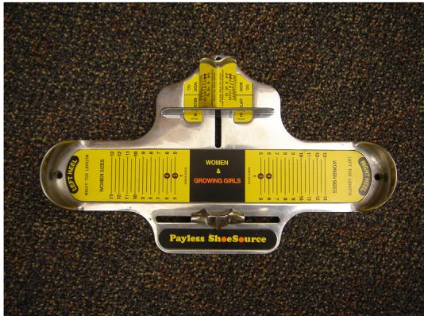  
Fig 1 A Brannock device should be used to measure foot length and arch length and width to get a properly fitted shoe.

Downloaded for Anonymous User (n/a) at Shanghai Jiao Tong University School of Medicine from ClinicalKey.com by Elsevier on December 27, 2024. For personal use only. No other uses without permission. Copyright ©2024. Elsevier Inc. All rights reserved.

is higher than with conventional shoes. In the last few years, some athletic shoes are considered in-depth, are available in different widths, have removable insoles, and are more fashionable thus gaining popularity among patients with lesser toe deformities. Some fancy designer shoes have redesigned their anterior box to the shape of a conventional forefoot instead of a pointed box thus allowing them to accommodate deformities better.7

Some modifications in the sole of a shoe may be beneficial in the conservative treatment of lesser toe deformities. Rocker soles allow for the transition from the first to the third rocker of gait without the shoe or foot bending, subsequently offloading the forefoot which is beneficial for lesser toe function and pain.8 Heel-to-toe rocker sole shoes are intended to decrease pressure on heel strike and increase propulsion at toe-off without overloading the lesser rays.9 They are especially indicated in patients with decreased or absent movement at ankle and/or at the first metatarsophalangeal joint (hallux rigidus, arthrodesis), and fixed claw or hammertoes.10 Many off-the-shelf rocker bottom shoes and some long-distance-running shoes are built with a rocker sole that is adequate for patients with painful lesser toe deformities unless they need orthoses that cannot be fitted.11 In that case, a custom-made rocker sole with a wider and deeper toe box may be needed. Shoe modifications such as an extended shank, re-lasting, or flaring that alleviate metatarsalgia may secondarily decrease functional demands of the lesser toes and alleviate pain in the digits.12

## ORTHOTICS

The word orthosis derives from the Greek “ortho”, which means straighten or correct and from New Latin orthosis (orth ot-artificial support). Under the International Stan- dard terminology, the term orthosis is used to describe an externally applied device used to compensate for impairments of the structure and function of the neuromuscular and skeletal systems.13 To many medical professionals and patients, foot orthoses are often described by the slang word orthotics to describe the wide range of in-shoe devices from off-the-self arch supports to prescription custom-made foot orthoses. The word orthotics defines the branch of medicine that deals with the provision (fabrication and modification) and use (theory and practice) of artificial devices such as splints and braces. The health provider specialized in orthotics is known as orthotist. For the purposes of this study, the abbreviated term “orthotics” and its derivatives will be used to describe all types of therapeutic medical devices that are intended to conservatively treat lesser toes pathologies.

## Types of Orthotics for Lesser Toes

There is a wide variety of lesser toe orthoses.14 The high variability of lesser toe deformities means surgeons have to develop an individualized, step-by-step approach to each patient. Some of the most popular lesser toe orthoses are

Budin splint: Flat pad with an elastic strap dorsally that is designed to reduce a flexible interphalangeal joint deformity, allowing the toe to rest in a more neutral and straightened position. It can hold one or more toes (single, double, triple splints).

Toe props: Crescent-shaped latex molds which can be covered in chamois leather and can be fitted to the toe using an elastic loop.

Gel foot cover: Forefoot protector in nontoxic, viscoelastic polymer gel coated with elastic surgical fabric.

Gel spreader with loop: Soft, flexible hourglass-shaped gel toe spreader with a toe loop to help keep it in place. Designed to separate, straighten, align, and reduce friction between the big and the second toes.

Toe spacers: Devices usually made of medical grade silicone separating and realigning the toes and reducing pressure and friction between them.

Gel crest pads: Soft silicone pad that provides maximum comfort and helps to relieve pressure and pain caused by hammer, claw, and mallet toes by absorbing shock providing effective pressure relief across the base of the lesser toes.

Gel tubes: Protect toes from pressure and friction and separate toes that rub.

Gel toe caps: Prevent blisters, rubbing, irritation, and toenail loss. They are used to treat sore nails, protect toenail injuries, and relieve pain in toes.

Wrap toe straps: Thin, flexible sheet that wraps around a hammertoe and the toe beside it. Once the hook and loop adhesive strip have been fastened, the wrap stays in place and acts as a toe straightener splint, flattening your toe, and correcting its alignment.

Corn pads/digital pads: Protectors slip on easily and stay in place all day long, padding toes against friction while protecting and soothing painful corns. The soft elastic fabric sleeve usually contains a visco-gel cushion.

Tailor bunion corrector/shield: Silicone gel shield cushions designed to be placed over the fifth toe protecting the digit from rubbing and friction and absorbing pressure and friction to relieve pain.

## Fabrication and Materials

Orthoses are available as off-the-shelf devices (finished products), semi-finished, or custom-made. Off-the-shelf orthoses are manufactured industrially and are used for a limited duration of therapy. Semi-finished products are fabricated industrially and can be adapted to the deformity. They are also known as custom-fitted or prefabricated. Off-the-self or prefabricated orthoses may be also good for an assessment of the effect before a custom-made orthosis is made. Custom-made devices are individually manufactured. It is common to have combined deformities and several functional deviations within the same foot. A mold of the deformity is created and with the advent of new silicone and gel materials the weight and adaptability of the orthoses are optimal to allow for flexibility when it is required.15

Orthoses should ideally provide shock absorption and relieve areas of high pressure, reduce shear using the total contact concept (as total contact casting in a diabetic foot), stabilize and correct flexible deformities, and accommodate fixed deformities by using moldable soft materials.15 Orthoses for lesser toe deformities can be accommodative, semirigid, or rigid.16

Accommodative orthoses are designed to cushion and protect the toes by offloading prominent areas. This type of orthosis may accommodate small deformities in active patients and low-density soft materials are used. They are also used in rigid deformities in which reposition of the digit to its original setting is no longer possible. They wear out quickly, so they need to be periodically repaired or replaced. A positive model of the lesser toe deformity is created by using a crushable foam box or a plaster cast or a 3D virtual model after scanning the foot. Soft, moldable materials are used to make accommodative orthoses. Some materials like closed-cell expanded rubber, sponge rubber, open-cell polyurethane foams, do not bottom out quickly but are not heat moldable. Heat moldable materials, such as soft cross-linked polyethylene foams, wear out quickly and should be used in combination with other materials.

Semirigid foot orthoses combine the protection of accommodative orthoses with the support and control of rigid orthoses. Semirigid orthoses are made with a supportive base material cushioned by a protective soft top layer offering both cushion and support/position control. The solid base of the device is made using firm cross-linked polyethylene foam, ethylene vinyl acetate, or cork composites. In flexible complex deformities, like the combination of hallux valgus, hammertoe, and crossover toe, a semirigid orthosis allows for the restoration of position of the second toe and effective separation from the first digit while protecting the dorsum of the toe against painful friction with the shoe.

Rigid foot orthoses are made of acrylics, carbon fiber composites, or thermoplastics. They are difficult to fit and not easily adjustable. They are commonly used in the fabrication of insoles that need to control hindfoot deformities but rarely used in the management of lesser toe deformities. Rigid orthoses are contraindicated in patients with diabetes or neuropathy with a history of ulcerations.

Orthoses are not free of complications and loss of sensation (skin and sensory nerves compressed in pressure areas), loss of proprioception, and restricted range of motion may be encountered (Fig 2). However, the most common problem is noncompliance either because of nonproper fitting into a shoe or because of the patient being inconsistent with their use.17

Modern orthotics thrives on customization and personalization. The fusion of 3D printing and digital foot scanning enables the creation of individualized solutions, providing bespoke orthotics that better fit to the anatomic attributes of each individual.18

## Indications of Lesser Toe Orthotics

Some of the most common lesser toe conditions that may be treated with orthotics are Hammer toes: Toe splints try to decrease metatarsophalangeal joint (MTPJ) hyperextension and interphalangeal joint flexion resulting in decreasing pressure at the plantar surface of the metatarsal head and on the dorsum of the lesser toe thus relieving pain at both areas.19 To accomplish the benefit of the splint, the material used has to be firm enough in order to control deformities and the patient needs to fit the splint snugly. Taping or strapping of the affected toes may improve alignment if they are flexible. Taping of the proximal phalanx in a figure-of-eight pattern can help prevent MTPJ subluxation and reduce flexible deformity.20,21 Hammertoe frequently combines with some degree of floating toe and pain because of a predislocation stage of the deformity (Fig 3).

Mallet and claw toes: Pain may result from the impaction of the distal phalanx and nail into the ground. Relieving of pressure at the distal tip of the phalanx may be

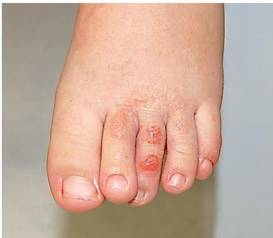  
Fig 2 Skin irritation and contact dermatitis as a complication of toe strapping.

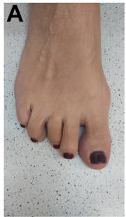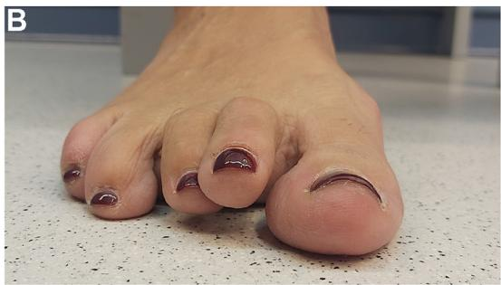

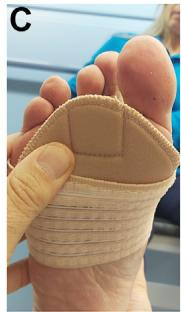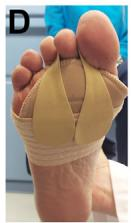

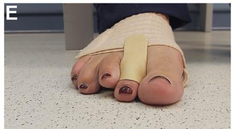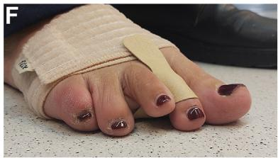  
Fig 3 Painful hammertoe and floating deformity of the second digit: (A) dorsal view, (B) frontal view, (C) forefoot band, (D) strapping of the second toe to the band, (E) correction in frontal view, and (F) oblique view of the device.

achieved using cushioned foam, gel sleeves, and/or toe crest devices, which are helpful because they elevate the toe, keeping the toe tip offloaded. Callus trimming, placement of a felt pad, and using shoes with a wide toe box and deepened heel can also reduce pressure and alleviate symptoms.22 Silicone molds may also be used to reduce friction on the dorsum of the digit (Fig 4).

Curly toes, crossover, floating, underlapping, and overlapping toes: Different types of orthotics may control malrotation and underlapping of one or more toes along with digit flexion or extension deformity (Fig 5). Curly toes can be corrected at an early age provided they are flexible under weight-bearing conditions with the use of custom-made silicone molds (Fig 6).

## OTHER CONSERVATIVE INTERVENTIONS

Chronic keratosis is common among patients with lesser toe deformities. Conservative symptom management by callus shaving is performed with a callus file, pumice stones, scalpel, or callus blade. This is a simple and effective means of managing

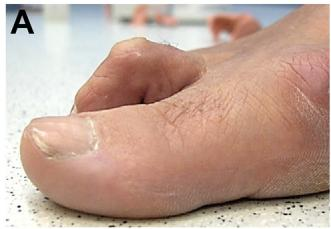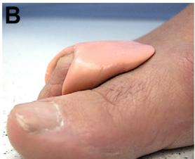

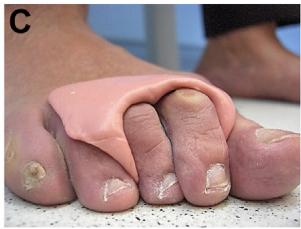
  
Fig 4 Painful rigid clawtoe deformity: (A) dorsal prominence causing painful rubbing on shoe, (B) silicone orthosis extending just proximal to the prominent area to avoid contact with shoe, and (C) omega-shaped silicone orthosis accommodating rigid clawtoes.

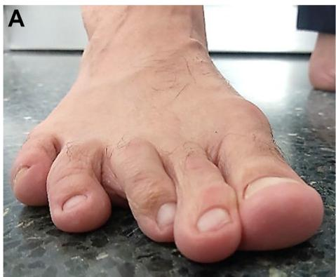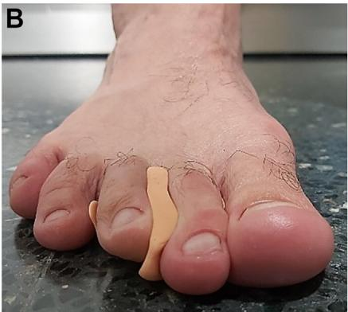  

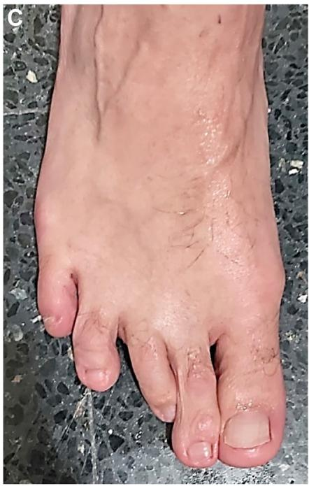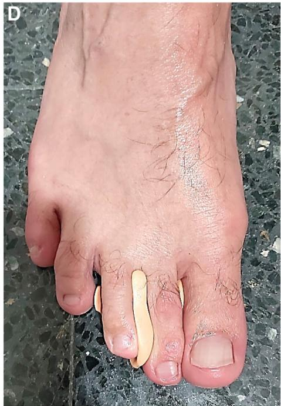

  
Fig 5 Painful underlapping third toe with rotation causing friction on the second toe: (A) frontal view, (B) frontal view with custom-made silicone spacer correcting the deformed digit, (C) dorsal view, and (D) dorsal view with silicone spacer.

this painful condition, although treatment also needs to focus on the primary cause for metatarsalgia.23 Hard skin should be applied with moisturizing cream daily and regular use of a foot file, alternatively contact a local podiatrist for treatment. Rehabilitation and the use of injections is beyond the scope of the present article.

## WHAT CAN WE EXPECT FROM CONSERVATIVE TREATMENT?

There is a paucity of studies to guide best conservative management of lesser toe deformities. Most of the studies analyzed had short-term follow-up, low number of patients, case reports, and not many are prospective and randomized. Most claimed effects—prevent ankle sprains, improve blood flow to the plantar fascia, encourage development of intrinsic foot muscles, enhance balance, weight distribution, proprioception, dexterity—have not been proven.

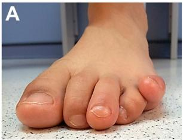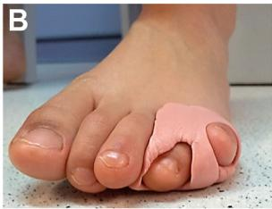

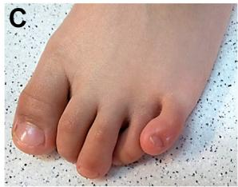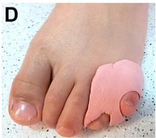
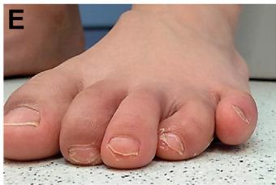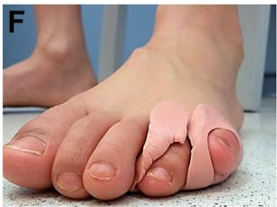

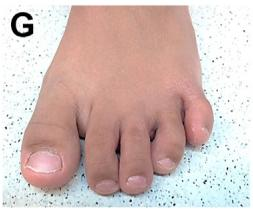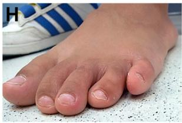

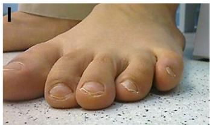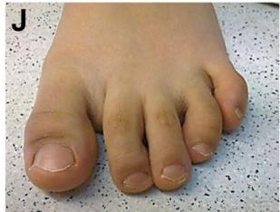  
Fig 6 Curly overlapping fifth toe in a 4 year old patient. Orthoses are changed every 3 months in children aged under 5 years and every 6 months in children aged over 5 years: (A) frontal view of deformity, (B) correction with custom-made silicone orthosis, (C) dorsal view of the deformity, (D) dorsal view with orthosis, (E) after 3 months of conservative treatment, (F) a new custom-made silicone orthosis help to continue correction of the deformity, (G) dorsal view at 6 months, and (H) oblique view at 6 months, (I) frontal view 1 year from the initiation of orthotic treatment, and (J) dorsal view of the final correction.

Many of the studies on conservative treatment of lesser toe deformities are case reports. There is no consensus regarding treatment of lesser toe deformities. Wide variations in definitions and strategies have been demonstrated in some countries.24 So many of the studies in the literature are cases series and biased. These include taping for predislocation syndrome,21 second metatarsophalangeal joint instability,25,26 hammer toe,20 or acute mallet toe. 27

Turner studied 90 underlapping fifth toes treated with an aggressive toe-strapping protocol.28 He was able to maintain taping for an average of 12.1 months. Disappointingly, only 14 toes maintained the corrected position at end of strapping, demonstrating that strapping for underlapping toes was ineffective.

Claisse and colleagues29 reported the effect of orthotic therapy for toe deformity on toe and metatarsal head pressures using an in-shoe pressure-measurement system’s ability to export detailed data. Plantar pressure-time integrals in 11 individuals (22 feet) with claw deformity of the lesser toes were measured with and without toe props. Plantar surface charts with contours of equal significant pressure-time integral change showed significant reduction under 17 second toes (77%), 22 third toes (100%), 15 fourth toes (68%), 13 second metatarsal heads (59%), 16 third metatarsal heads (73%), and 16 fourth metatarsal heads (73%). All 22 feet showed significant differences in toe and metatarsal head plantar pressure–time integrals between individuals wearing prefabricated silicone toe props and the same individuals not wearing the props.

Johnson and colleagues30 evaluated the effect of toe props on plantar digital pressure on 22 patients with lesser toe deformities (claw and hammertoes) and apical skin lesions. Three different types of materials were used for the props—leather, gel, and silicone—and comfort of each was evaluated. Significant difference in peak pressures was registered at the apex of the second toe when using any of the props compared to no toe prop, but no significant correlation was found between comfort and peak pressures. However, silicone and leather toe props were less effective than gel toe props in the reduction of peak pressure and pressure time integral on the apex of the second digit in patients with claw or hammertoe deformities. Patients found silicone props to be more comfortable than gel and leather props. Therefore, the authors recommended the use of silicone toe props as primary treatment of second toe apical lesions associated with claw and hammertoes.

Chadchavalpanichaya and colleagues31 studied the effectiveness of adjustable toe splints in decreasing metatarsalgia in patients with painful lesser toe deformities. In a prospective randomized single-blinded controlled trial, 36 patients with metatarsalgia and claw toes and hammertoes were studied after being randomized into the study group (adjustable toe splints and wide and deep toe box shoes) and the control group (wide and deep toe box shoes but no splinting). Significant improvement was noticed in the study group regarding metatarsalgia and pain at the dorsum of the lesser toes, although 2 patients complained of toe abrasions at just 2 weeks of wear. The limitation of this study was the duration of just 2 weeks which might bias both the results and patient’s compliance.

Different authors have demonstrated that rocker soles can also help alleviate pain from metatarsalgia thus reducing mechanical work of the lesser toes but no measurements on the improvement have been reported.8–10

Formosa and colleagues32 evaluated the effectiveness of the custom-made molded silicone toe props in distributing apical and metatarsophalangeal joint peak plantar pressures and force–time integral in toe deformities, including hammertoes and claw toes, and to observe any difference in pressures between flexible and rigid toe deformities. Ten patients presented with a flexible toe and 10 others presented with a rigid toe. Significant differences in mean peak plantar pressure and pressure–time integral were observed at the apex of the second toe in both the flexible and rigid claw or hammertoe deformities when using a molded silicone toe prop.

Ruiz-Ramos and colleagues33 studied a novel device that intends to simulate strapping of toes with a stabilizing tape. The authors compared plantar pressure changes using the device with the traditional method (stabilizing tape) in a young, healthy sample thorough a cross-sectional study. The novel device reduced median maximal pressure and median pressure–time integral under the second metatarsal head showing higher effectiveness than the traditional second metatarsophalangeal joint stabilizing taping technique.

## SUMMARY

Lesser toes, common problems, big troubles. Lesser toe deformities are common in our foot and ankle practice and can have a significant impact on the function of the foot and quality of life. Conservative treatment with footwear modification and orthotics should be tried before surgical treatment. Different types of shoes and adaptations are available, as well as some lesser toe orthotics. It is important to be familiar with the indications for the use of such devices. Lesser toe problems such as corns, hammertoes, tailor’s bunions, mallet and claw toes, curly toes, crossover, underlapping, and overlapping toes can effectively be treated with lesser toe orthotics. Rocker soles can help alleviate pain from metatarsalgia and reduce mechanical work of the lesser toes. Off-the-self in-depth shoes may accommodate most lesser toe deformities, but sometimes custom-made shoes are necessary to accept both orthotics and deformities. Silicone toe props and Budin-type devices show highest effectiveness in pain relieve and skin protection for most common deformities. However, there is a paucity of randomized controlled trials to guide best conservative management. Fusion of 3D printing and digital foot scanning enables the creation of bespoke devices, providing personalized orthotics that will surely make an impact on our patients.
