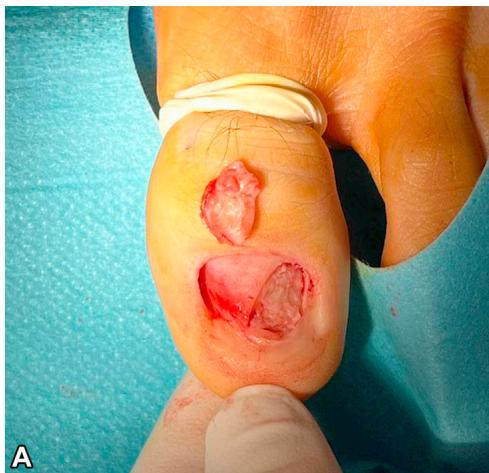
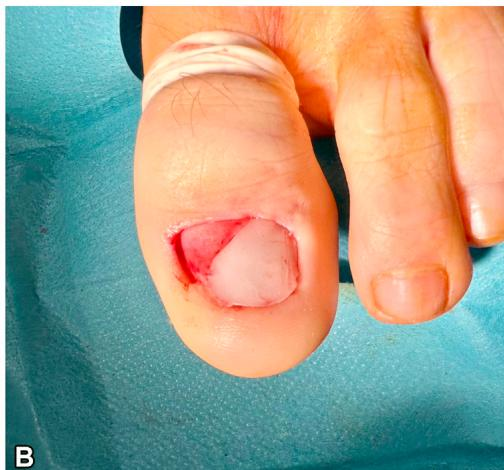

Belen de Nicolas-Ruanes, MD, Carlos Azcarraga-Llobet, MD, and Juan Jimenez-Cauhe, MD

## CLINICAL CHALLENGE

Nail plate replacement stands as the last step in nail surgery involving subungual tumors. However, the nail plate can occasionally be damaged or fractured during surgery or by the tumor itself, or it may be sent for histopathological analysis, so it cannot be repositioned after excision (Fig 1, A). In those cases, one of the proposed options is the use of a sterile semirigid plastic as a synthetic nail plate, such as suture packages.

## SOLUTION

Bone wax offers a simple and <mark style="background:#fff88f">cost-effective solution</mark> for addressing <mark style="background:#fff88f">nail bed defects</mark> when nail plate replacement is unfeasible. It is a sterile, rectangular-shaped piece of wax that can be easily molded to fit defects of any shape (Fig 1, B). It is removed after 2 or 3 weeks, when nail bed has already started to granulate by second-intention healing . As an advantage over other alternatives, bone wax promotes the natural process of tissue granulation and requires less frequent handling, simplifying wound care for the patient. However, it is not intended to prevent pterygium formation between nail fold and matrix.

   
Fig 1. Surgical defect in the nail bed after excision of a superficial acral fibromyxoma (A) and after coverage with bone wax (B).

Bone wax has been mainly used in neurosurgery and orthopedic surgery as a hemostatic agent. In dermatologic surgery, it has been reported as an effective dressing for skin defects in concave areas, by establishing an occlusive microenvironment that promotes tissue regeneration and second-intention wound healing. Due to its nonadherent properties, it can be easily removed without disrupting the granulation process.

In conclusion, we propose bone wax as a useful and easy pearl to cover and promote tissue granulation in nail bed defects.
